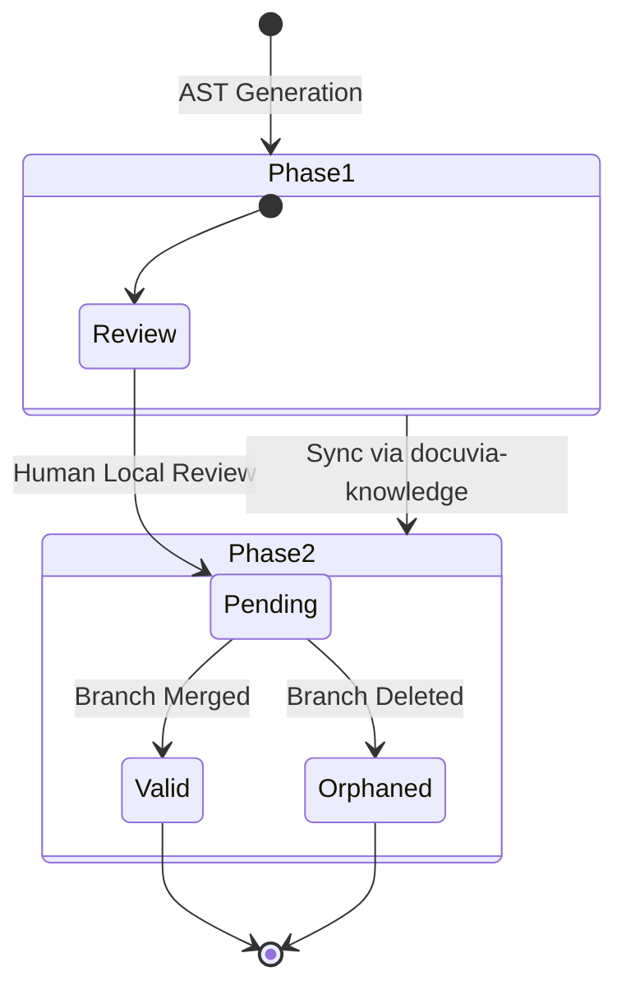

# ADR-011: Two-Phase Knowledge Validity

**Status:** Accepted

**Context:**  
[AI-generated knowledge nodes](./ADR-005-knowledge-abstraction-strategy.md) can originate from [commits](./ADR-016-git-blob-native-identity-and-checkout-thrashing-defense.md) on any branch — including feature branches that are later abandoned. Treating all generated knowledge as equally valid regardless of its source branch’s fate would pollute the [Git-Isomorphic knowledge graph](./ADR-004-git-isomorphic-graph.md) with decisions from discarded design attempts.

**Decision:**  
[L3 knowledge](./ADR-005-knowledge-abstraction-strategy.md) validity is determined by two independent gates:

**Phase 1 — Local Review (Quality Gate):**  
The developer or reviewer inspects the content generated by the [AST Microkernel](./ADR-020-unified-isomorphic-ast-microkernel.md) or [Progressive Enrichment](./ADR-015-progressive-enrichment-and-ast-lsp-dual-engine.md) locally via [VS Code](./ADR-001-vscode-client-onboarding.md) or the Web UI ([Local-First Architecture](./ADR-002-local-first-architecture.md)). They confirm whether the interpretation is accurate. This gate ensures content quality and is the current `review_tasks` mechanism ([Human-in-the-Loop](./ADR-006-self-evolution-architecture.md)). Passing Phase 1 sets status to `pending`.

**Phase 2 — Merge Gate (Validity Gate):**  
When the [Asynchronous Metabolism](./ADR-008-asynchronous-metabolism.md) worker synchronizes via the [`docuvia-knowledge` orphan branch](./ADR-017-tiered-storage-and-orphan-branch-graph-maintenance.md) (passing data via [Database-as-IPC](./ADR-014-sql-indexed-graph-and-database-as-ipc.md)), it checks whether the source commits have been merged into the main/default branch. Commits confirmed merged set their associated L3 nodes to `valid`. Commits on branches that are later deleted without merging cause their L3 nodes to be set to `orphaned` ([Tiered Storage & Tombstoning](./ADR-017-tiered-storage-and-orphan-branch-graph-maintenance.md)), rendering them archived and excluded from standard queries.

Both phases are required for `valid` status. A human-reviewed L3 node from an abandoned branch remains `pending` until/unless the branch is merged, then transitions to `valid`.

**Validity status enum:** `pending | valid | orphaned`

**MCP query behavior:** Default filter is `status = valid` only ([Agentic RAG Routing](./ADR-007-agentic-rag-routing.md)). Query parameter `include_pending=true` enables pending knowledge (e.g., for querying a specific feature branch's design decisions).

**Consequences:**

- ✅ Abandoned design attempts do not contaminate the canonical knowledge graph
- ✅ In-progress work is visible to collaborators (with clear status labels)
- ✅ The review queue (Phase 1) retains its existing role; Phase 2 is additive
- ⚠️ Background metabolism ([ADR-008](./ADR-008-asynchronous-metabolism.md)) must track branch merge status — requires either GitHub webhook integration or periodic polling of the Git tree.
- ⚠️ `l3_nodes` and `commits` tables require `validityStatus` column
- ⚠️ `commits` table requires `branchName text` column

## Diagram

