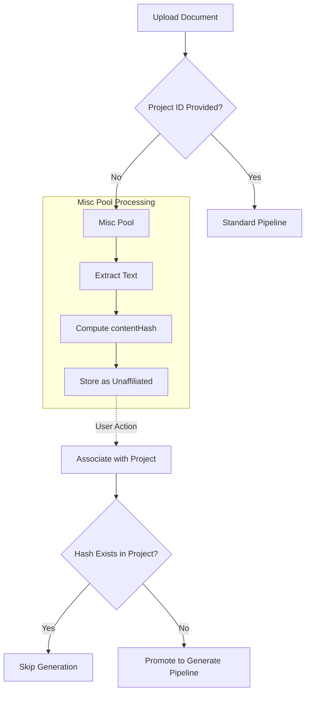

# ADR-012: Document Misc Pool for Unaffiliated Documents

> **Implementation status:** Tracked in the roadmap, not here — see [Generate Pipeline Orchestrator](../roadmap/features/generate-pipeline-orchestrator.md) in [Phase 1](../roadmap/phase-1-core-api-database-the-metabolism-engine.md).

**Status:** Accepted

**Context:**  
Documents (PDF, Word, Markdown specs) ingested into Docuvia (via Web UI or [VS Code Client](./ADR-001-vscode-client-onboarding.md) under our [Local-First Architecture](./ADR-002-local-first-architecture.md)) often cannot be immediately attributed to a specific project. Forcing project assignment at ingestion time makes Docuvia unusable for organizations that share company-wide specs or standards that span multiple projects.

**Decision:**  
`documents.projectId` is made nullable. Documents ingested without a project ID enter the **misc pool** (`projectId = null`, `status = 'unaffiliated'`). The pipeline (utilizing the [AST Microkernel](./ADR-020-unified-isomorphic-ast-microkernel.md) for Markdown, or dedicated binary extractors) extracts text content and computes a `contentHash` (SHA-256) at ingestion time (conceptually aligning with [Git Blob-Native Identity](./ADR-016-git-blob-native-identity-and-checkout-thrashing-defense.md)). However, it does NOT run L1/L2/L3 generation ([Three-tier knowledge graph](./ADR-005-knowledge-abstraction-strategy.md)) and does NOT create review tasks ([Human-in-the-Loop](./ADR-006-self-evolution-architecture.md)).

When a user manually associates a misc pool document with a project (via Web UI or VS Code Client), the system:

1. Sets `documents.projectId` to the target project.
2. Uses `contentHash` to check if this document has already been processed for this project — avoiding duplicate generate runs.
3. Promotes the document into the project's generate pipeline on the next run, leveraging [Database-as-IPC](./ADR-014-sql-indexed-graph-and-database-as-ipc.md) for the [Asynchronous Metabolism](./ADR-008-asynchronous-metabolism.md) worker to pick it up and eventually store generated knowledge in the [Orphan Branch](./ADR-017-tiered-storage-and-orphan-branch-graph-maintenance.md).

**Consequences:**

- ✅ Zero-friction document ingestion — upload first, classify later
- ✅ Company-wide specs can be associated with multiple projects over time
- ✅ No wasted LLM calls on documents not yet ready for knowledge extraction
- ⚠️ `documents` schema change: `projectId` must change from `NOT NULL` to nullable; add `contentHash text`, `affiliatedAt timestamp` columns
- ⚠️ Web UI needs a “Misc Pool” view and a “Associate with Project” action

## Diagram

