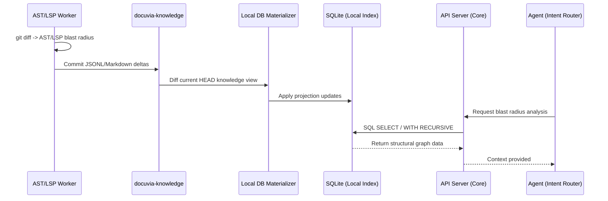

# ADR-014: SQL-Indexed Graph and Database-as-IPC

> **Note**: The exact sequence of SQLite updates during Git hooks has been refined by **[ADR-023](./ADR-023-granular-markdown-storage.md)**. The hook now updates the `docuvia-knowledge` branch first, treating the Local SQLite database as a Materialized View populated from Git diffs.

## Context

Transmitting the entire knowledge graph (e.g., hundreds of thousands of nodes and edges) via gRPC or JSON between [background parsing workers](./ADR-008-asynchronous-metabolism.md) and the Docuvia core would incur massive serialization overhead and payload size bombs. While gRPC streaming solves part of the transmission issue, the instantaneous I/O and deserialization still risk blocking the main thread.

## Decision

We will adopt a "Shared Database Pattern" (Database as IPC - Inter-Process Communication) for read-optimized local graph queries while preserving the storage order defined by [ADR-023](./ADR-023-granular-markdown-storage.md): the `docuvia-knowledge` branch is updated first, and `local.db` is materialized from that branch for the current Git `HEAD`.

- **Daemon Responsibility (Local Hooks)**: The local hook computes changed files and ranges with Git diff, then uses the [AST Microkernel worker](./ADR-020-unified-isomorphic-ast-microkernel.md) plus LSP enrichment to calculate the blast radius. The hook writes structural and semantic deltas to the `docuvia-knowledge` branch in the branch-native JSONL/Markdown format.
- **Projection Responsibility (Local DB)**: After the branch update succeeds, the materializer reads the `docuvia-knowledge` diff and applies `INSERT` / `UPDATE` / `DELETE` statements to the **Local SQLite database**. `local.db` is the Local HEAD Index and query cache, not the canonical write target.
- **Core Responsibility (Server API)**: The central API server strictly forbids Database-as-IPC for remote workers. Remote background workers MUST communicate via REST APIs to ensure authentication, rate-limiting, and validation before writing to PostgreSQL.
- **Data Querying**: When an [Agent](./ADR-007-agentic-rag-routing.md) needs to understand the blast radius, the Core directly issues SQL `SELECT` queries or recursive CTEs (`WITH RECURSIVE`) to the database.

## Sequence Diagram

## Consequences

- **Positive**: Extreme transmission efficiency. The inter-process communication is reduced to minimal control commands.
- **Positive**: Native SQL graph traversal, leveraging C-based database engines for recursive queries instead of running recursive algorithms in the V8 engine.
- **Positive**: Seamless persistence. The database can be rebuilt from the Git-native knowledge branch, enabling instant reads upon editor restart while preserving a recoverable source of truth.
- **Negative**: Requires careful worker lifecycle management to avoid orphan processes and handling of schema migrations.
