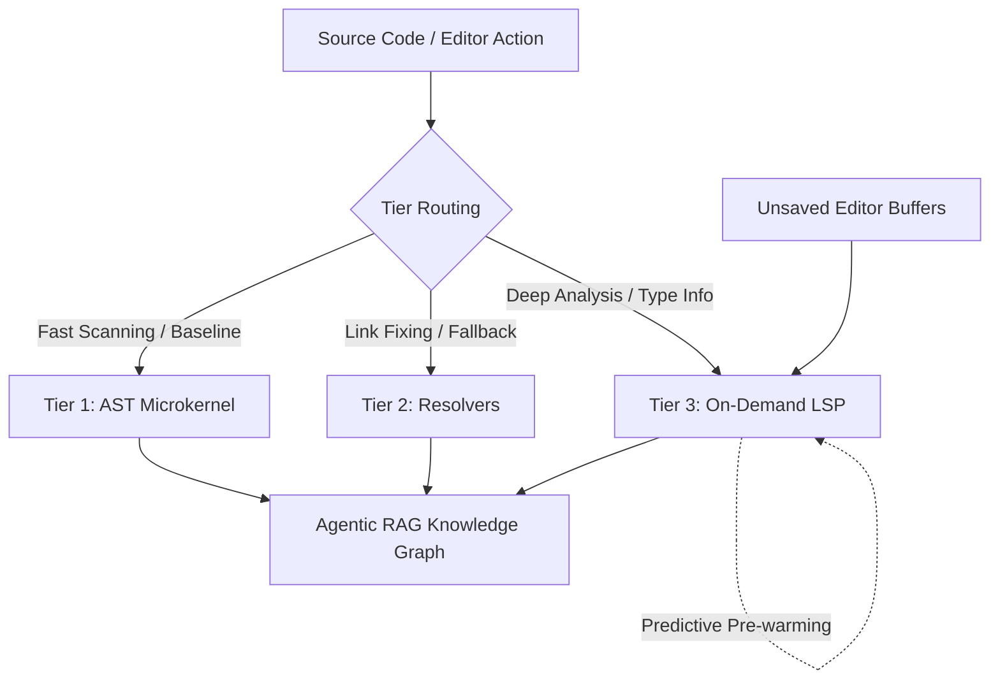

# ADR-015: Progressive Enrichment & AST/LSP Dual Engine

## Context

_(Ref: [`docs/gitbook/analysis/ast-semantic-graph.md`](../analysis/ast-semantic-graph.md), [`docs/gitbook/analysis/ide-vscode-client.md`](../analysis/ide-vscode-client.md))_

> **Implementation status:** Tracked in the roadmap, not here — see [AST Microkernel Architecture](../roadmap/features/ast-microkernel-architecture.md) and [Smart Blast Radius (WASM Semantic Diff)](../roadmap/features/smart-blast-radius-wasm-semantic-diff.md) in [Phase 2](../roadmap/phase-2-ast-microkernel-semantic-diffing.md).

Relying purely on Local AST (Tree-sitter) is fast but lacks global context and type inference capability (e.g., it cannot resolve `a.doSomething()` if `a` is imported dynamically). Conversely, running a full Language Server Protocol (LSP) daemon is perfectly accurate but too heavy, slow to cold-start, and memory-intensive to run across all project files.
Our competitor analysis against Cursor (Shadow Workspace) and GitNexus revealed that we need a hybrid approach to match their deep execution flow tracing without suffering their C++ dependency flaws.

## Decision

Docuvia will adopt a "Progressive Enrichment" (Fallback & Dual Engine) architecture, dividing the parsing into three tiers:

- **Tier 1 (Base - AST)**: The [AST microkernel](./ADR-020-unified-isomorphic-ast-microkernel.md) rapidly scans the entire project as a fallback mechanism. It establishes all base structural nodes (Classes, Functions, Imports) regardless of compilation status.
- **Tier 2 (Enrichment - Resolvers)**: Lightweight, domain-specific post-build resolvers (e.g., a `tsconfig_resolver`) step in to fix broken links and implicit magic that ASTs cannot decipher.
- **Tier 3 (On-Demand - LSP)**: A full LSP is treated as an on-demand Agent Tool (e.g., `lsp_go_to_definition`). To mask the 3-5 second cold start, Docuvia will use "Predictive Pre-warming"—asynchronously booting the LSP in the background the moment the [Intent Router](./ADR-007-agentic-rag-routing.md) detects an action that might require deep code analysis. The LSP will also act as the ultimate source of truth for unsaved editor buffers (Dirty States).

## Dual Engine Architecture Diagram

## Consequences

- **Positive**: Provides a 100% baseline coverage with AST while allowing exact type resolution via LSP when needed.
- **Positive**: Minimizes memory usage since the LSP is not used for global ingestion and is disposed of after an idle timeout.
- **Positive**: Solves the dirty state synchronization issue by deferring it directly to the LSP.
- **Negative**: Increased architectural complexity by having to orchestrate and manage both an AST engine and an LSP client tool.
