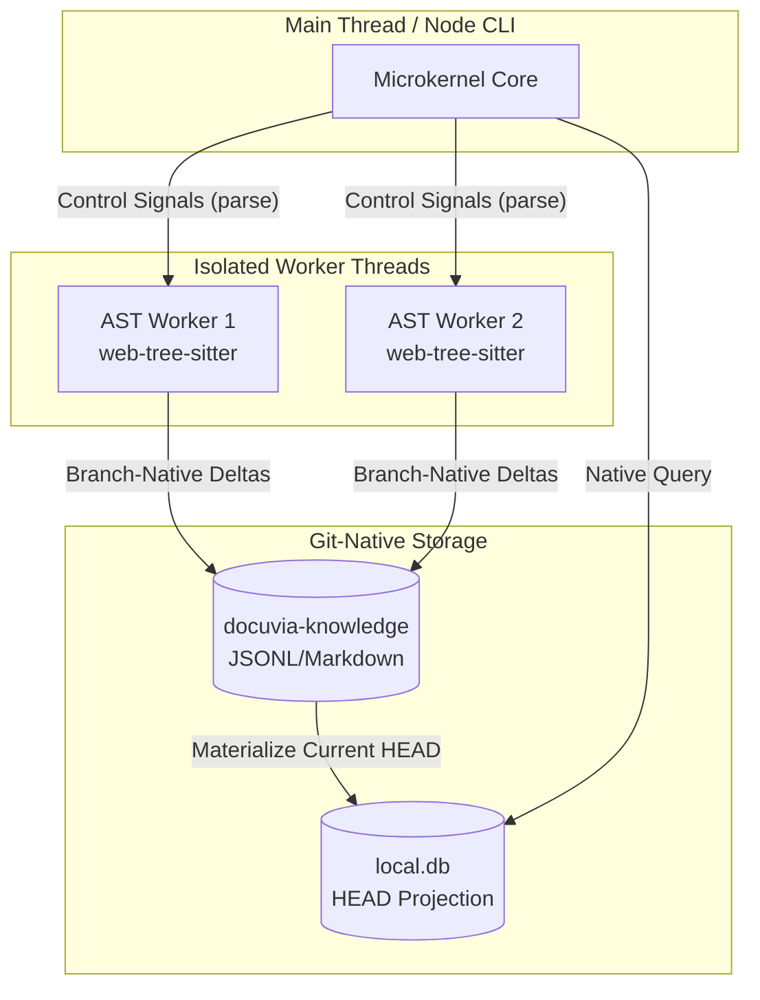

# ADR-020: Unified Isomorphic AST Microkernel

## Context

_(Ref: [`docs/gitbook/analysis/ast-semantic-graph.md`](../analysis/ast-semantic-graph.md#native-parsing-fallback-superseded))_

Docuvia requires blazing-fast, structural code analysis (AST) to generate the [Agentic RAG](./ADR-007-agentic-rag-routing.md) [Knowledge Graph](./ADR-005-knowledge-abstraction-strategy.md) without relying on expensive Language Servers (LSP) or incurring [LLM token costs](./ADR-009-token-management.md). Historically, our architecture suffered from extreme fragmentation:

1. We debated C++ vs. WASM bindings, risking a "split-brain" hashing bug where the Backend and VS Code Client produced different node hashes.
2. We struggled with bundle size limits for the VS Code extension if we monolithically packaged 30+ parsers.
3. We faced OOM (Out Of Memory) crashes in VS Code due to unmanaged WASM C++ heap allocations (`tree-sitter` memory leaks).

Our competitor analysis against GitNexus identified that native C++ bindings are a fatal flaw for web/browser portability, leading us to strictly adopt `web-tree-sitter` across all environments.

## Decision

We unify the entire AST architecture under the **Unified Isomorphic AST Microkernel** paradigm, defined by four non-negotiable pillars:

### 1. Isomorphic WASM-Only Parsing

To eliminate "split-brain" graph divergence, **C++ native bindings are strictly banned**. Both the Node.js API Server and the VS Code Client will exclusively use the WebAssembly (`web-tree-sitter`) engine. A single file parsed on the backend or the frontend must mathematically yield the exact same AST structure and SHA-256 hash (critical for [Git Blob Identity](./ADR-016-git-blob-native-identity-and-checkout-thrashing-defense.md)).

### 2. Microkernel & Dynamic Plugin Ecosystem

The core engine (`@workspace/ast-core`) will act as a lightweight Microkernel. It will contain zero language-specific grammars. Languages will be separated into isolated plugin packages. The Microkernel dynamically lazy-loads only the `.wasm` grammars present in the user's current repository, keeping the extension startup time sub-second and the base memory footprint minimal.

### 3. Strict Worker Thread Isolation

WASM heap memory must be manually freed (`tree.delete()`). To prevent memory leaks from crashing the VS Code Extension Host or the main API Server, all AST parsing **must** execute inside isolated `worker_threads` (or Web Workers). If a worker OOMs or hangs on a malicious file, the Microkernel simply terminates the worker, flags the file as failed, and spawns a new worker.

### 4. Zero-LLM Git-Native Delta Pipeline

To keep the structural extraction path cheap and deterministic, the isolated AST Worker handles parsing, traversing, and extracting structural metadata without invoking the LLM. The main thread sends small control signals (for example, "parse the ranges changed by `git diff`"), and the worker returns compact branch-native deltas rather than large in-memory graph payloads.

Those deltas are written to the `docuvia-knowledge` branch using the JSONL/Markdown format defined in [ADR-023](./ADR-023-granular-markdown-storage.md). The local SQLite database is updated only by the materializer after the branch update succeeds, following [ADR-014](./ADR-014-sql-indexed-graph-and-database-as-ipc.md). This preserves the invariant that `local.db` is the current-HEAD projection, not the source of truth.

## Component Diagram

## Consequences

- **Positive:** Guaranteed 100% hash parity between local IDE graphs and server-side databases ([Git-Isomorphic sync](./ADR-004-git-isomorphic-graph.md) and [Orphan Branch Maintenance](./ADR-017-tiered-storage-and-orphan-branch-graph-maintenance.md) are safe).
- **Positive:** VS Code Extension bundle size remains under 5MB.
- **Positive:** Complete immunity to IDE freezing or crashes caused by AST parsing.
- **Positive:** IPC serialization bottlenecks are eliminated by sending compact branch-native deltas from workers and rebuilding the query cache from Git-native storage.
- **Negative:** WASM is ~20-30% slower than native C++ bindings for massive bulk ingestion on the server (mitigated by [Asynchronous Metabolism](./ADR-008-asynchronous-metabolism.md)).
- **Negative:** Increased architectural complexity in managing a dynamic Web Worker pool, branch worktrees, and deterministic projection updates into SQLite.
