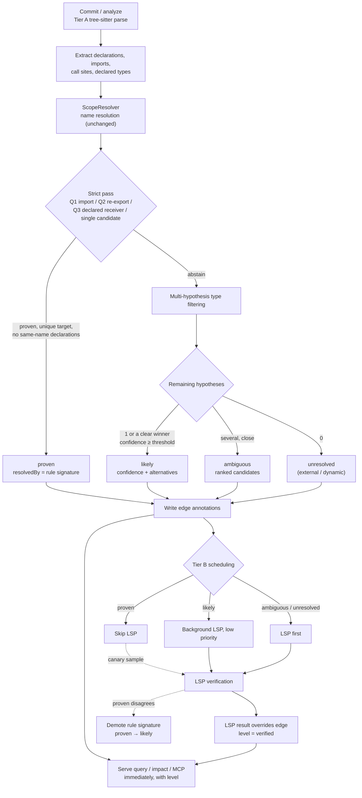
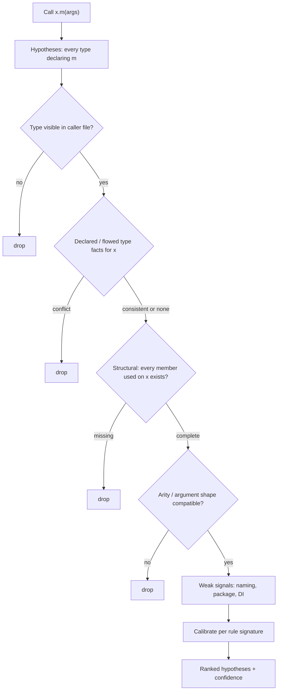

# Tiered Call Resolution — Proven, Likely and Ambiguous Edges

## Context

Tier A (tree-sitter plus `ScopeResolver`) resolves calls by name. tree-sitter is a syntax parser: it has no symbol binding or type checker. So member calls whose receiver needs a type (`this.client.execute()`) are deliberately left unresolved, and resolution quality for them depends on Tier B (LSP). [IMPT-002](../impact/IMPT-002-lsp-for-absolute-quality.md) makes LSP the quality engine, but running LSP on every call site is the dominant cost in Docuvia's pipeline. Until LSP finishes, agents get no answer at all for these calls.

Evidence from #553 (merged in #556, v1.17.0):

- **Learned System-1 scorers do not transfer across repositories.** CUA-S1 and Laya add 0 certified LSP avoidance under leave-one-family-out (LOFO) certification. The errors are family-specific.
- **Strict, read-only syntactic queries make no errors on this corpus.** Q1 import source, Q2 re-export trace and Q3 declared receiver type had 0 errors on 1,448 pool and 1,928 held-out multi-candidate requests. Combined with Tier A they raise LSP avoidance from 44.00% to 61.34% (pool) and from 39.78% to 73.22% (test).
- **That avoidance figure is a lower bound.** The offline measurement could not locate repeated call expressions within a file (2,598 pool requests), which production Tier A can.

Users and agents mind "no answer" more than a wrong answer, provided the answer states how certain it is. Classic IntelliSense-style multi-hypothesis type filtering reaches roughly 90% top-1 without full type inference. VS Code follows the same layered pattern:

- TextMate grammars give a fast, single-file syntactic layer.
- LSP semantic tokens override that layer when they are available.
- TypeScript's partial semantic server answers from open files only while the full project loads.

## Decision

Every resolved call site is labelled with one of three resolution levels. Only `proven` may skip LSP.

| Level       | How it is produced                                                                                                                | Gate                                                                                             | Tier B behaviour                                                     |
| ----------- | --------------------------------------------------------------------------------------------------------------------------------- | ------------------------------------------------------------------------------------------------ | -------------------------------------------------------------------- |
| `proven`    | A strict syntactic proof: Q1, Q2, Q3, or a single Tier A candidate. Any same-name declaration (C-03 `@L` disambiguation) abstains | 0 errors and a group-level one-sided Clopper–Pearson lower bound ≥ .990 on unseen data           | Skipped; a canary sample is still verified                           |
| `likely`    | The top hypothesis after multi-hypothesis type filtering, with calibrated confidence and alternatives                             | top-1 accuracy (target ≈ 90%), answer rate and ECE reported per repository family on unseen data | Verified in the background at low priority; the LSP result overrides |
| `ambiguous` | Several hypotheses survive with no clear winner                                                                                   | —                                                                                                | LSP first; the ranked list is still served                           |

1. **`ScopeResolver` is unchanged.** It keeps recall for impact and query. A strict pass and a hypothesis filter run after it and annotate call edges with `resolution`, `confidence`, `resolvedBy` (rule signature) and `alternatives`.
2. **Declared-type index (no inference).** tree-sitter extracts written types:
   - field and parameter annotations
   - constructor parameter properties, including DI
   - `new C()`
   - return-type annotations
   - `implements` / `extends`

   Extraction is table-driven from each grammar's `node-types.json`. TS/JS comes first.

3. **Multi-hypothesis type filtering.**
   - Hypotheses: every type declaring the member.
   - Filters, in order: visibility in the caller file, declared or flowed type facts, other members used on the receiver in the same scope (structural), arity and argument shape.
   - Weak signals: naming and DI conventions.
   - Confidence is the empirical precision of each rule signature, measured on the corpus. No learned model is in the critical path.
4. **Tier B scheduling follows the level.** A canary failure on a `proven` rule signature demotes that signature to `likely`.
5. **`query`, `impact` and MCP outputs expose the level, confidence and alternatives**, so agents get an answer immediately with an honest certainty label.
6. **Full type inference is out of scope.** Generics, unions and inferred bindings belong to LSP.

### Resolution flow

### Multi-hypothesis type filtering

## Consequences

- **Positive:**
  - Agents get an answer for most call sites at Tier A speed, labelled with how certain it is.
  - LSP cost drops for call sites that are `proven`.
  - LSP keeps its role as the authority (IMPT-002) and as the source of calibration and canary data.
- **Negative / risks:**
  - New edge attributes need a schema migration and may change the knowledge-branch snapshot format.
  - A wrong `proven` rule would never be corrected by LSP. That is why the canary and per-signature demotion are mandatory, not optional.
  - `likely` answers will sometimes be wrong. They must always carry their level so consumers can tell.
  - The declared-type index and filters are per-language work. TS/JS comes first.
- **Rejected alternatives:**
  - **Learned direct-target scorers (System-1)**: certified 0 avoidance across families in #553. They may return later only for routing.
  - **Changing `ScopeResolver` directly**: too broad a blast radius for impact and query recall.
  - **Proven-only (abstain otherwise)**: leaves agents without answers. Users prefer a labelled best guess.
  - **Full type inference in Tier A**: this duplicates tsserver at LSP-level cost.
- **Prerequisites and follow-ups:**
  - #561: a duplicate same-name node for the inner returned arrow misplaces edges and lowers `proven` coverage.
  - Certification needs unseen data: new repository families and a newer temporal slice of the existing ones.
  - tsserver `LanguageServiceMode.PartialSemantic` is a candidate middle tier for TS/JS. Phase 0 measures its accuracy and cost before it is adopted.

References: #468, #553, #559, #561, [IMPT-002](../impact/IMPT-002-lsp-for-absolute-quality.md), [PLAT-007](../platform/PLAT-007-tiered-background-knowledge-evolution.md), `docs/gitbook/analysis/semantic-decision-phase2-system1-query-routing.md`.
