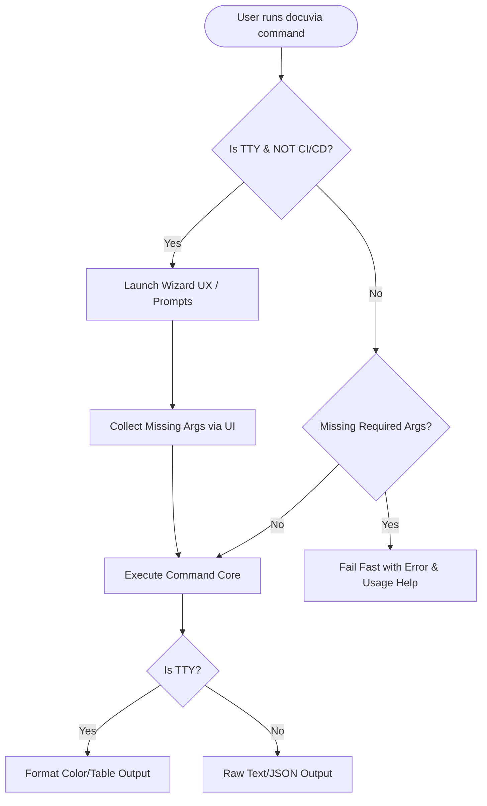

# Wizard-Style Interactive CLI (Auto-Triggered TTY)

## Context

A horizontal analysis against workspace sibling projects highlighted a UX gap in the Docuvia CLI. Previously, the CLI relied on raw `console.log` output and strict, unforgiving positional arguments. However, forcing an interactive TUI (Terminal User Interface) or wizard by default violates the fundamental UNIX philosophy of a CLI, where commands should be composable, headless-friendly, and safe for AI agents or CI/CD pipelines to run without hanging on a prompt.

## Decision

We refactored the Docuvia CLI to support a Wizard-style UX architecture, but **strictly as a TTY-bound, non-CI/CD fallback behavior**.

1. **Default Non-Interactive in headless/CI**: In non-TTY or CI/CD environments (detected via `!process.stdin.isTTY` or `process.env.CI`), the CLI runs in standard, headless mode. If required arguments or confirmations are missing, the command fails fast with usage instructions.
2. **Automatic TTY-Bound Interactivity**: To optimize the developer experience, we abolished the complex `--interactive` (or `-i`) flag. Instead, we use a zero-argument invocation on a real local TTY (non-CI/CD) as a natural interactive trigger. If the user invokes the bare `docuvia` command with no subcommands on a local TTY, the interactive wizard launches automatically.
3. **Dynamic Loading States**: Modern spinners/progress indicators are used for visual feedback during long-running tasks, but must gracefully degrade in non-TTY environments.
4. **Structured Output**: Replace unstructured `console.log` dumps with formatted, color-coded blocks for humans, while preserving raw JSON/text output for piped commands.

### Execution Flow

## Consequences

- **Positive**: Preserves the strict, scriptable nature of the CLI. Prevents CI pipelines and AI agents from hanging indefinitely on hidden prompts. Human developers enjoy a guided, polished experience automatically on a standard TTY with zero configuration or flags, while retaining absolute headless safety.
- **Negative**: Developers running scripts or custom aliases must pass subcommands explicitly, as calling the CLI bare in a standard local TTY will initiate the interactive menu rather than printing usage.

> **Implementation Status (Fully Resolved — 2026-07-17)**: The wizard-style interactive CLI has been fully implemented. Specifically, it relies on a bare TTY fallback check (`process.stdout.isTTY`) instead of requiring an explicit `--interactive` command flag, triggering beautiful inquirer select options when called interactively, while gracefully failing fast in non-interactive CI environments to guarantee automation safety.

> **Superseded (2026-07-27) — see [IFCE-004](IFCE-004-explicit-interactive-opt-in.md)**: The `!process.stdin.isTTY`/`CI` auto-trigger this ADR specifies (point 2 above) turned out not to be the automation-safe check it was designed to be. Several agent/terminal integrations allocate a pty for the child process — `stdin.isTTY` reads `true` — without ever delivering a real keypress behind it, so the wizard/confirm/input prompts this ADR auto-launches would hang the process forever with no way out. IFCE-004 reinstates the `--interactive`/`-i` flag this ADR deliberately abolished (point 2), making every prompt opt-in rather than TTY-guessed.
