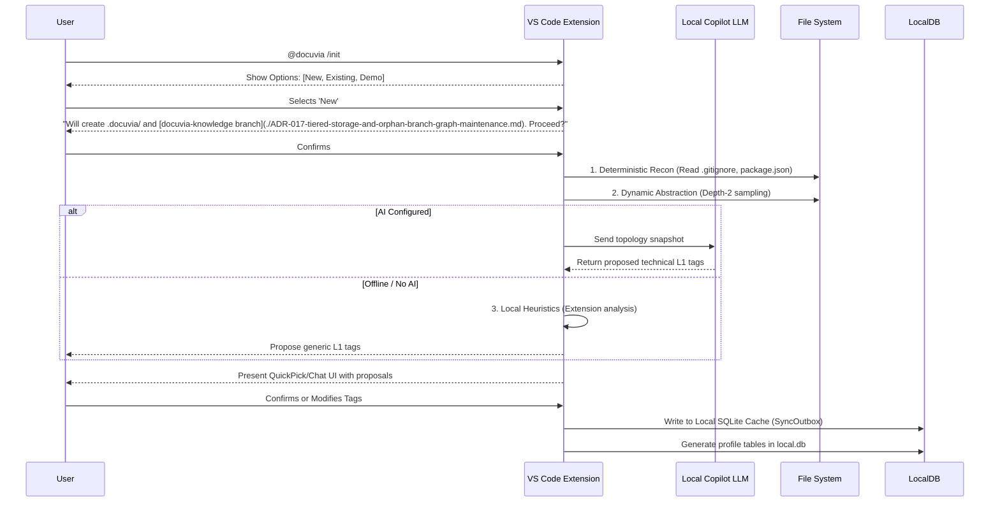

---
---
Date: 2026-07-02
Status: Superseded
Supersedes: None
---

# VS Code Client Onboarding & Scope Discovery (Zero to One)

> **Implementation status:** Tracked in the roadmap, not here — see [Workspace Onboarding (`/init`)](../roadmap/features/workspace-onboarding-init.md) in [Phase 5](../roadmap/phase-5-local-first-vs-code-client-web-ui.md).

## Core Pain Points & Objectives

Achieve a "Zero to One" onboarding experience within 1 minute without forcing users to manage SQLite directly. Prevent Token explosions and AI hallucinations using a "Pre-scanning, Intelligent Proposal, and Human Consent" flow.
Incorporate Tolaria-inspired "First Launch" principles:

- **User Autonomy (Clear Choices):** Provide explicit options rather than forcefully initializing a workspace.
- **Transparent Artifact Creation:** Explicitly state what files and branches will be created.
- **Graceful Degradation (Offline/No-AI):** Ensure users without LLM configuration can still initialize and utilize local-first capabilities.

## Zero-Trust & Dynamic Abstraction Workflow

### 1. State Checkpoint & The `/init` Command UX (Clear Choices)

- VS Code TreeView detects the absence of the `.docuvia` directory and provides an `[Initialize Docuvia Knowledge Base]` button.
- When the user clicks the button or runs `@docuvia /init`, show a VS Code QuickPick:
  - `✨ Initialize Knowledge Graph here` (New)
  - `🔗 Connect to Remote Graph` (Existing)
  - `📚 Clone & Explore Demo Sandbox` (Getting Started/Template)

### 2. Transparent Artifact Creation

- Before writing any files for a "New" initialization, show a confirmation prompt/chat card:
  _"This will create a `.docuvia/` folder for settings and a hidden `docuvia-knowledge` orphan branch for your graph. No source code will be modified. Proceed?"_

### 3. Deterministic Recon (Local)

- **Boundary Establishment**: Reads `.gitignore` to filter hidden directories.
- **Feature Sniffing**: Looks for ecosystem markers. Does not transmit massive trees; uses shallow sampling.

### 4. Optional AI & Graceful Degradation (Offline Fallback)

- If the `integrations-openai-ai-server` endpoint is unconfigured, unreachable, or the user opts out, the system skips the "Intelligent Proposal" step.
- Instead, the system relies on **Local Heuristics Only** (the "Unknown Framework Defense" logic). It calculates file extension ratios and uses generic software engineering directory conventions to propose safe fallback L1 tags (e.g., `CoreLogic`, `UI`, `API`), allowing the user to manually refine them without breaking the flow.

### 5. Radical Candor & UI Consent

- Never blindly writes to YAML. Distinguishes between "Certain Technical Dimensions" and "Inferred Business Dimensions" in the UI.

### 6. Record & Cognitive Snapshot (`local.db`)

- Generates a hidden profile table within `local.db` capturing the topology snapshot (e.g., CI/CD boundaries, primary depth). This acts as an $O(1)$ cache for future L2/L3 abstraction tasks, eliminating the need to rescan the workspace.

## Anchoring & Semantic Drift Prevention

To prevent line-number drift and Editor Host freezing when providing `vscode.CodeLensProvider` and `vscode.HoverProvider` capabilities, Docuvia employs a progressive enrichment fallback chain defined in [ADR-015](./ADR-015-progressive-enrichment-and-ast-lsp-dual-engine.md):

1. **AST Primary:** Anchoring is primarily handled by the local WASM AST Microkernel ([ADR-020](./ADR-020-unified-isomorphic-ast-microkernel.md)) running in a Web Worker, which is fast and handles raw source perfectly without compilation.
2. **LSP Fallback:** If the AST cannot resolve complex dependencies or is dealing with unsaved "dirty" editor buffers, the system falls back to `vscode.executeDocumentSymbolProvider` (LSP).
3. **LLM Last Resort:** Only if both deterministic parsers fail does the system delegate to an LLM to heuristically anchor the logic.
superseded_by: []
