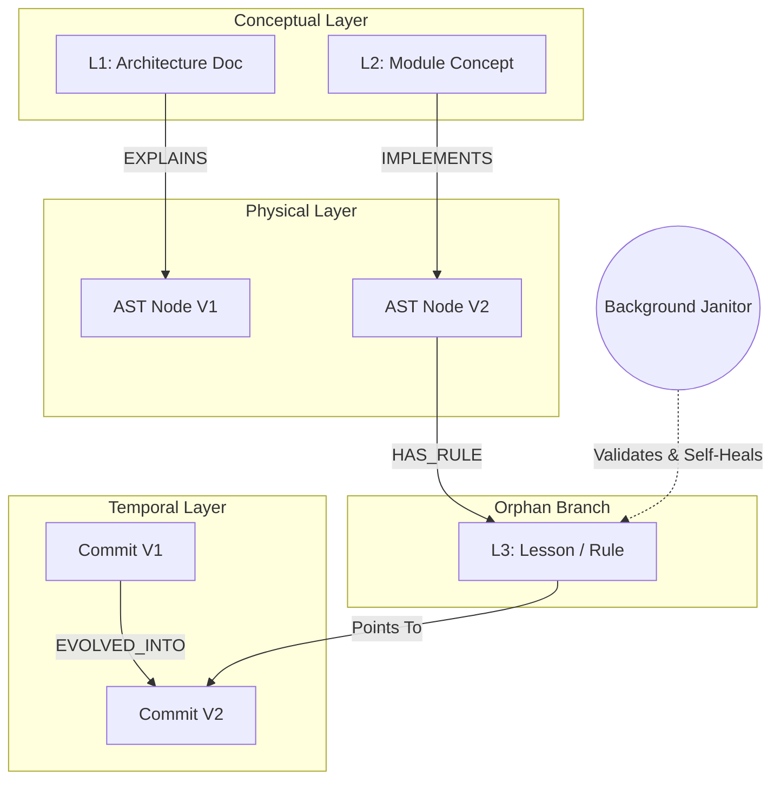

---
---

Date: 2026-07-02
Status: Deprecated
Supersedes: None
---

# ADR-018: Temporal & Conceptual Bidirectional Linking

> **Implementation status:** Tracked in the roadmap, not here — see [Temporal Decay Scoring](../roadmap/features/temporal-decay-scoring.md) in [Phase 4](../roadmap/phase-4-git-isomorphic-sync-temporal-knowledge.md). Note the self-healing re-anchoring Janitor described below has no dedicated roadmap entry yet.

## Context

A purely spatial 3D [AST graph](./ADR-020-unified-isomorphic-ast-microkernel.md) only reflects "what calls what" at the current HEAD. To build an [Agentic OS](./ADR-007-agentic-rag-routing.md), the AI must understand the "Concept" (why a function exists in relation to architecture docs) and the "Time/History" (how and why it evolved). Furthermore, associating historical [L3 rules (deltas)](./ADR-005-knowledge-abstraction-strategy.md) solely to a commit hash is fragile due to Git history rewriting (e.g., `git rebase` or `commit --amend`).

## Decision

The graph schema will be expanded to 4D, integrating [L1/L2 conceptual nodes](./ADR-005-knowledge-abstraction-strategy.md) and temporal edges, protected by a self-healing bidirectional binding mechanism:

- **Conceptual & Temporal Edges**: We will introduce semantic edges like `IMPLEMENTS` (Physical -> Conceptual) and `EXPLAINS` (Document -> Physical), alongside temporal edges like `EVOLVED_INTO` (Version 1 -> Version 2) tagged with the commit SHA and diff summary.
- **Bidirectional Validation**: L3 rules in the [orphan branch](./ADR-017-tiered-storage-and-orphan-branch-graph-maintenance.md) will contain a pointer to the user's commit, and the [local DB](./ADR-014-sql-indexed-graph-and-database-as-ipc.md) will register a `HAS_RULE` edge pointing to the L3 node.
- **Self-Healing Re-anchoring**: A [Background Janitor](./ADR-008-asynchronous-metabolism.md) will validate these links. If a target commit disappears (due to a rebase), the system will search the current graph for the original `content_hash` of the AST node. If found, it automatically re-anchors the L3 rule to the new commit. If the code is completely gone, the invalid L3 rule is safely garbage collected.

## Consequences

- **Positive**: AI Agents can navigate complex 4D queries (e.g., tracking how a module evolved over 3 months to satisfy a specific architectural concept).
- **Positive**: Unprecedented data resilience. The knowledge graph is immune to destructive Git history rewriting, preserving L3 lessons across rebases.
- **Negative**: Increases the complexity of the database schema and requires constant background janitorial processing to maintain data integrity.

## Diagram

superseded_by: []
