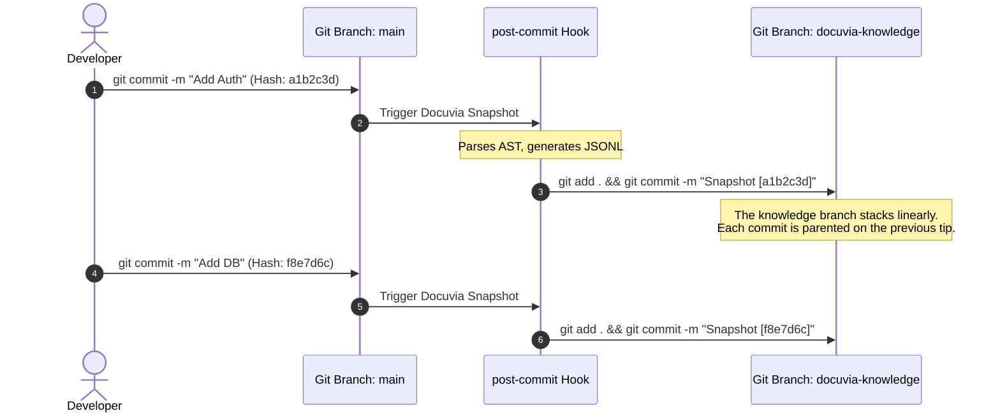

# Git Branch as Sole Source of Truth

## Context

During the Docuvia2 refactoring, there was a strong temptation to make the local SQLite database (`local.db`) the sole source of truth for the knowledge graph.

Initially, there was a temptation to abandon Git because developers experienced a "6-minute hydration delay" when trying to restore knowledge from a Git branch back into the database. This led to a false assumption that "Git is too slow for knowledge storage," prompting a push towards a pure SQLite architecture.

However, a deeper architectural review revealed two critical flaws in this assumption:

1. **The Performance Fallacy**: The 6-minute delay was not Git's fault. It was an implementation error caused by performing thousands of SQLite `INSERT` statements with auto-commit enabled, leading to massive I/O bottlenecks. Properly implemented Bulk Inserts inside a transaction take less than 10 seconds (see STOR-002).
2. **The Product Mission**: The core value proposition of Docuvia is not to build another local, disposable code scanner (like GitNexus or Graphify), but to build a system where **architectural knowledge can be shared, versioned, and preserved across the entire development team**. Any architecture that prevents seamless knowledge sharing and historical tracking violates this core mission.

We needed a storage strategy that solves three core problems:

1. **Team Sync**: How do developers share extracted knowledge without needing a centralized Cloud Database?
2. **Conflict Resolution**: What happens when two developers extract different architectural nodes simultaneously?
3. **Traceability (Reverse Lookup)**: How do we trace a specific architectural decision back to the exact code commit that introduced it?

## Decision

We enforce the **Git repository (specifically the `docuvia-knowledge` orphan branch) as the Sole Source of Truth**. SQLite is demoted to a transient query engine (see STOR-002).

This decision is implemented via a **Continuous Merge Strategy & Commit Reverse Lookup**:

1. **Native Team Sync via Git**: The knowledge graph is persisted as JSONL and Markdown files in the `docuvia-knowledge` branch. A team member's `git pull` fetches `origin/docuvia-knowledge`, but since that branch is normally never checked out, a plain `git pull` does not by itself advance the local `docuvia-knowledge` ref. Docuvia performs the fetch → reconcile → update-ref cycle described in point 3 itself; "git pull and you're synced" describes the outcome for the developer, not a claim that git's default fetch merge does this unassisted.
2. **Own-Clone Writes Are Always Linear ("Continuous Stacking")**: Every `snapshot` commit is a full-tree restatement of the just-completed analysis (`deleteall` + re-add everything), parented on the current tip of the _local_ `docuvia-knowledge` branch. This is **not** a ban on the `deleteall` fast-import operation — a full-tree replace per commit is the correct representation of "the graph as of now," and it keeps prior commits reachable as long as each new commit is properly parented on the previous tip. What is actually forbidden is a **force-moved ref that leaves prior commits unreachable** (e.g. committing a fresh, parentless root on every snapshot). Because a single clone's commits are always parented on its own prior tip, and each commit's content never depends on that parent (it's a full restatement, not a diff), **rollback (checking out an older source commit and re-analyzing) or working across multiple source branches never requires forking or merging the knowledge branch on a single clone** — each analysis simply appends the next self-describing entry (see point 4) to that clone's journal. Reconstructing "what did the knowledge graph look like at source commit X" from that journal is a read-time lookup performed during hydration (see STOR-002), not a write-time branching decision.
3. **Conflict Resolution ("Latest Wins") Applies Only Across Clones**: A real merge is needed only when two independently-advancing copies of `docuvia-knowledge` (two developers, or one developer's two machines) have genuinely diverged into two tips. We deliberately do **not** attempt a semantic, line-by-line JSONL merge — a plain `git merge -X theirs` over full-tree-replace commits can splice together a graph neither side ever had (e.g. one side's node deletion surviving while the other side's edge referencing that node also survives). Instead we perform a **tree-adoption merge**: create a two-parent merge commit whose tree is wholesale adopted from the "winning" side. The winner is (a) the side whose stamped source commit (point 4) is a descendant of the other's stamped source commit — i.e. topological recency in the _source_ repository — or (b) if neither stamped source is an ancestor of the other (unrelated lines of source history), the side with the newer committer timestamp. Both original tips stay reachable through the merge commit's two parents; nothing is deleted, only the tree adopted for the new tip is asymmetric. Wall-clock recency alone is never used when a topological answer is available, because a same-day re-analysis of old code is "newer" in time but describes older code.
4. **Commit Traceability**: Every `snapshot` commit's message carries the first 7 characters of the source-code commit hash in its subject line (e.g. `Snapshot [a1b2c3d]`) for human-facing lookup via `git log --grep="<7-char-hash>"`, and the full 40-character source SHA as a `Docuvia-Source: <sha>` trailer for unambiguous machine lookup (7-char prefixes can collide in large repositories, and the merge-winner logic in point 3 needs an exact ancestry check).
5. **Branch Creation Is Not a Special Case**: The knowledge branch's first commit (created during `init`) is produced by the same mechanism as every later snapshot — a full-tree write of an empty graph (nothing has been analyzed yet), stamped with the source HEAD hash at that moment — not a separate, unstamped "initialize empty knowledge graph" commit disconnected from source history. The branch is never in a state that doesn't correspond to some source commit.

### The Knowledge Mapping Tree (Out-of-Band Linkage)

Crucially, the `docuvia-knowledge` branch is an **Orphan Branch**. It NEVER merges with the main source code branch. Their git histories are completely parallel and isolated. The linkage is strictly out-of-band, achieved by stamping the source commit hash into the knowledge commit message.

This diagram shows the common case: one clone, moving forward. Rollback and multi-branch source development still produce a single linear journal on that clone (point 2) — they don't appear in this diagram because they don't change its shape, only which source hash gets stamped on the next entry. The only scenario that produces a _second_ tip needing reconciliation is two clones (point 3), which is not pictured here.

## Consequences

- **Positive**: Perfectly aligns with the project's core mission of preservation and sharing. Achieves decentralized team synchronization (with Docuvia performing the reconciliation git doesn't do automatically for an uncheckedout branch). Provides full historical preservation and lightning-fast reverse lookup from a source commit to its architectural impact. Rollback and multi-branch source development are handled without ever forking the knowledge branch itself.
- **Negative**: Requires writing robust hydration (Git to SQLite) and serialization (SQLite back to Git) pipelines, plus a real fetch/tree-adoption-merge/push cycle for cross-clone reconciliation (git's default `pull` is not sufficient — see point 1). Git history on the knowledge branch grows continuously (though managed by JSONL format's clean diffing). Requires assuming the user environment has a functional Git installation.

> **Implementation Status (Fully Resolved — 2026-07-17)**: The storage strategy and continuous merge mapping have been fully implemented in `lib/libgit2`. Specifically, the `packDirectoryToBranch` service correctly processes parents linearly via fast-import `from` (satisfying STOR-001 point 2), ensuring prior commits stay reachable, and stamps full metadata trailers (`Docuvia-Source: <sha>`) in commit messages to guarantee unambiguous machine-readable traceability.
