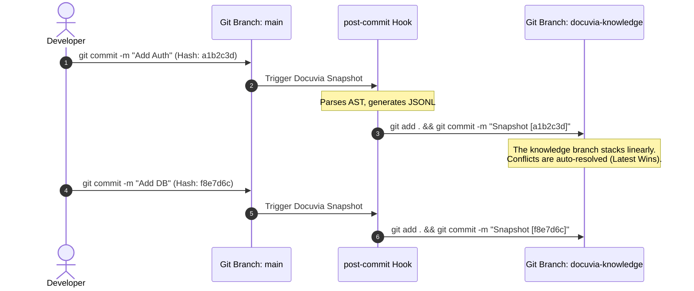

# Git Branch as Sole Source of Truth

## Context
During the Docuvia2 refactoring, there was a strong temptation to make the local SQLite database (`local.db`) the sole source of truth for the knowledge graph. 

Initially, there was a temptation to abandon Git because developers experienced a "6-minute hydration delay" when trying to restore knowledge from a Git branch back into the database. This led to a false assumption that "Git is too slow for knowledge storage," prompting a push towards a pure SQLite architecture.

However, a deeper architectural review revealed two critical flaws in this assumption:
1. **The Performance Fallacy**: The 6-minute delay was not Git's fault. It was an implementation error caused by performing thousands of SQLite `INSERT` statements with auto-commit enabled, leading to massive I/O bottlenecks. Properly implemented Bulk Inserts inside a transaction take less than 10 seconds (see STOR-002).
2. **The Product Mission**: The core value proposition of Docuvia is not to build another local, disposable code scanner (like GitNexus or Graphify), but to build a system where **architectural knowledge can be shared, versioned, and preserved across the entire development team**. Any architecture that prevents seamless knowledge sharing and historical tracking violates this core mission.

We needed a storage strategy that solves three core problems:
1. **Team Sync**: How do developers share extracted knowledge without needing a centralized Cloud Database?
2. **Conflict Resolution**: What happens when two developers extract different architectural nodes simultaneously?
3. **Traceability (Reverse Lookup)**: How do we trace a specific architectural decision back to the exact code commit that introduced it?

## Decision
We enforce the **Git repository (specifically the `docuvia-knowledge` orphan branch) as the Sole Source of Truth**. SQLite is demoted to a transient query engine (see STOR-002).

This decision is implemented via a **Continuous Merge Strategy & Commit Reverse Lookup**:

1. **Native Team Sync via Git**: The knowledge graph is persisted as JSONL and Markdown files in the `docuvia-knowledge` branch. This allows knowledge to travel seamlessly with the repository. A team member simply runs `git pull`, and they instantly receive the latest L2/L3 knowledge extracted by their peers.
2. **Merge Strategy (Continuous Stacking)**: The `docuvia-knowledge` branch is never forcefully overwritten or wiped with `deleteall`. We continuously stack updates on top of the branch history.
3. **Conflict Resolution ("Latest Wins")**: Because knowledge represents the *current* state of the architecture, we do not require humans to manually resolve merge conflicts on the knowledge branch. If concurrent updates occur, we rely on Git's `merge -X theirs` (or equivalent "latest wins" behavior) to automatically favor the newest commit. The latest commit is always the truth.
4. **7-Char Commit Traceability**: Every time `snapshot` exports data, the first 7 characters of the source code commit hash MUST be appended to the knowledge branch's commit message. This establishes a bidirectional link, allowing near-instant reverse lookup using `git log --grep="<7-char-hash>"` to find exactly what architectural nodes were generated by a specific code change.

### The Knowledge Mapping Tree (Out-of-Band Linkage)

Crucially, the `docuvia-knowledge` branch is an **Orphan Branch**. It NEVER merges with the main source code branch. Their git histories are completely parallel and isolated. The linkage is strictly out-of-band, achieved by stamping the source commit hash into the knowledge commit message.

## Consequences
- **Positive**: Perfectly aligns with the project's core mission of preservation and sharing. Achieves decentralized team synchronization for free. Provides full historical preservation and lightning-fast reverse lookup from a source commit to its architectural impact.
- **Negative**: Requires writing robust hydration (Git to SQLite) and serialization (SQLite back to Git) pipelines. Git history on the knowledge branch grows continuously (though managed by JSONL format's clean diffing). Requires assuming the user environment has a functional Git installation.

