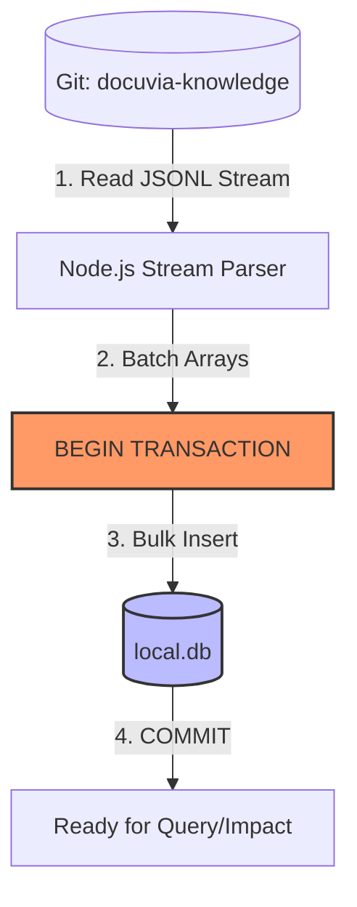

# SQLite as Ephemeral Query Engine

## Context
Because the Git branch is the sole source of truth (STOR-001), we cannot efficiently execute complex relational queries (like finding a 1-hop blast radius for an `impact` analysis) directly against raw JSONL and Markdown files sitting on disk. 

Past iterations failed because restoring knowledge from Git back into a database (Hydration) took several minutes. This latency was mistakenly blamed on the Git-Native architecture, but was actually caused by poor database implementation (e.g., executing thousands of `INSERT` statements with auto-commit enabled, causing massive I/O bottlenecks). We must ensure these implementation failures do not recur and dictate our architecture.

## Decision
The local SQLite database (`local.db` inside `.docuvia/`) acts entirely as an **Ephemeral Query Engine**.
1. **Disposable**: The database can be deleted (`docuvia clean`) or corrupted at any time without causing permanent data loss. 
2. **Hydration**: When the user opens the project or pulls new changes from the Git remote, the system parses the JSONL files from the `docuvia-knowledge` branch and hydrates them into the SQLite database.
3. **Write-Through**: When `analyze` extracts new data, it is written to SQLite for immediate querying, and then immediately flushed back to the Git branch via the `snapshot` process.

### Strict Performance Guardrails for Hydration
To prevent the "6-minute hydration" failure from recurring, AI Agents and developers implementing the Hydration pipeline MUST adhere to the following physical constraints:
- **Zero Auto-Commit Loops**: You must NEVER execute row-by-row `INSERT` statements outside of a transaction.
- **Bulk Insert Required**: Hydration must parse the JSONL stream and execute `Bulk Inserts` wrapped in a `BEGIN TRANSACTION` block.
- **Latency Threshold**: Restoring 100,000 nodes from JSONL into SQLite must complete in **< 10 seconds**. If the ORM (e.g., Drizzle) introduces unacceptable overhead during bulk inserts, the implementation must bypass the ORM and use the raw database driver (`better-sqlite3` prepared statements) for the hydration path.

### Hydration Flow

## Consequences
- **Positive**: Provides the blazing-fast SQL JOIN performance required for real-time `query` and `impact` commands, while keeping the data safely versioned in Git. Strict performance guardrails prevent poor implementations from breaking the UX.
- **Negative**: Adds the architectural overhead of writing a reliable and highly optimized Hydration (Git -> SQLite) engine to complement the existing Export (SQLite -> Git) engine.

