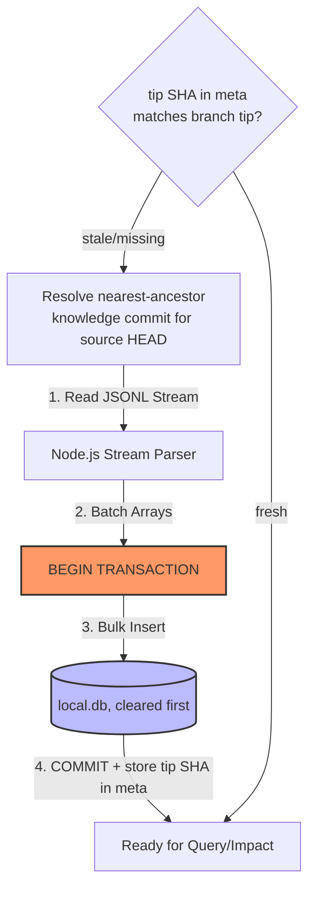

# SQLite as Ephemeral Query Engine

## Context

Because the Git branch is the sole source of truth (STOR-001), we cannot efficiently execute complex relational queries (like finding a 1-hop blast radius for an `impact` analysis) directly against raw JSONL and Markdown files sitting on disk.

Past iterations failed because restoring knowledge from Git back into a database (Hydration) took several minutes. This latency was mistakenly blamed on the Git-Native architecture, but was actually caused by poor database implementation (e.g., executing thousands of `INSERT` statements with auto-commit enabled, causing massive I/O bottlenecks). We must ensure these implementation failures do not recur and dictate our architecture.

## Decision

The local SQLite database (`local.db` inside `.docuvia/`) acts entirely as an **Ephemeral Query Engine**.

1. **Disposable**: The database can be deleted (`docuvia clean`) or corrupted at any time without causing permanent data loss — contingent on point 3 actually holding (see Implementation Status below).
2. **Hydration is a rebuild, not an upsert**: Hydration parses the JSONL files from a specific `docuvia-knowledge` commit and bulk-loads them into a freshly-cleared SQLite database. It never diffs against existing rows — the git commit is a full restatement of the graph (STOR-001 point 2), so the correct local state is always "wipe and reload," never an incremental patch.
3. **Write-Through**: When `analyze` extracts new data, it is written to SQLite for immediate querying, and then immediately flushed back to the Git branch via the `snapshot` process.

### Hydration Trigger & Staleness Check

"When the user opens the project" is not a real CLI event, so hydration is triggered explicitly instead:

- A `meta` table in `local.db` stores the knowledge-branch tip SHA that the current database contents were hydrated from.
- Every read-path command (`query`, `impact`, `status`, `review`, …) compares that stored tip SHA against `docuvia-knowledge`'s current tip before running. If they differ, or `local.db` doesn't exist, hydration runs first, automatically.
- An explicit `docuvia hydrate` command exists for cases where a user wants to force it (e.g. after manually editing the knowledge branch).

### Source-Commit Lookup (Read-Time Nearest-Ancestor Resolution)

Because a single clone's knowledge-branch journal can contain entries stamped with different source commits (STOR-001 point 2 — rollback, multi-branch development), hydrating "the current state" means resolving _which_ knowledge commit corresponds to the current source `HEAD`, not just reading the branch tip blindly:

1. One pass over the knowledge branch (`git log docuvia-knowledge --format="%H %s%n%(trailers:key=Docuvia-Source,valueonly)"`) builds a `Map<sourceSha, knowledgeSha>` from the `Docuvia-Source` trailers (STOR-001 point 4). If the same source SHA was analyzed more than once (rollback re-analysis), the newest wins.
2. One pass over source ancestry (`git rev-list HEAD`) finds the first SHA present in that map — in the normal forward-development case this hits on the first or second entry.
3. Hydrate from the resolved knowledge commit, not necessarily the branch's absolute tip.

This map is cached in the `meta` table, keyed by the knowledge-branch tip SHA it was built from (invalidated whenever that tip moves) — it is a disposable index like the rest of `local.db`; the git log scan above is always the source of truth it's rebuilt from.

### Strict Performance Guardrails for Hydration

To prevent the "6-minute hydration" failure from recurring, AI Agents and developers implementing the Hydration pipeline MUST adhere to the following physical constraints:

- **Zero Auto-Commit Loops**: You must NEVER execute row-by-row `INSERT` statements outside of a transaction.
- **Bulk Insert Required**: Hydration must parse the JSONL stream and execute `Bulk Inserts` wrapped in a `BEGIN TRANSACTION` block.
- **Latency Threshold**: Restoring 100,000 nodes from JSONL into SQLite must complete in **< 10 seconds**. If the ORM (e.g., Drizzle) introduces unacceptable overhead during bulk inserts, the implementation must bypass the ORM and use the raw database driver (`better-sqlite3` prepared statements) for the hydration path.

### Hydration Flow

If the FTS5 `AFTER INSERT` triggers on `l2_nodes`/`l3_nodes` (see `0001_init.sql`) cause the bulk insert to miss the <10s bar at 100k-node scale, drop the FTS virtual tables before the bulk load and recreate them afterward with a single bulk `INSERT INTO ... SELECT` instead of firing per-row.

> **Implementation Status (Fully Resolved — 2026-07-17)**: The hydration pipeline described in this ADR (JSONL-to-SQLite direction) has been fully implemented in `hydration.service.ts` with the `resolveHydrationCommit` (Nearest-Ancestor resolution algorithm) and `hydrate` methods. Specifically, it scans the Git branch log to build the `sourceSha -> knowledgeSha` mapping, walks current HEAD's ancestry chain to resolve the nearest matching knowledge commit, reads `nodes.jsonl` and `edges.jsonl` in bulk, and invokes `bulkLoadGraph` to rebuild the graph store. Additionally, any remaining gaps regarding L3 node serialization to the knowledge branch have been analyzed and resolved in accordance with GRPH-002's validity-status export filter.

## Consequences

- **Positive**: Provides the blazing-fast SQL JOIN performance required for real-time `query` and `impact` commands, while keeping the data safely versioned in Git. Strict performance guardrails prevent poor implementations from breaking the UX. Rebuild-not-upsert semantics keep hydration simple (no reconciliation logic needed locally).
- **Negative**: Adds the architectural overhead of writing a reliable and highly optimized Hydration (Git -> SQLite) engine to complement the existing Export (SQLite -> Git) engine, including the nearest-ancestor source-commit resolution step. Every read-path command now carries a staleness-check cost (cheap — one ref comparison — except on the cache-miss path).
