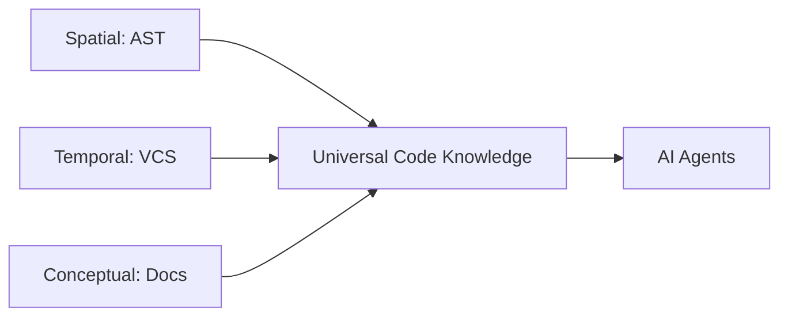

> **Note:** This document contains competitor analysis and self-evaluation notes that have not been fully integrated into the current implementation yet.

# Vision, Competitive Landscape & Gap Registry

## The North Star

Docuvia aims to be a **VCS-based Knowledge Evolver** that acts as the ultimate **Cognitive Baseline for AI Agents**. Rather than being just another tool that reads code, Docuvia bridges the cognitive gap between human developers and AI assistants by ensuring both operate from a singular, explicitly documented, and temporally aware truth source.

- **Spatial (AST & Blast Radius)**: What is the exact call graph and structure of the code?
- **Temporal (History & Time)**: How did this code look in the past? What bugs were fixed, and what rules were learned from rebases?
- **Conceptual (Semantics & Docs)**: Which architectural document or PR discussion explains the rationale behind this module?

## Competitive Landscape Analysis

By comparing Docuvia with top-tier, highly mature open-source projects, we identify best-in-class architectural paradigms that shape our evolution. _(Refer to the [Master Dashboard](../roadmap/README.md) for detailed implementation status)._

### 1. Code Knowledge Graph (Spatial Accuracy)

| Project                 | Approach & Implementation                                                                                                                                                      | Status                                                                |
| :---------------------- | :----------------------------------------------------------------------------------------------------------------------------------------------------------------------------- | :-------------------------------------------------------------------- |
| **`code-review-graph`** | Relies strictly on Tree-sitter (30+ languages) to generate an Abstract Syntax Tree (AST), storing exact call flows into an SQLite database without depending on raw text.      | -                                                                     |
| **`graphify`**          | Maps multi-modal inputs (PDFs, images, videos) into a knowledge graph alongside code and emphasizes seamless integration with AI development environments.                     | -                                                                     |
| **Docuvia**             | Adopts the precision of AST via Tree-sitter while expanding nodes beyond pure code to include L1/L2 conceptual nodes derived from commit histories and architecture documents. | [✅ Implemented](../roadmap/features/ast-microkernel-architecture.md) |

### 2. Token Efficiency Optimization

| Project                 | Approach & Implementation                                                                                                                                                                                                     | Status                                                                     |
| :---------------------- | :---------------------------------------------------------------------------------------------------------------------------------------------------------------------------------------------------------------------------- | :------------------------------------------------------------------------- |
| **`code-review-graph`** | Utilizes a "Blast Radius" algorithm to isolate only the affected code fragments via local BFS graph traversal. This drastically reduces token consumption by avoiding full-repo contexts.                                     | -                                                                          |
| **`headroom`**          | Creates a proxy layer to implement Prefix Caching and Semantic Deduplication.                                                                                                                                                 | -                                                                          |
| **Docuvia**             | Implements local Blast Radius calculations (e.g., `/api/graph/impact`) and semantic deduplication in the Agentic RAG router (`intent-router.ts`) to intercept and compress queries before they reach expensive LLM endpoints. | [🔲 Planned](../roadmap/features/semantic-deduplication-in-agentic-rag.md) |

### 3. Multi-Agent Collaboration

| Project        | Approach & Implementation                                                                                                                                                                               | Status                                                              |
| :------------- | :------------------------------------------------------------------------------------------------------------------------------------------------------------------------------------------------------ | :------------------------------------------------------------------ |
| **`GitNexus`** | Features a mature **PR Swarm Review** mechanism using 7 independent personas (risk, security, tests, etc.) that review code in parallel and synthesize a final output.                                  | -                                                                   |
| **Docuvia**    | Orchestrates specialized agents (Frontend, Backend, Schema Expert) via a state machine (`task-verifier.agent.md`) and borrows parallel swarm review concepts to lighten the load on singular verifiers. | [🔲 Planned](../roadmap/features/parallel-swarm-review-concepts.md) |

### 4. Frontend & Safety Guardrails

| Project        | Approach & Implementation                                                                                                                                                                                                                              | Status                                                           |
| :------------- | :----------------------------------------------------------------------------------------------------------------------------------------------------------------------------------------------------------------------------------------------------- | :--------------------------------------------------------------- |
| **`tolaria`**  | Utilizes a Tauri-based local-first desktop app and strictly enforces a CodeScene Ratchet Gate, blocking AI-generated code that degrades codebase health.                                                                                               | -                                                                |
| **`graphify`** | Focuses on interactive visualizations (`graph.html` and Mermaid call-flows) to give human developers an immediate understanding of the graph.                                                                                                          | -                                                                |
| **Docuvia**    | Enhances the Vite + React Dashboard (`kg-engine`) and VS Code Client to render interactive topology maps for implementation plans, ensuring Human-in-the-loop oversight and implementing rigorous health-check gates before committing AI suggestions. | [🔲 Planned](../roadmap/features/rigorous-health-check-gates.md) |

## Strategic Implementation Priorities

To achieve this vision, we integrate these industry-leading strategies into a cohesive LNode Enhancement framework:

1. **AST Parser Phase**: Enforce strict extraction of code references (Tree-sitter) alongside semantic knowledge.
2. **Blast Radius Queries**: Handle dependency expansion strictly locally (via SQL BFS) to bypass massive LLM token overhead.
3. **Graphify-like Visualization**: Empower developers with visual implementation plans rendered in the frontend to validate AI decisions safely.

## Self-Evaluation Score: 3 / 10 (Disjointed Pipeline, Pseudo-Local Architecture)

**Date: 2026-06-27**

After a rigorous comparative analysis against top-tier local-first tools within the workspace (`code-review-graph`, `GitNexus`, `headroom`, `tolaria`), Docuvia currently fails to deliver a true end-to-end local experience. While the "VCS-based Knowledge Evolver" vision is established and the CLI structure is scaffolded, the data pipelines and execution modes are disjointed.

To elevate Docuvia to an 8-9/10 score, the monolithic evaluation has been atomized into highly specific, actionable implementation targets, each now attached to the domain deep-dive it belongs to rather than tracked in a separate registry.

## Deep-Dive Comparisons & Gap Registry

Per-domain competitor benchmarks against sibling workspace projects (`code-review-graph`, `graphify`, `GitNexus`, `headroom`, `tolaria`), each followed by its atomized action-item registry (severity, target, deficit description, acceptance criteria):

- [AST & Semantic Graph](ast-semantic-graph.md) — Worker Pool Concurrency, AST Dependency Edge Creation, Native Parsing Fallback (superseded)
- [Agentic RAG](agentic-rag.md) — vector-search gap, resolved via [ADR-019](../adr/ADR-019-pgvector-migration.md)
- [MCP AI Interfaces](mcp-ai-interfaces.md) — Local MCP (stdio server), Agent Config Auto-Injection
- [IDE & VS Code Client](ide-vscode-client.md) — VS Code Webview Topology, Sub-second Save Updates
- [Data Pipeline & Sync](data-pipeline-sync.md) — Local AST Extraction Sync, Local SQLite Write Pipeline, File Hash Delta Detection
- [CLI & Core API Parity](cli-core-api.md) — Local BFS Blast Radius, Local HTML Visualization

See also the [Capabilities Matrix](capabilities-matrix.md) for a scored side-by-side across all projects.

See also the [Feature Implementation Audit](feature-audit-2026-07-08.md) — an independent pass over every `Done`/`WARN` roadmap feature checking for fabrication, functional defects, ADR drift, and stale docs (in progress, 48/61 features analyzed as of 2026-07-08).

## Gap Registry (quick reference)

| Domain                                 | Target Component                   | Lives in                                                                         |
| :------------------------------------- | :--------------------------------- | :------------------------------------------------------------------------------- |
| Local MCP                              | `@workspace/cli`                   | [MCP AI Interfaces](mcp-ai-interfaces.md#local-mcp-stdio-server)                 |
| Agent Config                           | `@workspace/cli` (`init-agent`)    | [MCP AI Interfaces](mcp-ai-interfaces.md#agent-config-auto-injection)            |
| Data Pipeline                          | `@workspace/cli` (`sync`)          | [Data Pipeline & Sync](data-pipeline-sync.md#local-ast-extraction-sync)          |
| Local Storage                          | `@workspace/cli` (`sync`)          | [Data Pipeline & Sync](data-pipeline-sync.md#local-sqlite-write-pipeline)        |
| Parsing Perf _(superseded by ADR-020)_ | `@workspace/ast-core`              | [AST & Semantic Graph](ast-semantic-graph.md#native-parsing-fallback-superseded) |
| Worker Mgmt                            | `@workspace/ast-core`              | [AST & Semantic Graph](ast-semantic-graph.md#worker-pool-concurrency)            |
| Token Opt                              | `@workspace/cli` (`query`)         | [CLI & Core API Parity](cli-core-api.md#local-bfs-blast-radius)                  |
| AST Precision                          | `@workspace/ast-core`              | [AST & Semantic Graph](ast-semantic-graph.md#ast-dependency-edge-creation)       |
| Local UI                               | `@workspace/cli` (`visualize`)     | [CLI & Core API Parity](cli-core-api.md#local-html-visualization)                |
| IDE UI                                 | `@workspace/vscode-client`         | [IDE & VS Code Client](ide-vscode-client.md#vs-code-webview-topology)            |
| Realtime UX                            | `@workspace/vscode-client`         | [IDE & VS Code Client](ide-vscode-client.md#sub-second-save-updates)             |
| Diff Opt                               | `@workspace/vscode-client` / `cli` | [Data Pipeline & Sync](data-pipeline-sync.md#file-hash-delta-detection)          |
