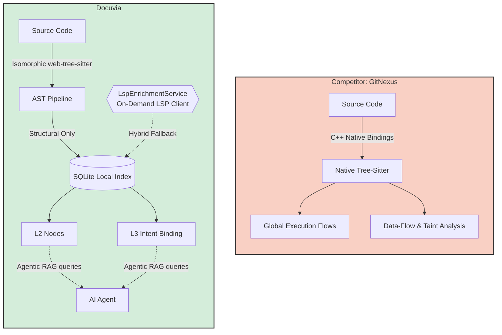

> **Note:** This document contains competitor analysis and self-evaluation notes that have not been fully integrated into the current implementation yet.

# AST & Semantic Graph Competitor Analysis

## Current State

Docuvia utilizes a multi-language Web-tree-sitter worker pool and a local-first SQLite schema. It features a "Ring 3" cross-file Scope Resolver that accurately maps `CALLS` edges by traversing import statements, and it anchors L1/L3 Architectural Intent directly to these L2 structural nodes.

## Competitors

GitNexus, Sourcegraph (Cody / sg)

## What Competitors Have That We Don't

- **Global Execution Flows (`processes`)**: While Docuvia accurately maps cross-file `CALLS` edges (Ring 3), we do not currently stitch these individual edges together into high-level, end-to-end "execution flows" or business processes like GitNexus does.
- **Data Dependency & Taint Analysis**: GitNexus and Sourcegraph can track variable assignments and data-flow (Reachability), not just function calls.
- **WASM Independence**: GitNexus compiles Node-API (C++) native bindings for tree-sitter, avoiding the memory limits and module-resolution quirks of Web-tree-sitter in CLI environments.

## What We Have That They Don't

- **Isomorphic Engine**: By strictly adhering to `web-tree-sitter`, Docuvia's AST engine can run in the Node.js CLI _and_ inside the VS Code Web Extension (browser). GitNexus completely fails in a pure browser/Web IDE environment because it relies on C++ binaries.
- **Intent Binding (L2/L3)**: We don't just extract structural syntax. Our graph schema is purpose-built to attach Human/AI Architectural Intent (`l3_nodes`) directly to the AST nodes, creating an Agentic RAG graph.

## Fatal Flaws

- **No Control Flow Graph (CFG)**: We have zero understanding of loops, conditionals, or statement-level blocks. Our AST extraction is strictly structural (Functions, Classes, Imports, Calls).
- **Hardcoded Path Aliases**: Our `ScopeResolver` currently hardcodes the `@workspace/` alias logic. It does not dynamically read the `tsconfig.json` paths or `package.json` exports, meaning it will silently fail to resolve cross-file calls in projects with complex monorepo layouts (unlike GitNexus which natively uses the TypeScript compiler API).

## Immediate Next Steps

- Keep the AST `ScopeResolver` "fast and dumb". Avoid bloating the AST pipeline with deep compiler logic (CFG, full execution flow stitching, or parsing `tsconfig.json` paths). The indexer should focus on maintaining fast, O(1) SQLite lookups.
- Achieve true parity with GitNexus via a **Hybrid Approach**: lazy-load an on-demand background LSP client (`LspEnrichmentService`). MCP tool calls like `docuvia_impact` will query the fast AST SQLite index first, and then conditionally escalate to the LSP for exact execution flows and taint analysis ONLY when required by an AI agent.

---

## Action Item Registry

### Native Parsing Fallback (SUPERSEDED)

**Severity:** 🟠 HIGH · **Target:** `@workspace/ast-core`

> **SUPERSEDED:** This fallback strategy contradicts [ADR-020](../adr/ADR-020-unified-isomorphic-ast-microkernel.md), which explicitly mandates pure WASM parsing to prevent cross-platform hash divergence. Retained below for historical evaluation context only — the codebase correctly follows ADR-020 and this item requires no further action.

Original deficit description (historical)

ADR-020 mandated pure WASM parsing (`web-tree-sitter`) to prevent cross-platform hash divergence. However, WASM is significantly slower than native C++ implementations. In massive legacy codebases, the initial AST scan will cause CPU spikes and unacceptable execution times. Competitors like `GitNexus` solve this by defaulting to high-speed Native C++ bindings and gracefully falling back to WASM only when binaries are unavailable.

Originally proposed acceptance criteria: attempt native `tree-sitter` bindings first, fall back to `web-tree-sitter` (WASM) if unavailable, and keep AST hashing deterministic regardless of engine. All three points are moot under ADR-020's pure-WASM mandate.

### Worker Pool Concurrency

**Severity:** 🟠 HIGH · **Target:** `@workspace/ast-core`

**Deficit:** When parsing hundreds of files simultaneously (e.g., during a large git merge or initial project onboarding), running AST parsing sequentially is too slow, but running it unrestrictedly in parallel will crash the Node.js process (OOM). There is currently no robust concurrency management for local parsing.

**Acceptance Criteria:**

1. Implement a `worker_threads` pool in `@workspace/ast-core`.
2. Limit the maximum concurrent workers to `os.cpus().length - 1` to ensure the machine remains responsive.
3. Implement a strict memory ceiling and a timeout (quarantine) mechanism to kill and respawn workers that hang on malicious or overly complex source files.

### AST Dependency Edge Creation

**Severity:** 🟠 HIGH · **Target:** `@workspace/ast-core`

**Deficit:** Currently, the AST microkernel successfully identifies files and functions to create L2 and L3 nodes, but it fails to map the relationships between them. For [Local BFS Blast Radius](cli-core-api.md#local-bfs-blast-radius) to work, the graph must actually possess edges.

**Acceptance Criteria:**

1. Enhance the tree-sitter logic in `@workspace/ast-core` to extract `ImportDeclaration`, `CallExpression`, and interface implementations across supported languages.
2. Resolve local file paths to correctly identify inter-module dependencies.
3. Output these relationships so the CLI sync pipeline can `INSERT` them into the `node_links` table in SQLite.
