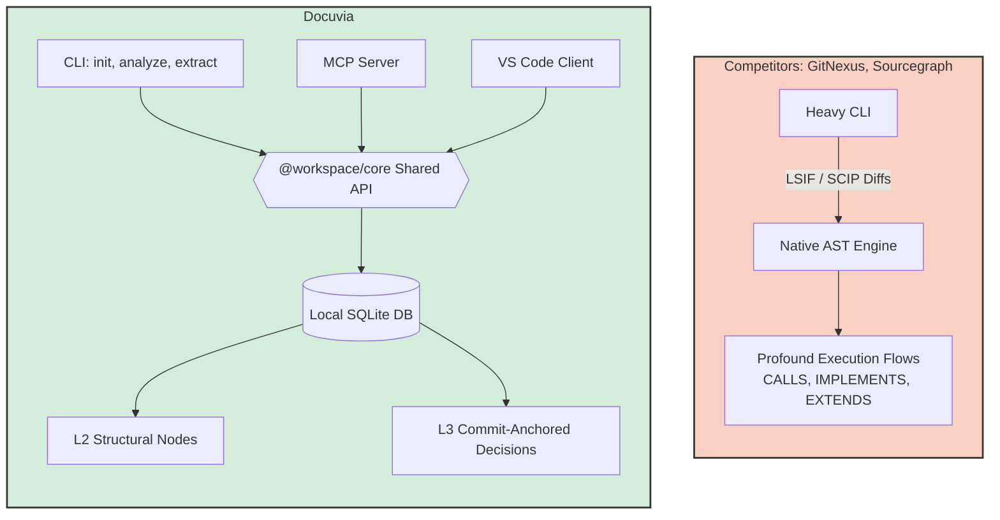

> **Note:** This document contains competitor analysis and self-evaluation notes that have not been fully integrated into the current implementation yet.

# CLI & Core API Parity Competitor Analysis

## Current State

This document tracks the implementation status of CLI commands (init, analyze, extract, query, clean, status, detect-changes, sync), their alignment with the Shared Core API (`@workspace/core`), and parity across other presentation layers (MCP, VS Code). Implementation is largely complete and well-aligned, with recent architectural updates providing Core API encapsulation (ADR-021), multi-root workspace isolation, feature parity across MCP tools, and localized CLI fixes.

## Competitors

GitNexus, Sourcegraph (Cody / sg), Cursor (Shadow Workspace), GitHub Copilot (Workspace)

## What Competitors Have That We Don't

- Git-integrated dirty-tracking (GitNexus) and LSIF/SCIP diffs (Sourcegraph) or fast LSP-based invalidation (Cursor).
- Direct compilation of tree-sitter parsers, explicit `.wasm` bundling via loaders, or native bindings (Node-API).
- Profound execution flows out of the box (`CALLS`, `IMPLEMENTS`, `EXTENDS`, `ACCESSES`).
- Automatic linking of high-level architectural intent (embeddings) to underlying symbols without a separate extraction pass.

## What We Have That They Don't

- Unified local-first Core API connecting CLI commands with MCP tools in a single SQLite DB.
- Integrated L3 decision extraction that anchors directly to commits.

## Fatal Flaws

- Historically fragile WASM loading strategies that broke based on package manager hoisting.
- High overhead if delta tracking (file hashing) fails to match fast LSP-based invalidation on large codebases.
- Limited semantic edge depth (recently added `CALLS`, but missing broader type-aware dependencies).

## Immediate Next Steps

- Scale incremental sync (`AnalyzeService`) for large monorepos.
- Expand semantic graph to include cross-module `IMPLEMENTS` and `EXTENDS`.
- Refine background L3 Extraction (`--deep` flag) for better LLM context building.

---

## Action Item Registry

### Local BFS Blast Radius

**Severity:** 🟠 HIGH · **Target:** `@workspace/cli` (`query` command)

**Deficit:** The current `docuvia query` command limits token consumption by simply taking the top 5 records that match a `LIKE` query. While this prevents token explosion, it completely ignores topological relationships. If module A depends on module B, and a developer queries module B, the AI is not informed about module A. A generic Breadth-First Search (BFS) graph traversal solves this flawlessly.

**Acceptance Criteria:**

1. Extend `query.ts` to utilize the `node_links` table in SQLite (see [AST Dependency Edge Creation](ast-semantic-graph.md#ast-dependency-edge-creation) — this depends on edges actually existing).
2. Implement a local BFS algorithm that accepts a target node and a `depth` parameter (e.g., depth=2).
3. Extract and return the graph neighborhood (callers and callees) formatted tightly as part of the `<docuvia_context>` prompt.

> Cross-reference: the roadmap lists [Smart Blast Radius (WASM Semantic Diff)](../roadmap/features/smart-blast-radius-wasm-semantic-diff.md) as ✅ Done — verify it specifically covers depth-parameterized BFS over `node_links` (not just semantic diffing) before treating this item as fully closed.

### Local HTML Visualization

**Severity:** 🟡 MEDIUM · **Target:** `@workspace/cli` (`visualize` command)

**Deficit:** If a developer clones a repository offline, extracting the graph is invisible to them. Starting the `kg-engine` React dashboard requires running a dev server, which is slow and heavy. `code-review-graph` provides a zero-friction CLI command to dump the graph into a standalone HTML file. Docuvia needs this feature for immediate visual validation.

**Acceptance Criteria:**

1. Add a `docuvia visualize` command to `@workspace/cli`.
2. Query `.docuvia/local.db` for `l2_nodes` and `node_links`.
3. Generate a standalone HTML file embedding D3.js or Mermaid.js.
4. Output the HTML file to the user's workspace (e.g., `.docuvia/graph.html`) and open it in the default browser.

> Feeds into [VS Code Webview Topology](ide-vscode-client.md#vs-code-webview-topology), which reuses this same rendering logic inside the IDE.
