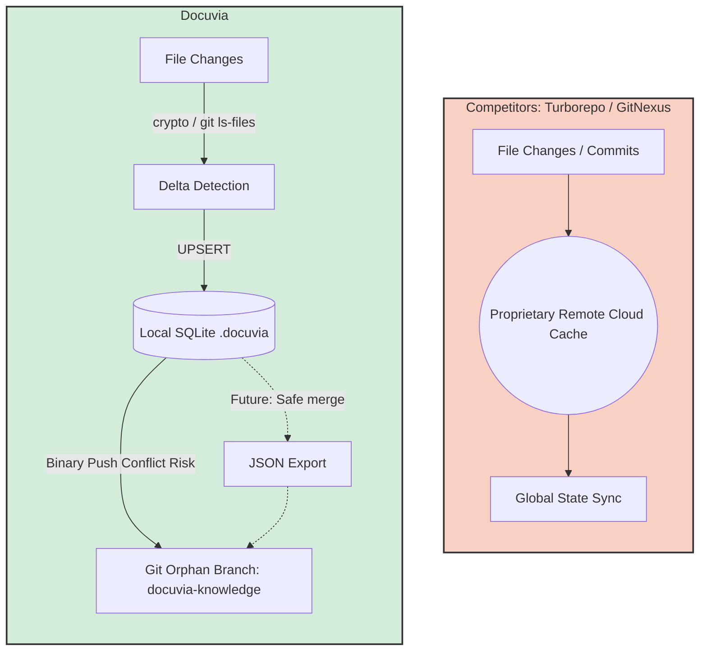

> **Note:** This document contains competitor analysis and self-evaluation notes that have not been fully integrated into the current implementation yet.

# Data Pipeline & Sync Competitor Analysis

## Current State

Docuvia utilizes a Git-native blob hashing approach (`git ls-files -s`) combined with SQLite `UPSERT` transactions to achieve near-instant incremental AST scanning. Syncing is handled non-intrusively via an orphan Git branch (`docuvia-knowledge`).

## Competitors

Turborepo, GitNexus

## What Competitors Have That We Don't

- **Global Remote Caching**: Turborepo can fetch artifact hashes from a centralized cloud cache (Vercel) to share build states across teams.
- **Deep Git Integration**: GitNexus analyzes commits to find "affected execution flows" mapping git diff hunks to their exact AST symbols dynamically.

## What We Have That They Don't

- **Zero-Pollution Local State**: Turborepo and GitNexus often leave heavy cache folders (`.turbo`, `.gitnexus`). Docuvia strictly bounds its database inside `.docuvia` but relies on the actual Git internal tree for distribution. By storing the graph in an orphan branch, developers can `git push` the graph directly to their origin without needing a proprietary remote caching server.
- **Graceful Degradation**: If Git is unavailable, Docuvia's data pipeline seamlessly falls back to `fast-glob` and manual Node.js `crypto` hashing.

## Fatal Flaws

- **Git Branch Conflicts**: While the orphan branch strategy is clever, concurrent pushes from multiple developers to `docuvia-knowledge` will result in severe merge conflicts, as SQLite binary files cannot be easily merged by git.
- **Lack of Garbage Collection**: We do not currently prune deleted files from the `project_files` table efficiently; we only skip what hasn't changed. Over time, the SQLite DB will bloat with dead nodes.

## Immediate Next Steps

- Implement a robust JSON-based export for the SQLite DB before committing to the orphan branch, allowing Git to handle line-by-line diff merging safely.
- Write a `CleanService.prune()` function to garbage collect orphaned L2/L3 nodes whose `source_paths` no longer exist in the working directory.

---

## Action Item Registry

### Local AST Extraction Snapshot

**Severity:** 🔴 CRITICAL · **Target:** `@workspace/cli` (`snapshot` command)

**Deficit:** The `docuvia snapshot` command is currently registered to act as the `post-commit` hook, but its implementation is incomplete regarding the extraction pipeline. It attempts to call the server or do basic setup, but it does not actually stream the Git delta (the changed files in the commit) into the `@workspace/ast-core` parser. Without this link, the system is fundamentally broken: commits happen, but the AST is never analyzed locally.

**Acceptance Criteria:**

1. The `docuvia snapshot` command must correctly read the `git diff-tree` or equivalent to determine which files were modified in the target commit.
2. It must route these modified files into the `@workspace/ast-core` processing queue.
3. The processing must handle large commits gracefully without running out of memory.

### Local SQLite Write Pipeline

**Severity:** 🔴 CRITICAL · **Target:** `@workspace/cli` (`snapshot` command)

**Deficit:** Even if the AST core parses the files (#03), the resulting architectural data (L2 Modules, L3 Decisions) must be durably stored in the Local HEAD Index (`.docuvia/local.db`). The current pipeline lacks the concrete `INSERT/UPDATE` mechanisms to transform AST output into the finalized SQLite schema locally.

**Acceptance Criteria:**

1. Establish a local `drizzle-orm` instance bound to `better-sqlite3` targeting `.docuvia/local.db` inside the AST execution loop.
2. Persist extracted AST nodes into the `l2_nodes` and `l3_nodes` tables.
3. Automatically serialize these changes into an append-only JSON event and commit it to the `docuvia-knowledge` git orphan branch to fulfill the Event Sourcing architecture.

#### Current State (as of 2026-07-05) — Two Disconnected Pipelines

These acceptance criteria are **not unified in practice**. Two independent write paths exist for the same conceptual data, and they never intersect:

- **`analyze`** (`lib/core/src/services/sqlite-graph.repository.ts`, `SqliteGraphRepository.persistAstGraph`) — parses the AST and persists L2/L3 nodes into the real, durable `.docuvia/local.db` via `drizzle-orm`. This is the actual Local HEAD Index.
- **`snapshot`** (`artifacts/cli/src/commands/snapshot.ts`) — re-parses the AST independently and writes into a `GitNativePersistenceService`-managed **temp directory** (`fs.mkdtemp`), which is deleted (`fs.rm`) once the orphan-branch write completes. It never reads from or writes to `.docuvia/local.db`, and currently calls `writeKnowledgeToOrphanBranch(1)` with a hardcoded `projectId`, reflecting the single-tenant limitation noted in [crosscutting-concepts.md §8.4](../architecture/crosscutting-concepts.md).

Do not assume these two commands operate on the same underlying store — running one does not update the other's data. Unifying them (routing `snapshot` through `SqliteGraphRepository`/`.docuvia/local.db` instead of a discarded temp dir) is a real pipeline rewrite, tracked separately; this note exists so the divergence is at least documented rather than silent. **This is the most current, verified finding in this entire registry — re-check it before assuming any adjacent roadmap "Done" status implies it has been fixed.**

### File Hash Delta Detection

**Severity:** 🟡 MEDIUM · **Target:** `@workspace/vscode-client` / `@workspace/cli`

**Deficit:** When re-evaluating a project (e.g., during a large `git pull` or `git checkout`), passing thousands of files through the AST parser is computationally expensive and slow. To achieve the sub-second speeds required for a local-first experience, unmodified files must be aggressively skipped.

**Acceptance Criteria:**

1. Introduce a `project_files` tracking table in the local SQLite database.
2. Store the SHA-256 hash of every file's contents upon successful parsing.
3. During any bulk or incremental extraction, hash the incoming file first. If the hash matches the DB, skip AST extraction entirely.

> Cross-reference: the roadmap lists [Incremental Update (delta-only)](../roadmap/features/incremental-update-delta-only.md) as ✅ Done — verify it actually covers file-hash skipping (as opposed to just DB-level incremental writes) before treating this item as fully closed.
