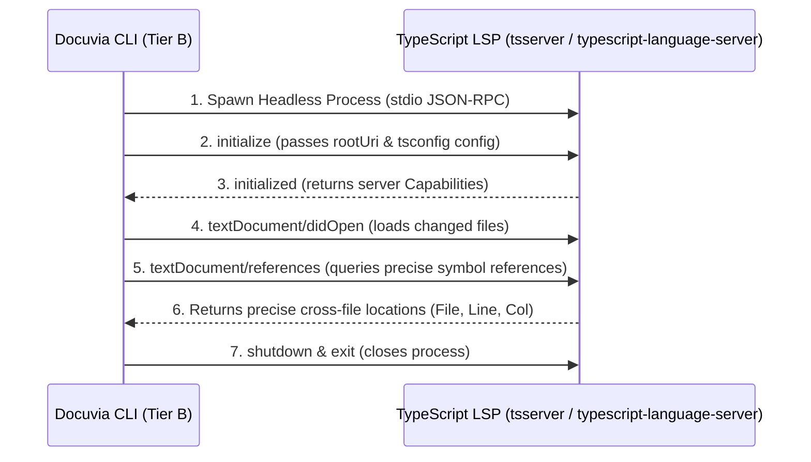

# Docuvia2 Headless LSP Orchestration & Contract Changed Diffusion Report (IMPT-003)

> **Context**: Detailed design for `IMPT-003` (LSP Escalation for Absolute Quality) and `PLAT-007` Tier B planning, specifically addressing Headless LSP startup orchestration, cross-file dependency resolution, and how contract changes trigger precise Impact Radius diffusion.
> **Date**: 2026-07-16
> **Status**: Independent Analysis Report

---

## 1. Why Must We Escalate to LSP?

In knowledge graph construction, many AI tools (like GitNexus, Graphify) rely solely on static Tree-sitter AST parsing:

- **The Limit of AST**: Can only understand structure "within a single file" (e.g., what Classes were declared, what Function names were called).
- **The Blind Spot of AST**: In large projects, when **cross-file calls**, **Interface inheritance & polymorphism**, and **TypeScript Path Aliases (e.g., `@workspace/contracts`)** occur, pure AST cannot precisely identify which concrete implementation in which file a Method call points to.

### 🚨 Erroneous Impact Radius Caused by AST (Example Case)

```typescript
// lib/contracts/src/interfaces.ts
export interface ILogger {
  info(msg: string): void;
}

// lib/core/src/git.ts
logger.info("packed snapshot"); // AST only knows a method named 'info' was called, but not which ILogger implementation
```

If we modify the `ILogger` interface, a pure AST graph would produce an **incomplete impact radius analyzed by `docuvia impact`** because it cannot find definitive dependencies. Developers and AI Agents, trusting this incomplete radius, could cause Silent Failures during code modifications.

This is why `IMPT-003` declares: **"Quality first. Better to spend 3 minutes starting LSP than have 100% fast but wrong garbage data."**

---

## 2. Headless LSP Startup Orchestration Design

Based on the `PLAT-007` decision, we reject a resident LSP Daemon in favor of a **Spawn-per-batch** mode.

### 2.1 LSP Startup Flow & Lifecycle



### 2.2 Cross-Platform LSP Parser Adapter Design

To resolve cross-language (TypeScript/Rust/Go) adaptation, the LSP engine should be designed as a Pluggable Technology Provider in `lib/ast-core`:

```typescript
export interface ILanguageServerOrchestrator {
  start(workspaceRoot: string): Promise<void>;
  findReferences(
    filePath: string,
    line: number,
    character: number,
  ): Promise<ReferenceLocation[]>;
  stop(): Promise<void>;
}
```

- **TypeScript Projects**: In Node environments, we can directly invoke the `typescript-language-server` under the project's `node_modules`, communicating via `stdio` JSON-RPC without requiring global installation by the developer.
- **Rust Projects**: If a project contains `Cargo.toml`, it can selectively invoke `rust-analyzer` from the system.

---

## 3. Contract-Changed Diffusion Algorithm

When Tier A's `SemanticDiffDetector` detects changes, it classifies the changed nodes:

1. **`INTERNAL_LOGIC`**:
   - Example: Specific implementation details inside a Function change, but its Signature and Export remain unchanged.
   - **Diffusion Strategy**: Impact radius is 0, **no need** to initiate LSP escalation.
2. **`CONTRACT_CHANGED`**:
   - Example: Interface fields added/removed, Function signature changed, Exported Class renamed.
   - **Diffusion Strategy**: **Forcibly trigger LSP Escalation**, enqueueing the changed points into the diffusion queue.

### 3.1 Impact Diffusion Algorithm

```text
[Contract Changed Symbol X] ──(LSP find references)──> [Referencers A, B, C]
                                                        │
                                    (Recursively check if A, B, C are also contracts)
                                                        ▼
                                                   [Diffuse again...]
```

#### Concrete Execution Steps:

1. **Collect Seeds**: Find all L2 nodes from the database marked as `CONTRACT_CHANGED` in Tier A (with precise definition file paths, lines, and columns).
2. **Start LSP and Locate**: Launch Headless LSP, send `textDocument/references` requests for these seed nodes.
3. **Establish Precise Associations**:
   - LSP returns all concrete files, lines, and columns referencing the symbol.
   - Docuvia looks up the corresponding L2 nodes based on these locations.
   - Write physical edges of type `depends_on` into the `node_links` SQLite table.
4. **Recursive Diffusion**: If the referencer (like `A`) is itself an interface exported by another module, use `A` as a new seed, recursively execute Step 2, until the impact radius is fully converged.

---

## 4. Quality Defense Line & Grounding Metrics

To verify whether IMPT-003 is perfectly executed, we must establish the following Quality Metrics in the project:

- **L2 Precision Rate**:
  - Without LSP enabled, the graph might be filled with Soft Edges ("same name but wrong target").
  - With LSP enabled, all symbol associations must have 100% determinism.
- **Incremental Indexing Time**:
  - For 90% of daily Commits (modifying only internal logic), analysis time should remain **< 1 second** (since Tier A skips LSP entirely).
  - Only during contract changes does LSP quietly spend **30 ~ 60 seconds** in the background for precise propagation, which is an entirely acceptable cost for an idle schedule.
