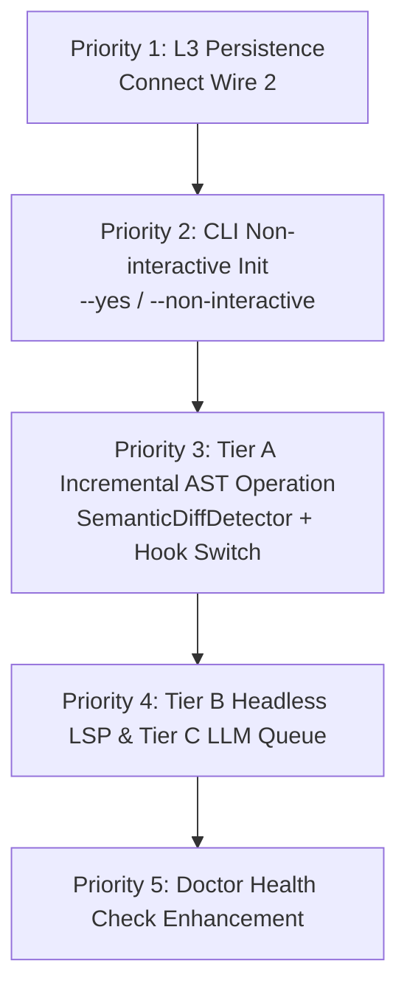

# Docuvia2 Phase 1 Incremental Background Knowledge Accumulation Loop & Gap Analysis Report

> **Context**: This report matches the Phase 0-1 planning of the Docuvia2 project against current ADRs (`PLAT-007` and `IMPT-003`), dissects the gaps in the current implementation (Commit `6cdb552`), and provides a concrete, executable roadmap for Phase 1.
> **Date**: 2026-07-16
> **Status**: Independent Analysis Report (Not mixed with Gemini 3.1 Pro Strategy)

---

## 1. Executive Summary & Core Diagnosis

The product vision for Docuvia2 is to build a **"fully background-running, developer-invisible, Git-Isomorphic local-first knowledge accumulation loop"**.

Following an in-depth audit of the source code and test suites, our core conclusions are:

> **Core Diagnosis**: The basic skeleton and atomic modules (such as the incremental AST engine `SemanticDiffDetector`, SQLite L3 tables, Git knowledge branch hydration mechanism, single-flight concurrency lock `PLAT-006`) have all been repaired or readied in Phase 0. However, the system is currently in a state of **"three broken wires"**, causing each module to be isolated and not chained together in production Workflows.
>
> This causes the current background Commit Hook to merely republish the "static stale graph" from initialization, and the results of L3 decision analysis to remain only as console outputs, never written to the database.

We must adhere to the decision principles of the approved **`PLAT-007` (Three-Tier Background Knowledge Evolution)** and **`IMPT-003` (LSP Quality Upgrade)** to revive the deprecated AST + LSP + LLM three-tier architecture, changing the update granularity to **"cost-tiered triggering"** to achieve smooth and high-quality automated background knowledge accumulation.

---

## 2. Phase 0 (Background Readiness & Core Fixes) Current Status Audit

Before starting Phase 1, we evaluate the delivery quality of Phase 0:

### 2.1 Verified Implemented Work

- **CLI Build and Startup Issues Fixed**: The `tsup` double Shebang issue that previously prevented `dist/cli.js` from starting, and the `encoding.js` module path resolution crash loop during `init` AST worker execution, have both been thoroughly fixed.
- **Single-Flight Lock Readiness**: Based on the `PLAT-006` design, the `init` phase and background snapshot processes are protected by a single-flight lock, avoiding database migration conflicts during concurrency.
- **L2 Graph Processing Normal**: Running `docuvia status` successfully parses and reports L2 nodes (e.g., correctly loading and reporting 2,852 L2 nodes in workspace tests).
- **Self-Healing Read Paths**: `ensure-hydrated.ts` is correctly invoked in read paths like `query`/`impact`/`status`/`review`, achieving "first-read auto-hydration (STOR-002)".

### 2.2 Remaining Technical Debt (Gaps inside Test Suite)

According to the test coverage audit in `docs/cli-test-analysis/README.md`, the following low-frequency, edge case, or concurrent scenarios lack tests:

1. **Windows Platform `EBUSY` Lock**: The exception catch path for when `clean` and `uninstall` delete SQLite DB files if occupied by other processes is not simulated in unit tests.
2. **`doctor` Hook Detection Boundaries**: The branch handling `fs.stat` hook failure (`.catch(() => null)`) in `doctor.ts` lacks test coverage.
3. **`query` TTY Interaction and Defense Limits**: The interactive input loop, Ctrl+C interrupt path, and prompt truncation guardrails for large nodes (e.g., thousands of relationships) remain unaddressed in the `query` workflow.

---

## 3. Phase 1 Key Gap Analysis: The Three Broken Wires

The current implementation has three fatal "broken wires" in **Phase 1 (Capture & Process)** that must be connected as a priority in upcoming development:

```text
capture ──✂──> process ──> store ──> distribute ──> consume
  (AST only     (SQLite)   (git      (knowledge     (MCP/query/impact,
   at init,                 branch)    branch,        self-healing ✅)
   never again)                        manual sync)
                 L3 decisions ──✂──> (Printed to console only, never persisted)
```

### 🔴 Broken Wire 1: Hook Republishes the Static "Day 1" Stale Graph (Wire 1)

- **Current Status**: After the background Post-Commit hook is triggered, it calls `SnapshotWorkflow`. However, `SnapshotWorkflow` is designed **deliberately not to re-run AST parsing** (because full parsing cost is too high), it merely repacks the current SQLite database.
- **Consequence**: For every Commit, the background merely uses a new Git Commit SHA stamp to repeatedly publish "the stale old graph created during `init` on day one".
- **Solution Matching (PLAT-007 Tier A)**: We must enable the currently Dead Code `SemanticDiffDetector`. In `docuvia analyze` Auto Mode, compare "Last Fed Commit SHA (obtained from `Docuvia-Source` or `docuvia_meta`) → Current HEAD", perform incremental Tree-sitter parsing only on affected files, update L2 tables, and finally snapshot.

### 🔴 Broken Wire 2: L3 Decisions and Analysis Results Evaporate into Thin Air (Wire 2)

- **Current Status**: Executing `docuvia analyze <targetPath>` indeed runs LLM decision extraction normally, but its produced structured data **is only output via `ui.info()` (printed to terminal)**.
- **Consequence**: `l3-nodes-repo.ts` exists, the remote `sync` telemetry push pipeline for L3 exists, **but the `l3_nodes` database table is always empty**. Background-analyzed L3 Decisions simply evaporate from memory after execution.
- **Solution Matching (PLAT-007 L3 Schema)**: Before `analyze-workflow.ts` finishes, we must call the L3 Repo's write methods (adding `insert` related methods in contracts and implementations) to persist the extraction results to the `l3_nodes` table, saving the complete source file, `commitSha`, extraction model, Confidence, and Content Hash.

### 🟡 Broken Wire 3: Distribution and Push Remain Manual (Wire 3)

- **Current Status**: `sync-knowledge` is intentionally designed for manual invocation (due to networking and key operations involved).
- **Solution Matching (PLAT-007 Phase 2)**: This design is reasonable. Before Phase 1 ends, we can keep it manual or bind it to the `pre-push` stage, but it should not be hard-coded into the background `post-commit` hook to avoid hindering Git fluidity.

---

## 4. Key Architectural Decision Matching: PLAT-007 and IMPT-003

Based on `PLAT-007` (Tiered Background Knowledge Evolution) and `IMPT-003` (LSP Escalation for Absolute Quality), we review the current design and provide the following implementation recommendations:

### 4.1 Convergence of Command Surfaces (Command Surface Convergence)

- **ADR Decision**: We should not add independent `update` or `delta` commands. Instead, all modes of "updating the knowledge graph to the latest code state" should converge into **`docuvia analyze`**:
  - `docuvia analyze` (no parameters): **Auto Mode**. Full Ingestion if no graph exists initially, then automatically increments based on `Docuvia-Source` sha (Tier A).
  - `docuvia analyze <targetPath>`: Single point L3 analysis.
  - `docuvia analyze --escalate-to-lsp`: Tier B deep LSP analysis.
- **Current Matching**: Currently `cli/src/commands/analyze.ts` only supports L3 decision analysis with parameters. The parameterless Auto mode for `analyze` must be rewritten, replacing the old, useless config-scan-only behavior.

### 4.2 Implementation of The Three Tiers (The Three Tiers Mechanism)

According to empirical data, rival Hermes Agent's Full Index takes 40 minutes, GitNexus incremental takes 5 minutes, and LSP propagation takes at least 3 minutes. This proves that **"Running full quality analysis on every Commit" is unfeasible**.

We support the three-tier trigger architecture recommendation of `PLAT-007`:

| Trigger Level                        | Execution Content                                                 | Current Code Readiness                                                  | Recommended Implementation Approach                                                                                                                                                                                               |
| :----------------------------------- | :---------------------------------------------------------------- | :---------------------------------------------------------------------- | :-------------------------------------------------------------------------------------------------------------------------------------------------------------------------------------------------------------------------------- |
| **Tier A (Every Commit)**            | AST Delta (Tree-sitter)                                           | 70% (`SemanticDiffDetector` needs invocation)                           | Bind to `post-commit`. Utilize fast hash (SHA comparisons) to extremely fast-skip unchanged files, ensuring duration < 1 second.                                                                                                  |
| **Tier B (Batch/Debounce/Pre-push)** | LSP Deep Analysis (Precise dependencies and cross-file diffusion) | 10% (LSP `escalateToLsp` remains no-op)                                 | **Start a headless LSP running without daemon**. Only invoked when the change set contains `CONTRACT_CHANGED` (contract changed) nodes. Perform `snapshot` packing here to prevent frequent and bloated knowledge branch commits. |
| **Tier C (Async Queue + Budget)**    | LLM L3 Decision Extraction (Local model default)                  | 40% (`analyze-workflow` ready, lacking queue mechanism and persistence) | The local side supports OpenAI format endpoints running Ollama/llama.cpp, detected for connectivity by `doctor`, without process lifecycle management.                                                                            |

---

## 5. Phase 1 Implementation Roadmap

To resolve the aforementioned "broken wires" and fully connect with `PLAT-007`, we recommend executing step-by-step according to the following priorities and physical validation gates:



### 🥇 Priority 1: Connect Wire 2 (L3 Decision Persistence, immediately unlocking Sync Push)

- **Tasks**:
  1. Add write interfaces in the contract layer `IL3NodesRepo` (`lib/contracts/src/interfaces/graph-store.interfaces.ts`) and implementation layer `L3NodesRepo` (`lib/schema/src/sqlite/repos/l3-nodes-repo.ts`), e.g., `insertL3Node(node: Omit<L3NodeRow, 'id' | 'created_at'>): number`.
  2. Modify `analyze-workflow.ts` to actually write results to `l3_nodes` after LLM decision extraction, saving complete source files, `commitSha`, extraction models, Confidence, and Content Hash.
- **Physical Validation**: Write an integration test invoking `analyze` to extract specific decisions, then use `getAllExportable()` to verify the decision is genuinely saved in the table, with completely correct source Git SHA and hashes.

### 🥈 Priority 2: Fix `init` Unattended Support (Headless / CI Support)

- **Tasks**:
  - Introduce `--yes` or `--non-interactive` flags in `init.ts`.
  - If the flag is passed, skip TTY's `askConfirm` interactive confirmation, running directly with defaults to ensure background automation flows do not permanently hang.
- **Physical Validation**: Run `docuvia init --yes` in a non-interactive terminal (like CI or background script) to verify smooth initialization without any input.

### 🥉 Priority 3: Implement Tier A (Incremental AST Delta) and Switch Post-Commit Hook

- **Tasks**:
  1. Rewrite `docuvia analyze` (no parameters) to read the "last fed SHA" from `docuvia_meta`.
  2. Compare "last fed SHA → HEAD", sending the changed file list to `SemanticDiffDetector`.
  3. Call the existing `AstProcessingService` + `GraphPersister` for precise incremental updates of detected changed nodes.
  4. If updates contain `CONTRACT_CHANGED` nodes, mark "Tier B/C escalation needed" to background queues/queue files.
  5. Change `docuvia snapshot` previously called in the `post-commit` hook to call `docuvia analyze`.
- **Physical Validation**:
  - Pass the concurrency and hydration tests required by `docs/cli-test-analysis/` (especially `analyze` + `snapshot` concurrency, `doctor` + `hydrate` concurrency).

### 🏅 Priority 4: Implement Tier B (Headless LSP Escalation) and Tier C (LLM Queue)

- **Tasks**:
  - **LSP Escalation**: Implement actual `escalateToLsp` logic. When `docuvia analyze --escalate-to-lsp` is triggered, start a temporary Headless LSP instance to perform precise symbol location for contract changes filtered from Tier A, writing back to L2.
  - **LLM Queue**: Read Tier A legacy L3 extraction candidate symbols, and call local Ollama/remote APIs to complete L3 analysis according to Daily Token/Call budgets in config files.
- **Physical Validation**: In Test Fixtures containing complex cross-file calls (e.g., Interface implementation changes), verify if LSP escalation precisely corrects impact relationships.

### 🏅 Priority 5: `doctor` Health Check Defense (Reliability Checks)

- **Tasks**:
  - Add health check items: If `.git/hooks/post-commit` exists but the system environment cannot resolve the `docuvia` executable, actively issue warnings to prevent silent failure of background analysis.
  - Add connectivity (Reachability) tests for local/remote LLM endpoints.

---

## 6. Conclusion

Docuvia2's architectural design is highly forward-looking, with its separation of **Virtual Contracts** and implementation providing an excellent foundation for expansion. The current main bottleneck of the project is **"the unfulfilled promise of background automation"** (underlying incremental and L3 modules ready but unchained to CLI flows).

This report suggests creating separate work branches, unmixed with the 3.1 Pro strategy, and steadily advancing in the following concrete steps:

1. **Connect Wire 2 (decision persistence) first to unlock the Sync pipeline**.
2. **Refactor `analyze` Auto mode, connecting `SemanticDiffDetector` to achieve incremental AST**.
3. **Introduce non-interactive `--yes` initialization for CI and background execution**.
4. **Gradually tackle LSP and LLM local endpoints, completing the auto-evolution closed loop**.
