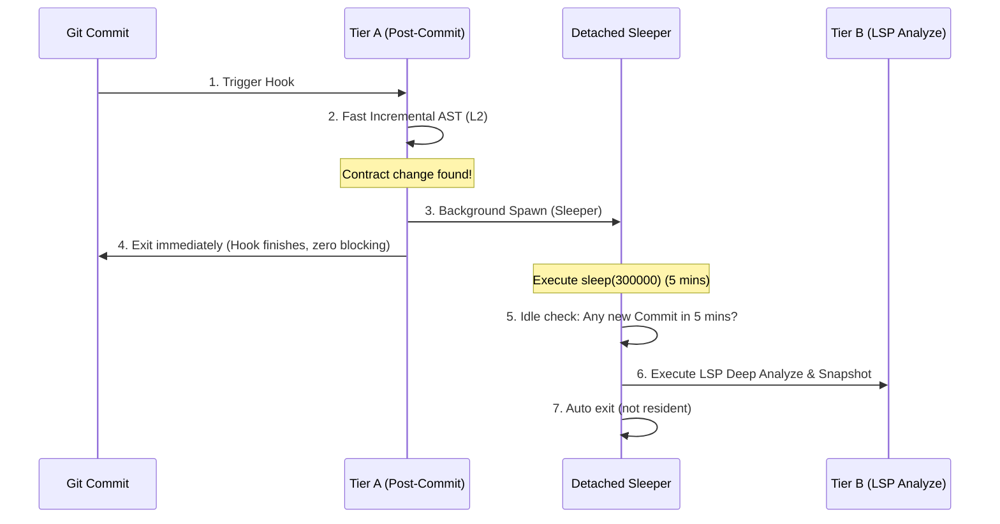

# Docuvia2 Tiered Background Scheduling & Daemonless Trigger Mechanism Report (PLAT-007)

> **Context**: Concerning the `PLAT-007` plan, this report provides a detailed design on how to achieve "Idle Timer", "Pre-push Interception", and "Commit Cap" scheduling mechanisms for Tier B (LSP) and Tier C (LLM) without utilizing a Resident Daemon.
> **Date**: 2026-07-16
> **Status**: Independent Analysis Report

---

## 1. Core Contradictions & Design Boundaries

`PLAT-007` and `IFCE-002` established a hard boundary: **Docuvia2 Rejects Resident Daemons**.
We cannot launch a persistent background Service or Socket listener on a developer's machine because it introduces:

- Massive complexity in cross-platform process maintenance (Windows Service vs. macOS Launchd vs. Linux Systemd).
- Persistent memory and CPU footprint, destroying the "invisible" and "lightweight" product positioning.

But without a Daemon, how do we implement **Tier B (LSP Escalation) firing after 5 minutes of idle time**, **instant Pre-push synchronization**, and **forced triggering when Commit counts exceed limits**?

---

## 2. Three Non-Resident Implementation Plans for the Idle Timer

### Solution A: Git Hooks & Timestamp Comparison (Piggyback on Next Run)

- **Principle**: Does not actively keep time in the background. Instead, each time a developer executes any `docuvia` command (or the next `post-commit` triggers Tier A), check the time difference between the last LSP execution timestamp and the current time.
- **Fatal Flaw**: If a developer commits and leaves for coffee without executing the next commit or command, the LSP background analysis will never run until their next commit hours later. This defeats the purpose of "analyzing quietly while idle".

### Solution B: Dynamic OS-level Scheduler Registration

- **Principle**: When Tier A incremental analysis finds `CONTRACT_CHANGED`, it doesn't start a background timer. Instead, `docuvia` registers a **"one-off, execute in 5 minutes"** background task with the OS scheduler:
  - **Windows**: Call `schtasks` to create a one-off Task.
  - **macOS**: Call `launchd` to write a temporary plist file.
  - **Linux**: Call the `at` command (e.g., `echo "docuvia analyze --escalate-to-lsp" | at now + 5 minutes`).
- **Evaluation**:
  - 🟢 Pros: Truly daemonless idle triggering, orchestrated by the OS.
  - ❌ Cons: Poor cross-platform command compatibility. Windows `schtasks` and Linux `at` have inconsistent permission requirements and easily fail due to permissions.

### Solution C: Single Background Lightweight Process Suspension (Fire-and-forget Spawning w/ Sleep)

This is the highly recommended "pseudo-resident" solution. When `post-commit` (Tier A) finds LSP escalation is needed, it `spawns` an independent, asynchronous, detached lightweight `docuvia` process in the background, and immediately exits the main Commit process.



#### Concrete Implementation Steps

1. **Background Suspension**: `post-commit` hook starts `node dist/cli.js analyze --idle-sleep 300` (non-blocking terminal, detached from parent process).
2. **Reentrancy Prevention & Debounce**:
   - Write a lock file `.docuvia/locks/idle-timer.lock` containing the PID.
   - If the next Commit comes within 5 minutes, the new Tier A will `kill` the previous background Sleeper and start a new 5-minute Sleeper. This perfectly achieves a **Debounce** effect!
3. **Invisible Analysis**: If no new changes occur within 5 minutes, the Sleeper awakens, executes `docuvia analyze --escalate-to-lsp && docuvia snapshot`, and then self-destructs.

---

## 3. Pre-push Interception and Commit Cap

### 3.1 Pre-push Interception Mechanism

- **Trigger Point**: Install a `pre-push` hook (`.git/hooks/pre-push`).
- **Execution Content**: Before pushing code to the remote, we must guarantee the remote knowledge branch is perfectly synced with the code.
  ```bash
  # .git/hooks/pre-push
  npx --no-install docuvia analyze --escalate-to-lsp --non-interactive
  npx --no-install docuvia snapshot --non-interactive
  npx --no-install docuvia sync-knowledge --non-interactive
  ```
- **Fault Tolerance (Degradation)**: If network fails (`sync-knowledge` fails), degrade to only completing local LSP and snapshot without blocking the developer's push.

### 3.2 Commit Cap (Force Trigger)

- **Principle**: If a developer commits crazily and the interval between each commit is less than 5 minutes, Tier B will be infinitely delayed by the Debounce mechanism.
- **Defense Design**:
  - Record `unresolved_commit_count` in `docuvia_meta`.
  - Every time Tier A executes, if the cumulative un-LSP'd commit count $\ge 20$, **forcefully skip the sleep suspension**, directly and asynchronously launching LSP analysis in place.

---

## 4. Comparison of Three Trigger Mechanisms and Optimal Combination Suggestion

| Scheduling Mechanism        | Trigger Characteristics               | CPU/Memory Overhead                           | Implementation Difficulty      | Recommendation                              |
| :-------------------------- | :------------------------------------ | :-------------------------------------------- | :----------------------------- | :------------------------------------------ |
| **Sleeper Process (Sol C)** | Precise 5-min idle, Auto Debounce     | 🟢 Extremely Low (One suspended Node process) | 🟢 Simple (Native JS)          | **🌟 Core Recommendation (Tier B Idle)**    |
| **Pre-push Interception**   | Final step, ensures sync              | 🟢 None (Runs only once at push)              | 🟢 Extremely Easy (Git Native) | **🌟 Core Recommendation (Tier B Force)**   |
| **Commit Cap**              | Prevents long-tail unanalyzed changes | 🟢 None                                       | 🟢 Extremely Easy (DB count)   | **🌟 Core Recommendation (Safety Defense)** |

### 🛠️ Final Architectural Recommendation

Adopt the daemonless Iron Triangle scheduling of **"Sleeper Process (Debounced) + Pre-push Force + Commit Cap"**. This mechanism retains the "non-resident, lightweight" local-first spirit, while 100% guaranteeing that the knowledge graph and L3 decisions are fully evolved to the latest state prior to code push.
