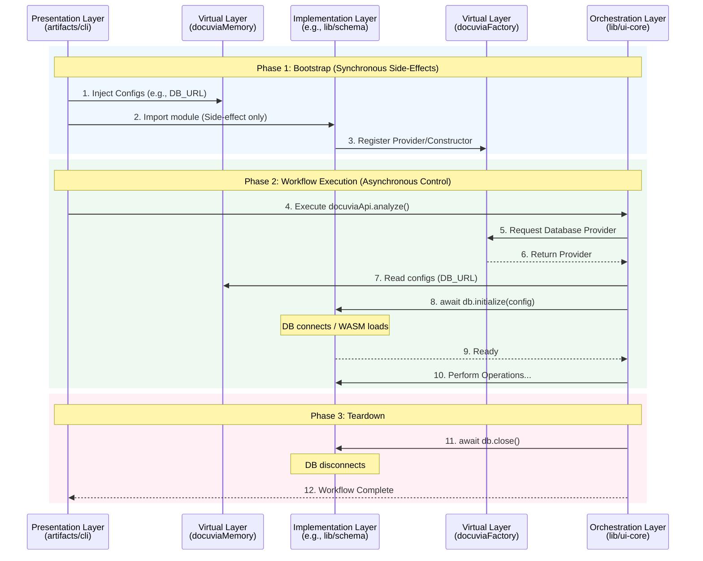

# Application Lifecycle & State Management

> **Mandatory Architecture Protocol:** 
> Implementation libraries must never instantiate their own heavy resources (like DB connections or WASM workers) at the module level. Lifecycle ownership (Initialization and Teardown) belongs strictly to the Orchestration Layer (`ui-core`). Furthermore, libraries are strictly forbidden from reading `process.env` directly; all configuration must be injected via `docuviaMemory`.

---

## 1. How It Works

Docuvia2 solves the "Phantom Registration" (how isolated libraries register themselves) and "Async Race Conditions" (when database connections or WASM are ready) through a strict **Bootstrap -> Instantiate -> Teardown** lifecycle.

The process is divided into explicit phases. The Presentation Layer acts as the entry point, deliberately importing implementation libraries to trigger their registration, but it never instantiates them. The Orchestration Layer later requests these factories, instantiates them, and controls their asynchronous lifecycle explicitly.

---

## 2. Roles & State Management Boundaries

The lifecycle and state management duties are strictly partitioned:

### 🟨 The Virtual Layer (`lib/contracts`)
*   **`docuviaFactory` (Transient by Default)**: Stores *Constructors* or *Providers*, not active instances. By default, every time the Orchestrator requests an object, it receives a **brand new, transient instance**. A factory does not manage the lifecycle of what it produces; there may be a few explicit Singleton objects defined in `contracts`, but they are the exception.
*   **`docuviaMemory` (UUID Scoping & Teardown)**: The **only** source of truth for runtime configurations. To prevent state pollution in concurrent environments (like a long-running MCP Server serving multiple workspaces), memory states are isolated using a **UUID** (e.g., hashed from the workspace path). 

### 🟥 The Presentation Layer (`artifacts/cli`, `mcp`)
*   **The Bootstrapper & Garbage Collector**: Responsible for generating the Context UUID, reading configurations, and injecting them into `docuviaMemory`. Crucially, because it is the only layer that knows when a command or request is fully complete, **it is strictly responsible for Garbage Collection**. It must explicitly delete the UUID context from `docuviaMemory` at the end of the run to prevent Out-of-Memory (OOM) leaks.
*   **The Trigger**: Explicitly imports implementation libraries to ensure they execute their registration code during the Node.js module loading phase.

### 🟦 The Orchestration Layer (`lib/ui-core`)
*   **The Lifecycle Owner**: Because objects from the factory are transient, `ui-core` owns them entirely. It explicitly calls `.initialize()` and `.close()` on the instances.
*   **Concurrency Locks**: If `ui-core` spawns multiple processes or retrieves multiple transient DB instances that act on the same target, it manages concurrency exactly like `git` does: by issuing a **Lock**. The orchestration flow must acquire a lock for a target resource, preventing simultaneous writes that would cause database collisions.

### 🟩 The Implementation Layer (`lib/schema`, `lib/core`)
*   **The Follower**: It waits for `.initialize()` to be called. It reads settings exclusively from `docuviaMemory` using the Context UUID passed down by the Orchestrator.

---

## 3. The Goal

To create a predictable, race-condition-free runtime environment where the core business logic has absolute authority over when resources start and stop, and where implementation libraries are completely divorced from the host environment (Node.js vs Browser).

## 4. The Problem

In standard Node.js applications, two major anti-patterns often emerge:
1.  **Implicit Async Initialization**: A database module exports an already-connected instance. If `ui-core` imports it, it has to guess whether the connection is ready, leading to brittle `await setTimeout()` hacks or unhandled promise rejections.
2.  **Environment Coupling**: Deeply nested libraries read `process.env.DATABASE_URL` directly. This makes the library impossible to run in a VS Code Webview or a Browser Extension, as `process.env` does not exist there.

## 5. The Rationale

By splitting Registration (Sync) from Instantiation (Async), we give `ui-core` absolute control over the timeline. By forcing all configurations through `docuviaMemory`, we treat the environment configuration as just another injectable parameter.

## 6. The Pros

1.  **Zero Race Conditions**: The Orchestrator `await`s the initialization of every dependency explicitly.
2.  **Universal Portability**: Because implementation libraries don't touch `process.env`, they can be compiled and run in any JavaScript environment (Node, Deno, Bun, Browser, VS Code Webview).
3.  **Clean Teardown**: Because `ui-core` tracks initialization, it can guarantee that all database connections and child processes are cleanly closed, preventing memory leaks and hanging processes.

## 7. The Cons

1.  **Verbose Orchestration**: `ui-core` cannot just import a tool and use it. It must retrieve it from the factory, initialize it, use it, and remember to close it.
2.  **Bootstrap Complexity**: The entry points (`cli.ts` or `mcp.ts`) become responsible for manually wiring up the initial imports and memory injection before anything else can run.
