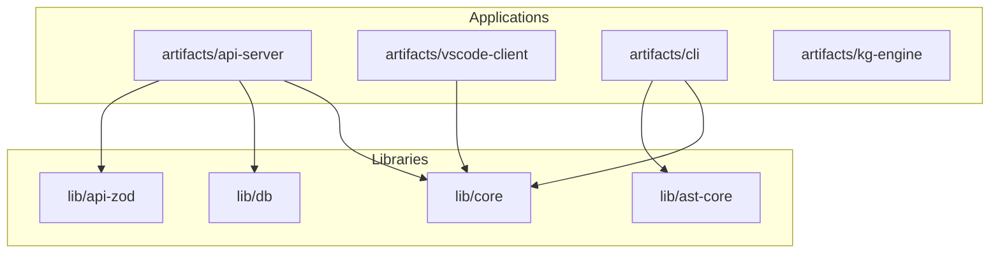
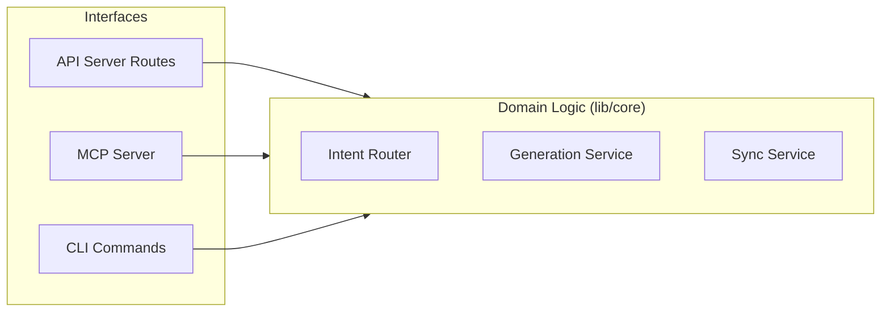
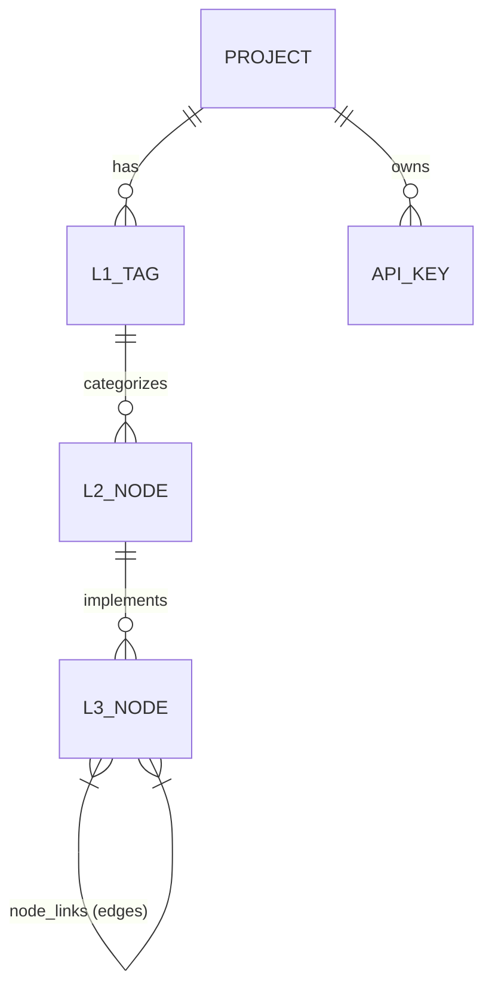
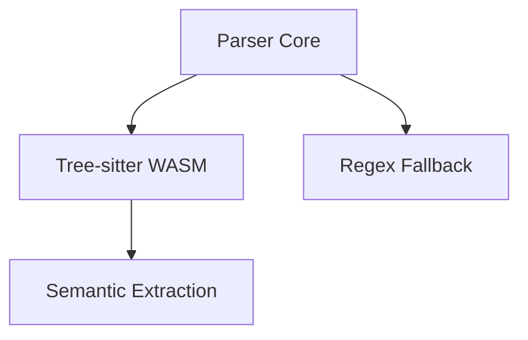

# Building Blocks

This document decomposes Docuvia's architecture into its primary software components (packages) and describes their responsibilities and interactions.

## Level 1 – Monorepo Packages

Docuvia is structured as a `pnpm` monorepo to cleanly separate concerns between the API server, frontend, database schemas, and shared utilities.

> **Explanation:** This diagram illustrates the macro-level dependencies of the workspace. The Application layer (API, VS Code Client, CLI) always depends downward on the Library layer (Core, Database, AST). This prevents circular dependencies and ensures business logic remains reusable across interfaces.

**Key Components & Status:**

- **`artifacts/api-server`**: Express REST/MCP server. Handles metabolism and LLM integration.
  - _Status_: [✅ Implemented](../roadmap/features/server-side-metabolism.md)
- **`artifacts/vscode-client`**: The developer IDE extension for local knowledge graph usage.
  - _Status_: [✅ Implemented](../roadmap/features/workspace-onboarding-init.md)
- **`artifacts/cli`**: Command-line interface for local extraction and syncing.
  - _Status_: [✅ Implemented](../roadmap/features/cli-commands-analyze-init.md)
- **`lib/ast-core`**: The WASM-based AST parser microkernel, detailed in [AST Core](#2-ast-core-libast-core) below. See [ADR-020](../adr/ADR-020-unified-isomorphic-ast-microkernel.md).
  - _Status_: [✅ Implemented](../roadmap/features/ast-microkernel-architecture.md)

---

## Architectural Pattern: Shared Core API (Hexagonal)

Docuvia separates purely functional, side-effect-free code from interface-specific routing to avoid duplicating logic across the API server, CLI, and VS Code.

> **Explanation:** By isolating our core domain logic inside `lib/core`, we ensure that the same AST ingestion and Graph querying logic can be triggered securely via HTTP REST, via MCP for AI Agents, or locally via the CLI without duplicating routing logic.

See [ADR-021](../adr/ADR-021-shared-core-api-and-presentation-layers.md) for detailed reasoning behind this Hexagonal Architecture approach.

---

## Internal Module Decomposition

Instead of exhaustive tables, below is a high-level visual representation of how internal modules collaborate across the stack.

### 1. Database Schemas (`lib/db`)

> **Explanation:** This entity-relationship model shows the hierarchical nature of the knowledge graph. A Project has high-level L1 Tags, which categorize L2 Architectural Nodes. These L2 nodes define the concepts that the actual L3 Code Nodes implement. The `node_links` table connects L3 nodes to form the dependency graph.

_Status_: [✅ Implemented](../roadmap/features/core-db-schemas-defined.md)

### 2. AST Core (`lib/ast-core`)

> **Explanation:** The parsing funnel begins with the `parser-core`. It prefers the high-speed `tree-sitter.wasm` for precision, but gracefully degrades to Regex fallbacks for unsupported file types before extracting semantic nodes. See [ADR-020](../adr/ADR-020-unified-isomorphic-ast-microkernel.md).

_Status_: [✅ Implemented](../roadmap/features/ast-microkernel-architecture.md)

---

## References

- [ADR-020: Unified Isomorphic AST Microkernel](../adr/ADR-020-unified-isomorphic-ast-microkernel.md)
- [ADR-021: Shared Core API and Presentation Layers](../adr/ADR-021-shared-core-api-and-presentation-layers.md)
