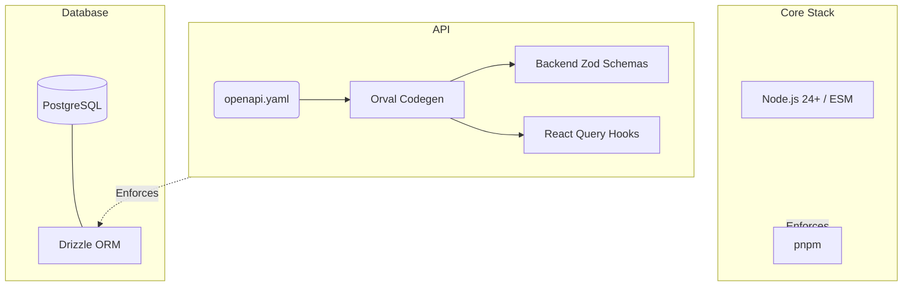
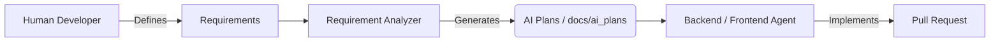
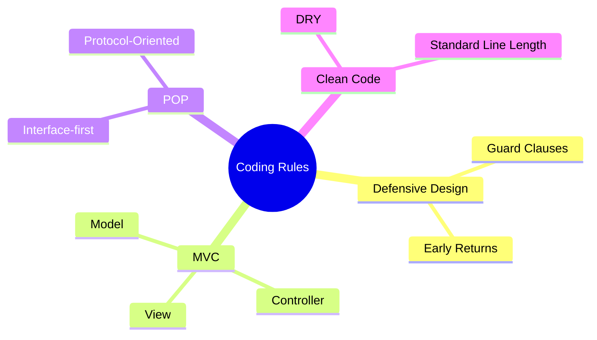

# Constraints

This document defines the overarching technical, organizational, and convention-based constraints for Docuvia.

## Technical Constraints

Technical constraints are non-negotiable architectural guardrails. They restrict technology choices to guarantee long-term stability and unified developer experience.

> **Explanation:** The core stack enforces type safety and strict dependency management. By locking to Node 24+, pnpm, and OpenAPI-driven code generation, we eliminate entire classes of runtime errors. Drizzle ORM acts as the sole bridge to PostgreSQL, ensuring no raw SQL vulnerabilities.

**Key Constraints & Status:**

- **Runtime & Package Manager**: Node.js 24+, `pnpm` exclusive, ESM only.
  - _Status_: [✅ Implemented](../roadmap/features/monorepo-directory-layout.md)
- **Database (PostgreSQL + Drizzle)**: Raw SQL is forbidden in application code. See [ADR-019](../adr/ADR-019-pgvector-migration.md).
  - _Status_: [✅ Implemented](../roadmap/features/core-db-schemas-defined.md)
- **API Contract (API-First)**: `openapi.yaml` drives all types. Manual fetch code is prohibited. See [API-First Playbook](../development/patterns/api-codegen-pipeline.md).
  - _Status_: [✅ Implemented](../roadmap/features/ci-cd-pipeline.md)
- **LLM Integration**: OpenAI-compatible endpoint. For local usage, see [ADR-026](../adr/ADR-026-multi-provider-llm-abstraction.md).
  - _Status_: [⚠️ WARN](../roadmap/features/llm-abstraction-layer.md)

---

## Organizational Constraints

These define how AI agents and human developers collaborate safely within the repository.

> **Explanation:** To maintain an auditable trail of decisions, AI agents are restricted to generating Markdown plans. Only when a plan is approved does the actual implementation begin via pull requests, ensuring Human-in-the-Loop oversight.

**Key Constraints & Status:**

- **AI Implementation Plans**: All agent-driven development MUST start with an AI Plan saved in `docs/ai_plans/`. See [ADR-013](../adr/ADR-013-adversarial-implementation-protocol.md).
- **Agent Scope Limits**: Planners produce Markdown. They do not write code.
- **Design Documentation**: All architecture lives centrally in this GitBook directory.

---

## Conventions (Coding Rules)

All source code must follow the mandatory coding rules.

> **Explanation:** All code must adhere to a strict set of paradigms. We use Defensive Design (guard clauses) to fail fast, Protocol-Oriented Programming (POP) for decoupling interfaces, and the MVC pattern for UI components.

Detailed implementation of these conventions is documented in the [Crosscutting Concepts](./crosscutting-concepts.md#4-coding-guidelines) guide and enforced via our standard [Coding Guidelines](../guidelines/README.md).
