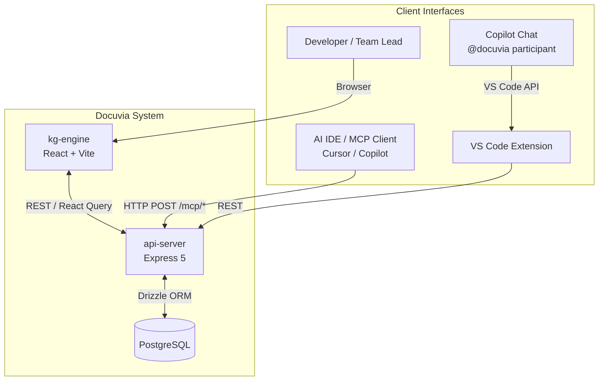
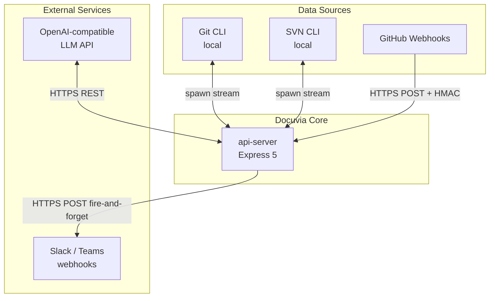

# Context and Scope

## System Context Diagram

> **Explanation:** The Developer, AI IDE, VS Code Extension, and Copilot Chat are all clients of the same `api-server`; none of them talk to PostgreSQL directly. The [VS Code extension runs locally and degrades gracefully](../adr/ADR-002-local-first-architecture.md) if the server is unreachable.

### External Integrations & Data Ingestion

> **Explanation:** Git/SVN CLIs are invoked as local child processes rather than through a hosted API, keeping ingestion [git-isomorphic](../adr/ADR-004-git-isomorphic-graph.md) and provider-agnostic. Slack/Teams notifications are fire-and-forget so a failing webhook never blocks the request that triggered it.

---

## External Interfaces Table

| Partner                     | Direction | Protocol                           | Auth / Security                                | Key Endpoints / Commands                                           |
| --------------------------- | --------- | ---------------------------------- | ---------------------------------------------- | ------------------------------------------------------------------ |
| **Developer Browser**       | Inbound   | HTTP (Vite dev server, port 18774) | None (local dev)                               | All kg-engine React pages                                          |
| **AI IDE / MCP Client**     | Inbound   | HTTP REST (port 8080)              | Bearer token (configurable)                    | `POST /mcp/query`, `POST /mcp/tools/*`                             |
| **VS Code Extension**       | Inbound   | HTTP REST (port 8080)              | API key (stored in VS Code SecretStorage)      | `POST /extensions/vscode/extract`, `GET /extensions/vscode/status` |
| **Copilot Chat `@docuvia`** | Inbound   | VS Code Extension API              | VS Code session                                | Slash commands: `/explore`, `/query`, `/extract`, `/help`          |
| **GitHub Webhooks**         | Inbound   | HTTPS POST                         | HMAC-SHA256 (`GITHUB_WEBHOOK_SECRET`)          | `POST /github/webhooks`                                            |
| **PostgreSQL**              | Outbound  | TCP (Drizzle ORM)                  | `DATABASE_URL` connection string               | All schema tables in `lib/db/src/schema/`                          |
| **OpenAI-compatible LLM**   | Outbound  | HTTPS REST                         | API key (`OPENAI_API_KEY` or equivalent)       | `/v1/chat/completions`                                             |
| **Slack / Teams**           | Outbound  | HTTPS POST (webhook)               | Webhook URL (stored in `project_integrations`) | Notification events (fire-and-forget)                              |
| **Git CLI**                 | Outbound  | `child_process.spawn (streamed)`   | Local filesystem permissions                   | `git log`, `git diff`, `git show`                                  |
| **SVN CLI**                 | Outbound  | `child_process.spawn (streamed)`   | Local SVN credentials                          | `svn log --xml`, `svn diff`                                        |

---

## System Boundary

### Inside Docuvia

- **Ingestion pipeline** — Git adapter, SVN adapter, document upload, build artifact parser
- **Knowledge construction** — L1 tagger, L2 extractor, L3 generator (all LLM-powered)
- **Knowledge graph storage** — PostgreSQL tables for L1/L2/L3 nodes, node links, embeddings (JSONB)
- **Graph traversal** — One-hop impact analysis via `node_links`; raw SQL cosine distance over JSONB with temporal decay over embeddings
- **Review task queue** — Human-in-the-loop workflow with feedback loop to correction examples
- **MCP query layer** — 4-way intent routing (vector | graph | direct | hybrid)
- **REST API** — All routes defined in `lib/api-spec/openapi.yaml`; implemented in `artifacts/api-server/src/routes/`
- **Web dashboard** — React + Vite frontend (`artifacts/kg-engine/`)
- **VS Code extension** — Knowledge Graph TreeView, Command Palette, CodeLens, Hover, Chat participant (`artifacts/vscode-client/`)
- **Subscription and notification system** — Cross-team watch and event feed
- **Export** — Knowledge graph export (JSON)
- **GitHub PR analysis** — Webhook-triggered PR comment with knowledge graph context

### Outside Docuvia

- LLM model weights and inference infrastructure (cloud-hosted; Docuvia is a client only)
- Git/SVN hosting providers (GitHub, GitLab, Bitbucket, SVNHub, etc.)
- VS Code itself (Docuvia is a consumer of the VS Code Extension API)
- External CI/CD infrastructure (GitHub Actions, Jenkins, etc.)
- Browser / IDE (Docuvia does not control the client environment)

---

## References

- [Solution Strategy](./solution-strategy.md) — Technology choices behind these interfaces
- [Runtime Scenarios](./runtime-scenarios.md) — Runtime flows showing how interfaces are used
- `AGENTS.md` — External interface list (Section: Tech Stack & Architecture)
