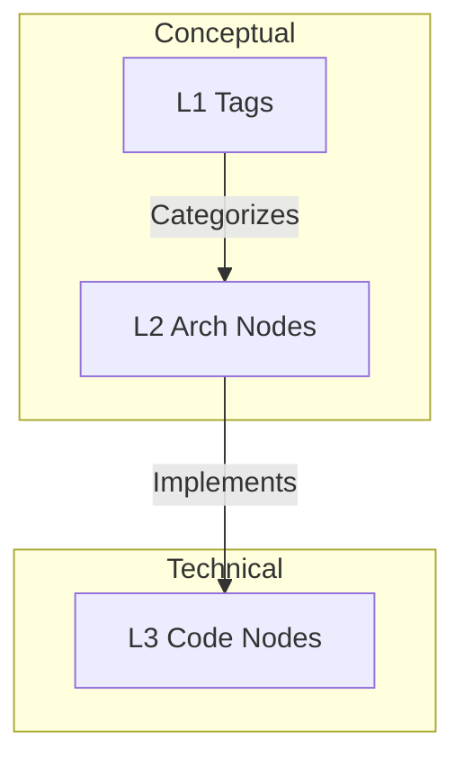
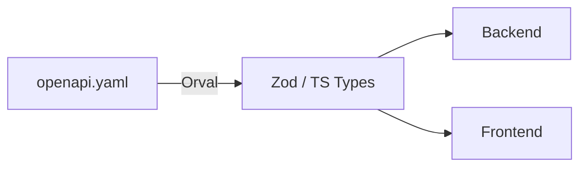
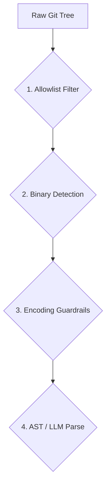

# Crosscutting Concepts

This section describes principles, rules, and concepts that apply across all parts of the Docuvia system.

## 1. Domain Model: Three-Tier Knowledge Graph

Knowledge in Docuvia is separated into three distinct abstraction tiers.

> **Explanation:** The Three-Tier Knowledge Graph separates concerns to prevent context overflow. L1 tags and L2 nodes provide the "conceptual" understanding of the system, while L3 nodes represent the "technical" reality of the code.

**Concept & Status:**

- **Knowledge Abstraction Strategy**: Prevents context overflow by fetching only the necessary depth. See [ADR-005](../adr/ADR-005-knowledge-abstraction-strategy.md).
  - _Status_: [✅ Implemented](../roadmap/features/l2-extractor.md)

---

## 2. API-First with Codegen

We use `openapi.yaml` as the absolute Single Source of Truth for cross-boundary communication.

> **Explanation:** The `openapi.yaml` specification acts as the ultimate contract. By generating Zod schemas for the backend and React Query hooks for the frontend, we guarantee that API changes propagate safely across the entire stack without manual type drift.

**Concept & Status:**

- **Code Generation**: Prevents type drift. See [API-First Playbook](../development/patterns/api-codegen-pipeline.md).
  - _Status_: [✅ Implemented](../roadmap/features/ci-cd-pipeline.md)

---

## 3. The 4-Phase Parsing Funnel

To ensure Docuvia handles dirty repositories safely, all ingestion passes through a funnel.

> **Explanation:** To protect the system from parsing massive binaries or unsupported encodings, all raw inputs from Git are aggressively filtered and validated before they ever reach the CPU-intensive AST or LLM parsers.

---

## 4. Coding Guidelines

All code in this repository MUST follow the strict coding rules outlined in the `docs/gitbook/guidelines/` directory.

### Quick Summary of Mandatory Rules:

1. **Defensive Design**: Use early returns and guard clauses. Fail fast.
2. **POP (Protocol-Oriented Programming)**: Services must depend on `Interfaces`, not concrete classes, specifically in `lib/core`.
3. **Clean Code**: Keep functions under 50 lines. Keep line length under 100 characters.

> **For AI Agents:** You MUST read [docs/gitbook/guidelines/README.md](../guidelines/README.md) to understand the strict code formatting expected in this repository.

---

## References

- [ADR-005: Knowledge Abstraction Strategy](../adr/ADR-005-knowledge-abstraction-strategy.md)
- [Coding Guidelines](../guidelines/README.md)
