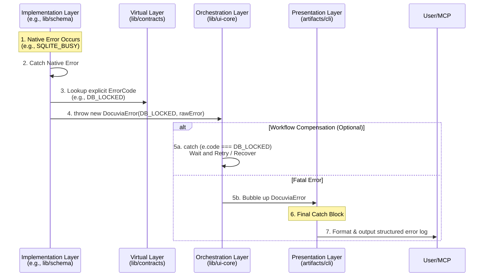

# Unified Error Handling Strategy

> **Mandatory Architecture Protocol:**
> Silent failures are strictly forbidden. AI agents and developers **MUST NOT** swallow errors with empty `catch` blocks or generic `console.log()` statements. Every error must converge into the unified error handling architecture defined within `lib/contracts`.

---

## 1. How It Works

Docuvia2 abandons fragmented, per-library error handling. Instead, it enforces a strict **Catch, Wrap, and Bubble** pipeline.

When a raw technology error (like a SQLite exception or a Git missing branch error) occurs deep within an Implementation library, it is never allowed to leak directly into the Orchestration layer. The Implementation library must catch it, map it to a predefined `ErrorCode` from the Virtual Contracts layer, wrap it in a standardized `DocuviaError`, and throw it upwards.

---

## 2. Roles & Error Boundaries

The system strictly divides error handling responsibilities across the four architectural layers:

### 🟨 The Virtual Layer (`lib/contracts`)

- **Role**: The centralized registry for all things that can go wrong.
- **Key Objects**:
  - `DocuviaError`: The single base error class used across the entire workspace.
  - `ErrorCodes`: A strictly typed Registry/Enum.
- **Rule**: As new failure modes are discovered (e.g., `AST_PARSE_FAILED`, `GIT_BRANCH_NOT_FOUND`), developers and AI agents **must** append new, highly specific error codes here.

### � The "No Eager Logging" Rule

A thrown error is **not** inherently a fatal system failure; often, it is just expected control-flow data. For example, a `GIT_UNINITIALIZED` error thrown by `lib/libgit2` might just mean the Orchestrator needs to decide whether to automatically download a submodule or ignore the folder.

Therefore, **no layer other than the Presentation Layer is allowed to call `logger.error()`**. Logging an error prematurely creates "log spam" for conditions that the Orchestrator intentionally recovers from.

### 🟩 The Implementation Layer (`lib/schema`, `lib/core`, `lib/ast-core`)

- **Role**: The raw error interceptor.
- **Responsibilities**:
  1. Must wrap all risky third-party operations (DB queries, file system access) in `try/catch` blocks.
  2. Must translate third-party exceptions into `DocuviaError` using the appropriate code from `lib/contracts`.
- **Strict Constraint**: Never log an error (not even `logger.error()`) and never return `null` just to keep the program running. You must throw the wrapped error upwards silently.

### 🟦 The Orchestration Layer (`lib/ui-core`)

- **Role**: Workflow error routing and Graceful Degradation.
- **Responsibilities**:
  - Because this is the primary operational logic layer, it is actively responsible for catching **known, defined Error Codes** to perform graceful degradation, workarounds, or fallback strategies (e.g., catching `GIT_UNINITIALIZED` to trigger an auto-init sequence or gracefully skip the module).
  - If an error is truly unrecoverable for the current workflow, it allows the `DocuviaError` to bubble up **without logging it**.

### 🟥 The Presentation Layer (`artifacts/cli`, `mcp`)

- **Role**: The final safety net for Unrecoverable or Unexpected Errors.
- **Responsibilities**: This layer acts as the absolute boundary to prevent the Node.js process from abruptly shutting down.
- **The Only Logger**: When an error bubbles up here, it means the system truly cannot proceed. This is the **only** place where `logger.error()` is called. The Presentation layer evaluates the failure, logs it structurally, and decides whether to halt, wait for auto-recovery (`doctor` routines), or prompt the user for a bug report.

---

## 3. The Goal

To force all errors into the light. By centralizing error codes and enforcing a strict wrapping protocol, we ensure that every failure mode is explicitly documented, traceable, and format-agnostic.

## 4. The Problem

In previous iterations (and in many AI-assisted development workflows), poor error handling led to severe technical debt:

1.  **AI Swallowing Errors**: AI agents often generate `try { doSomething() } catch (e) {}` just to bypass TypeScript compilation errors or make a failing test pass. This causes catastrophic silent data corruption.
2.  **Leaking Abstractions**: A raw SQLite error bubbling up to the CLI means the CLI has to know about database internals to print a helpful message, violating the Dependency Inversion principle.
3.  **Unreadable Stack Traces**: Deeply nested, generic "Unknown Error" messages make debugging in production nearly impossible.

## 5. The Rationale

By treating Errors exactly like Data Models, we apply the same "Virtual Contracts" logic. An error originating from a database is mapped into a pure domain error before crossing the boundary into `ui-core`. This prevents implementation details (like a Prisma/Drizzle specific query error) from polluting the orchestration logic. Furthermore, forcing the registration of `ErrorCodes` creates a living documentation of every known edge case.

## 6. The Pros

1.  **Zero Silent Failures**: The strict protocol makes it immediately obvious during code review if an error is being swallowed.
2.  **Predictable AI Behavior**: When an AI agent encounters a new edge case, the architecture forces it to stop, go to `lib/contracts`, and officially define the error code, rather than patching it locally.
3.  **Clean Presentation**: The CLI/MCP layers only need to know how to render a `DocuviaError`. They do not need a massive `switch` statement handling 50 different third-party exception types.

## 7. The Cons

1.  **Boilerplate Heavy**: Developers and AI agents must write explicit `try/catch` wrappers around almost every external library call within the Implementation layer to map the errors.
2.  **Registry Bloat**: The `ErrorCodes` enum in `lib/contracts` will grow continuously as the system expands, requiring diligent organization and categorization.
