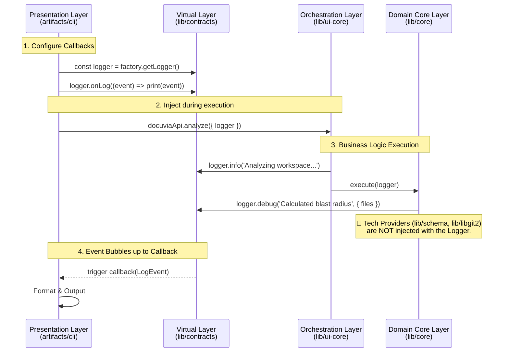

# Event-Driven Logging Architecture

> **Mandatory Architecture Protocol:**
> Implementation libraries and business logic must **never** use `console.log`, `console.error`, or direct file-writing for logs. All logging must utilize the Event-Driven Logger injected by the Presentation Layer. The Presentation Layer has absolute authority over how, when, and where logs are formatted and persisted.

---

## 1. How It Works

Docuvia2 treats logging as a **Stream of Events** rather than a direct I/O operation.

The standard `Logger` object is defined within the `lib/contracts` layer. When the Presentation Layer (e.g., CLI or MCP Server) initiates a command, it configures this logger with specific **Callbacks** (Event Listeners) and injects it into the Orchestration Layer (`ui-core`).

As `ui-core` and the underlying implementation libraries execute, they simply emit structured log events (containing Level, Code, Message, and Context) into this logger object. The events bubble back up to the Presentation Layer's callbacks, which decide whether to render them as colorful CLI text, JSON-RPC notifications, or silent file writes.

---

## 2. Roles & Boundaries

### 🟨 The Virtual Layer (`lib/contracts`)

- **Role**: Defines the standard structures and the primitive Event Emitter.
- **Key Objects**:
  - `ILogger` Interface: Defines `.info()`, `.debug()`, `.error()`, `.warn()`.
  - `LogEvent` Type: Every log must conform to `{ level, code, message, context }`.
  - _(Exception to Zero-Logic)_: `contracts` may provide the base `Logger` class (an Event Emitter) and register it to the factory, so all layers share the exact same event bus implementation.

### 🟥 The Presentation Layer (`artifacts/cli`, `mcp`)

- **Role**: The Sink and Formatter.
- **Responsibilities**:
  - Retrieves the Logger and attaches event listeners.
  - **Decision Maker**: It decides _where_ the logs go (e.g., terminal `stdout`, a `.log` file, or an MCP JSON response).
  - **Formatter**: It decides _how_ the logs look (e.g., adding colors, emojis, or stripping out debug traces).

### 🟦 The Orchestration Layer (`lib/ui-core`)

- **Role**: The High-Level Reporter.
- **Responsibilities**:
  - Receives the `logger` from the Presentation Layer.
  - Decides _what_ high-level business events to record (e.g., "Starting AST Parsing", "Finished Knowledge Graph Sync").
  - Passes the `logger` down **only** to the Domain Core layer (`lib/core`).

### 🟩 The Domain Core Layer (`lib/core`)

- **Role**: The Detail Reporter.
- **Responsibilities**:
  - Uses the injected `logger` to record domain-specific operational details (e.g., "Calculated blast radius for 5 files", "Generated branch name").
  - It does not know if the log will be printed to a screen or thrown away. It just reports the domain facts.

### 🚫 The Technology Providers (`lib/schema`, `lib/ast-core`, `lib/libgit2`)

- **Role**: Silent Workers.
- **Responsibilities**:
  - They **do not** receive the `logger`.
  - **Observability is not their job**: If we need to measure how long a SQL query takes, or the progress of a Git clone, it is the responsibility of the calling layer (`lib/core` or `lib/ui-core`) to wrap that call, measure the execution time, and log the performance metric. The Tech Providers remain pure, silent functions.

---

## 3. The Goal

To establish a unified, environment-agnostic telemetry system. We want to ensure that no rogue `console.log` pollutes the standard output, which is absolutely critical for protocols like MCP that rely on clean JSON streams via `stdio`.

## 4. The Problem

In previous architectures, logging was highly fragmented:

1.  **Stdout Pollution**: `lib/schema` might use `console.log("DB connected")`. When running as an MCP Server over `stdio`, this plaintext log would corrupt the JSON-RPC stream, instantly crashing the AI agent's connection.
2.  **Inflexible Verbosity**: Hardcoded `console.log` statements meant developers had to manually comment out code to silence logs in production.
3.  **Missing Context**: Errors and logs were just strings, lacking the structural context (like Workspace UUID or Error Codes) needed for post-mortem analysis.

## 5. The Rationale

By implementing an **Inversion of Control (IoC) via Callbacks**, we strip the underlying libraries of the right to perform I/O operations for logging.

- `lib/core` just emits an event.
- If the CLI is running in `--verbose` mode, the CLI's callback prints it.
- If the CLI is in `--silent` mode, the callback simply ignores the event.
  This guarantees that the Presentation Layer has 100% control over the process's standard output streams.

## 6. The Pros

1.  **Protocol Safe (MCP-Ready)**: Complete elimination of rogue `stdout` writes ensures protocols like MCP will never crash due to random debug text.
2.  **Highly Customizable**: The CLI can format logs with beautiful spinners and colors, while a background daemon can write the exact same events to a structured JSON file for Datadog/ELK.
3.  **Unified Structural Data**: Forcing logs to conform to `{ level, code, message, context }` means we can easily build analytics tools to trace execution paths later.

## 7. The Cons

1.  **Prop-Drilling**: The `logger` object must be passed down through function arguments or injected via `docuviaMemory` throughout the entire call stack.
2.  **Boilerplate**: A simple debug message now requires constructing an object rather than just a quick `console.log("here")`.
