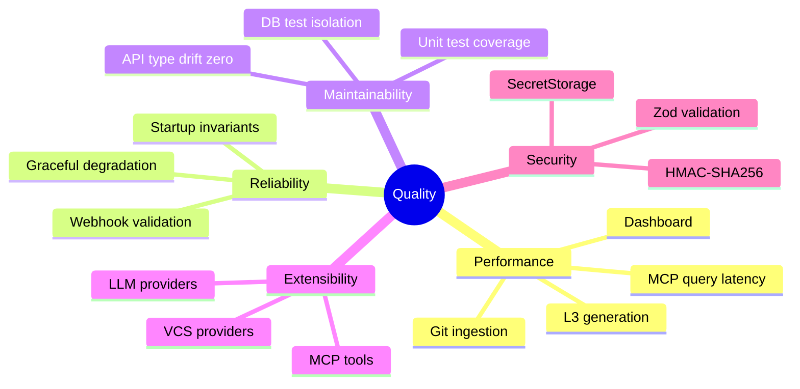

# Quality Requirements

## Quality Tree

---

## Quality Scenarios

### Performance

| Scenario                                                           | Stimulus                                                                              | Response                        | Target                             |
| ------------------------------------------------------------------ | ------------------------------------------------------------------------------------- | ------------------------------- | ---------------------------------- |
| MCP query latency                                                  | Single `POST /mcp/query` request with embedding-based search                          | End-to-end server response time | p95 < 2s (excluding LLM call time) |
| [Git ingestion](../adr/ADR-004-git-isomorphic-graph.md) throughput | `POST /projects/:id/ingest/git` with 1,000 commits                                    | Ingestion completion time       | < 30 seconds                       |
| [L3 generation](../adr/ADR-005-knowledge-abstraction-strategy.md)  | `POST /projects/:id/generate` with 50 unprocessed commits                             | Pipeline completion time        | < 5 minutes (LLM-call-bound)       |
| Dashboard load                                                     | `GET /dashboard`                                                                      | Response time                   | < 500ms                            |
| Knowledge Graph TreeView                                           | [VS Code extension](../adr/ADR-001-vscode-client-onboarding.md) TreeView first render | Time to first node visible      | < 1 second after activation        |

### Reliability

| Scenario                     | Stimulus                                                                                     | Response                                                                    | Target                                 |
| ---------------------------- | -------------------------------------------------------------------------------------------- | --------------------------------------------------------------------------- | -------------------------------------- |
| GitHub webhook: invalid HMAC | POST `/github/webhooks` with wrong signature                                                 | HTTP 401; no processing                                                     | Zero false-positive webhook processing |
| LLM API unavailable          | LLM endpoint times out during [generate pipeline](../adr/ADR-008-asynchronous-metabolism.md) | Graceful degradation: error logged; partial results saved; no DB corruption | No data loss; partial output committed |
| Missing PORT env var         | `api-server` startup                                                                         | Explicit throw with variable name in error message                          | Immediate, clear failure               |
| DB connection failure        | PostgreSQL unavailable at startup                                                            | Server fails fast with clear error                                          | No silent degradation                  |
| Concurrent generate requests | Two `POST /generate` on same project                                                         | Idempotent or serialized; no duplicate rows                                 | No duplicate L2/L3 nodes created       |

### Maintainability

| Concern              | Rule                                 | Mechanism                                                                                                      |
| -------------------- | ------------------------------------ | -------------------------------------------------------------------------------------------------------------- |
| API type drift       | Zero tolerance                       | All types generated from `openapi.yaml`; CI checks typecheck-and-build on every PR                             |
| Test isolation       | DB state must not leak between tests | `withRollback()` from `artifacts/api-server/test/support/db.ts` wraps all DB-backed integration tests          |
| Test discoverability | Tests colocated with source          | `*.unit.test.ts` files adjacent to source modules; integration tests under `artifacts/<pkg>/test/integration/` |
| External API mocking | No live external calls in tests      | MSW handlers in `artifacts/api-server/test/setup/msw/handlers.ts`; large fixtures in `msw/fixtures/`           |
| Coding standards     | Consistent across team               | See [Coding Guidelines](./crosscutting-concepts.md#4-coding-guidelines)                                        |

### Extensibility

| Extension Point     | Protocol / Interface         | How to Add                                                                   |
| ------------------- | ---------------------------- | ---------------------------------------------------------------------------- |
| New VCS provider    | `VcsIngestAdapter` interface | Implement interface; register in `artifacts/api-server/src/routes/ingest.ts` |
| New LLM provider    | `LLMClient` interface        | Implement in `lib/integrations-openai-ai-server/`; inject via constructor    |
| New MCP tool        | OpenAPI path + handler       | Add path to `openapi.yaml` → run codegen → implement Express route handler   |
| New API endpoint    | OpenAPI spec                 | Add to `openapi.yaml` → codegen → implement; never hand-write types          |
| New VS Code command | `extension.ts`               | Register in `activate()`; implement handler; follow Controller/Model pattern |

---

## Known Acceptance Test Gaps

The following quality areas have known gaps in automated test coverage:

| Gap                                                                                                      | Severity  | Reference                                                            |
| -------------------------------------------------------------------------------------------------------- | --------- | -------------------------------------------------------------------- |
| End-to-end LLM pipeline testing ([L1→L2→L3](../adr/ADR-005-knowledge-abstraction-strategy.md) full flow) | 🟠 High   | Requires LLM mock fixture; not yet implemented                       |
| [VS Code extension](../adr/ADR-001-vscode-client-onboarding.md) Playwright E2E tests                     | 🟠 High   | `artifacts/vscode-client/tests/` has spec stubs; fixtures incomplete |
| Cross-project link detection accuracy                                                                    | 🟡 Medium | Cosine similarity threshold not validated against real-world data    |
| UI component snapshot tests                                                                              | 🟢 Low    | No snapshot tests for kg-engine React components                     |
| GitHub webhook E2E (with real PR diff)                                                                   | 🟡 Medium | Only unit-level HMAC validation tested                               |

_(Legacy testcase roadmaps deprecated. Refer to `AGENTS.md` for current testing strategy.)_

---

## Operations & Resilience

To prevent infinite crash loops, errors in the [background queue](../adr/ADR-008-asynchronous-metabolism.md) are subjected to a Dead Letter Queue (DLQ) pattern. Any job failing 3 times is isolated into the `error_reports` table.

---

## References

- [Crosscutting Concepts](./crosscutting-concepts.md#4-coding-guidelines) — Coding rules that enforce maintainability
- [Risks and Technical Debt](./risks-and-debt.md) — Quality risks and known gaps
- [docs/gitbook/development/vscode-client/ui-ux/user-journeys.md](../development/vscode-client/ui-ux/user-journeys.md) — VS Code extension user journeys and known bugs
