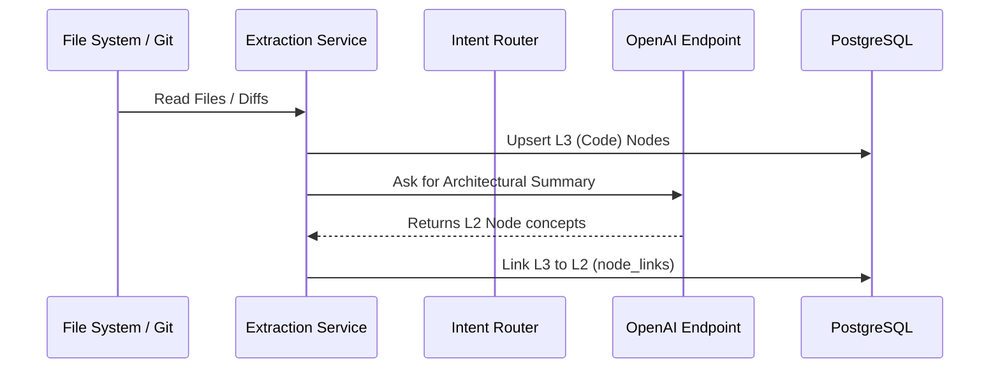
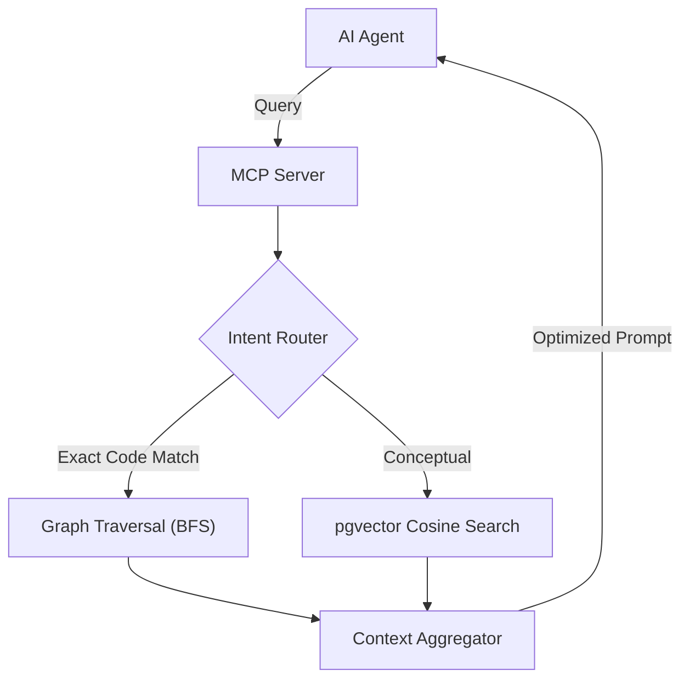
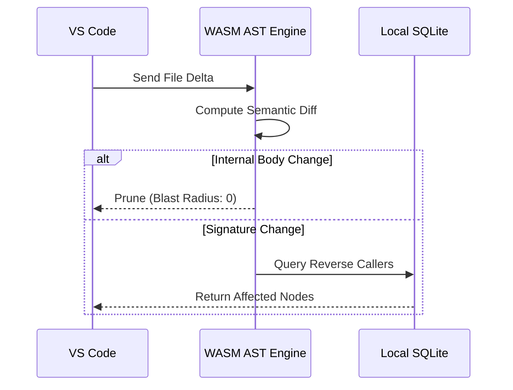

# Runtime Scenarios

This document explains how the building blocks collaborate at runtime to fulfill Docuvia's core use cases.

## Scenario 1: Knowledge Generation Pipeline (Metabolism)

When new code is pushed or a repository is analyzed, the system extracts nodes and computes semantic relationships asynchronously.

> **Explanation:** During ingestion, the Extraction Service reads code and pushes L3 structural nodes to the database. It then asynchronously queries an LLM to derive higher-level L2 architectural concepts, linking them back to the code. This "Metabolism" runs in the background to prevent blocking.

**Key Dependencies & Status:**

- **Server-Side Metabolism**: Handled asynchronously via `metabolism.ts`. See [ADR-008](../adr/ADR-008-asynchronous-metabolism.md).
  - _Status_: [✅ Implemented](../roadmap/features/server-side-metabolism.md)

---

## Scenario 2: Agentic RAG Query (MCP)

When an AI Agent (like Claude Code) asks a question, the Intent Router classifies the request to minimize token usage.

> **Explanation:** The Intent Router classifies each incoming query into one of four strategies before dispatch, so exact-match lookups take the cheap graph traversal path while conceptual questions take the vector search path — minimizing LLM token spend on retrieval.

**Key Dependencies & Status:**

- **Agentic RAG (Intent Router)**: 4-way classification routing. See [ADR-007](../adr/ADR-007-agentic-rag-routing.md).
  - _Status_: [✅ Implemented](../roadmap/features/agentic-rag-intent-router.md)

---

## Scenario 3: Smart Blast Radius Detection

When a developer saves a file, Docuvia computes the exact semantic impact locally.

> **Explanation:** To minimize sync overhead, the WASM AST Engine intercepts local file saves. It computes a semantic diff: if only internal logic changed, the blast radius is pruned to 0. If signatures changed, it queries the local graph to find and notify all upstream dependents.

**Key Dependencies & Status:**

- **WASM Semantic Diff**: Smart pruning using Tree-sitter. See [ADR-022](../adr/ADR-022-wasm-ast-blast-radius.md).
  - _Status_: [✅ Implemented](../roadmap/features/smart-blast-radius-wasm-semantic-diff.md)

---

## References

- [ADR-007: Agentic RAG Routing](../adr/ADR-007-agentic-rag-routing.md)
- [ADR-008: Asynchronous Metabolism](../adr/ADR-008-asynchronous-metabolism.md)
- [ADR-022: WASM AST Blast Radius](../adr/ADR-022-wasm-ast-blast-radius.md)
