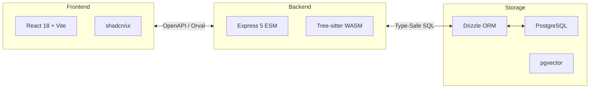
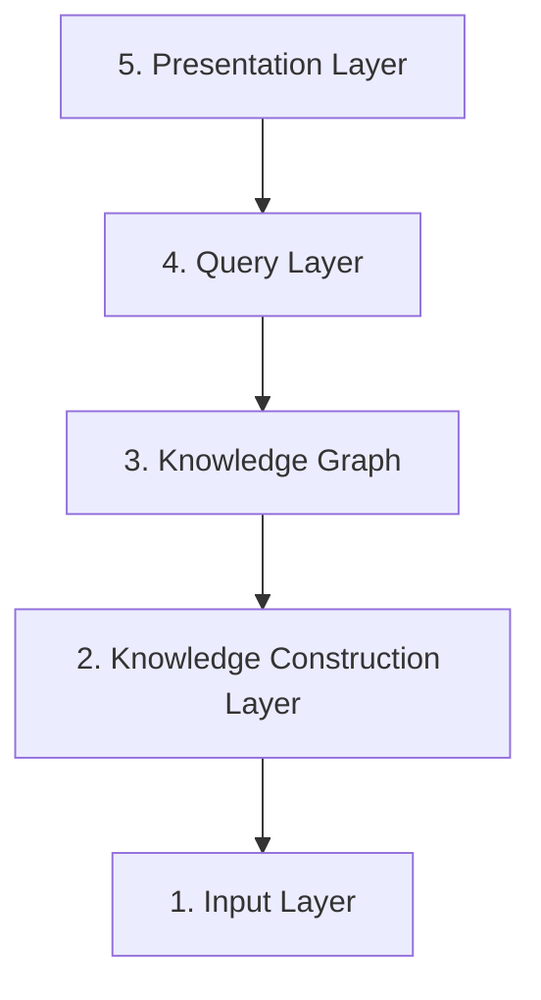

# Solution Strategy

This document outlines the high-level technology choices and the top-level architectural decomposition of Docuvia.

## Technology Choices

The technology stack is carefully selected to balance type safety, execution speed, and Agentic RAG capabilities.

> **Explanation:** This diagram shows the end-to-end data flow. The Frontend communicates with the Backend strictly via types generated from the OpenAPI spec by Orval. The Backend leverages Tree-sitter for fast AST parsing and interacts with PostgreSQL (augmented by `pgvector` for AI embeddings) purely through Drizzle ORM.

**Key Decisions & Status:**

- **Language**: TypeScript (strict mode) for full-stack type safety.
- **AST Engine**: `@workspace/ast-core` using `tree-sitter.wasm`. See [ADR-020](../adr/ADR-020-unified-isomorphic-ast-microkernel.md).
  - _Status_: [✅ Implemented](../roadmap/features/ast-microkernel-architecture.md)
- **Database & ORM**: PostgreSQL with `pgvector` and Drizzle ORM. See [ADR-019](../adr/ADR-019-pgvector-migration.md).
  - _Status_: [✅ Implemented](../roadmap/features/pgvector-migration.md)
- **API Contract**: OpenAPI 3.x with Orval codegen to eliminate type drift.
  - _Status_: [✅ Implemented](../roadmap/features/ci-cd-pipeline.md)
- **IDE Integration**: VS Code Extension API.
  - _Status_: [✅ Implemented](../roadmap/features/workspace-onboarding-init.md)

---

## Top-Level Decomposition

Docuvia is decomposed into **five conceptual layers**, each corresponding to one or more packages in the monorepo:

> **Explanation:** The system is divided into five distinct layers. Raw files enter the Input Layer, are structurally analyzed in the Knowledge Construction Layer, stored in the Graph database, routed by the Query Layer for RAG optimization, and finally surfaced to users and agents in the Presentation Layer.

### 1. Input Layer

Handles raw data ingestion from Git/SVN. Uses a 4-Phase Parsing Funnel to filter binaries and encode data safely.

### 2. Knowledge Construction Layer

Uses the AST engine to extract structural metadata (L3 nodes, edges) and the LLM engine to extract conceptual intent (L2 nodes, summaries).

- _Status_: [✅ Implemented](../roadmap/features/l2-extractor.md)

### 3. Knowledge Graph (Database)

Stores the nodes and relationships. Uses `pgvector` for semantic search and `node_links` for graph BFS queries.

- _Status_: [✅ Implemented](../roadmap/features/core-db-schemas-defined.md)

### 4. Query Layer

The **Intent Router** classifies incoming queries to route them optimally (Direct, Graph, Vector, or Hybrid) to minimize LLM token overhead. See [ADR-007](../adr/ADR-007-agentic-rag-routing.md).

- _Status_: [✅ Implemented](../roadmap/features/agentic-rag-intent-router.md)

### 5. Presentation Layer

Exposes the knowledge via MCP (for AI Agents), REST API (for Web Dashboards), and VS Code integration.

- _Status_: [✅ Implemented](../roadmap/features/mcp-route-scaffolding.md)
