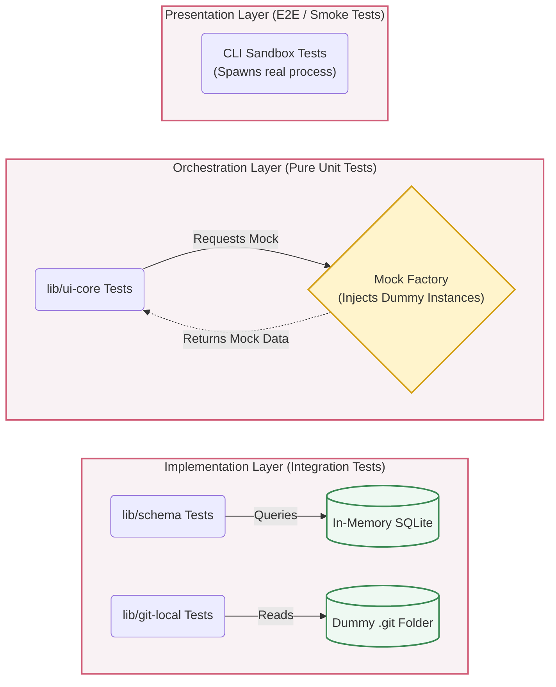

# Strict Testing & Quality Gates Architecture

> **Mandatory Architecture Protocol:**
> Test-Driven Development (TDD) is not optional. Code must not be written without a failing test (Red-Green-Refactor). Furthermore, testing boundaries must strictly align with the Two-Layer Virtual Contracts Architecture: Orchestration layers must be tested using pure Mocks, while Implementation layers must be tested in isolation.

---

## 1. How It Works

Thanks to the **Virtual Contracts Architecture**, Docuvia2 achieves the holy grail of software testing: perfect isolation.

Because `ui-core` relies entirely on interfaces from `lib/contracts`, we can test complex business logic instantly by injecting Mock implementations into the `docuviaFactory`. Conversely, Implementation libraries (`lib/schema`, `lib/git-local`) are tested in complete isolation against real local resources (like an in-memory SQLite database or a dummy `.git` folder) without needing to boot up the CLI or Orchestrator.

---

## 2. Roles & Testing Boundaries

The testing strategy is segregated into specific lanes based on the architectural roles:

### 🟨 The Virtual Layer (`lib/contracts`)

- **Role**: The Mock Provider & Registry Guardian.
- **Responsibilities**: In addition to interfaces, this layer provides standardized Mock utilities and Test Factories (e.g., `createMockLogger()`, `createMockDb()`) exclusively for testing purposes.
- **Factory Lock**: During unit tests, the test suite must engage a **Factory Lock** (`docuviaFactory.lock()` or similar mechanism) before running. This prevents any accidental imports of real implementation libraries (like `lib/schema`) from overwriting the registered mocks during the test runner's discovery phase, ensuring pristine test isolation.

### 🟦 The Orchestration Layer (`lib/ui-core`) & Domain Core (`lib/core`)

- **Test Type**: Pure Unit Tests.
- **Rules**:
  - **NO I/O ALLOWED**: Tests in this layer must execute in milliseconds. They are absolutely forbidden from writing to disk, connecting to a real database, or calling external APIs.
  - **Dependency Injection**: Tests must register mock providers to the `docuviaFactory` before executing the `ui-core` logic, asserting that `ui-core` calls the expected methods with the correct mapping parameters.

### 🟩 The Technology Providers (`lib/schema`, `lib/git-local`, `lib/ast-core`, `lib/llm-api`, `lib/remote-api`)

> `lib/plugins-ast` (per-language AST configs) is a plugin package rather than a standalone Tech
> Provider, but its tests follow the same shape — isolated integration tests against the real
> tree-sitter host ([PLAT-009](../adr/platform/PLAT-009-ast-core-technology-provider-type-b.md)).

- **Test Type**: Isolated Integration Tests.
- **Rules**:
  - **Real I/O Required**: These tests _must_ interact with the real underlying technology (e.g., `lib/schema` spins up a real SQLite instance).
  - **Contract Assertion**: The test's primary goal is to execute the raw operation and assert that the output perfectly maps to the `lib/contracts` interface (The Mandatory Mapping rule).

### 🟥 The Presentation Layer (`artifacts/cli`, `mcp`)

- **Test Type**: Smoke & E2E Tests.
- **Rules**:
  - These tests spawn a real Node.js child process or run an MCP client against the full stack.
  - They are kept minimal (Smoke tests < 5 minutes) to verify that the Bootstrap phase, CLI flag parsing, and cross-layer wiring work end-to-end.

---

## 3. Quality Gates (The Ratchet)

To prevent code rot, Docuvia2 enforces strict Quality Gates that AI Agents and human developers must pass before pushing code:

1.  **Coverage Ratchets**:
    - Core logic (`lib/*`) coverage must remain ≥ 85%.
    - CI pipelines will fail the build if a Pull Request drops the coverage below the threshold.
2.  **Test Lane Segregation**:
    - `pnpm run test:smoke`: Fast critical-path tests. Must pass locally before committing.
    - `pnpm run test`: Full regression suite (Unit + Integration + E2E).
3.  **No Bypassing (The AI Trap)**:
    - AI agents are forbidden from writing tests that merely `expect(true).toBe(true)` or silencing errors simply to pass the CI gate. The Adversarial Protocol dictates that QA/Challenger personas must verify the robustness of assertions.

## 4. The Goal

To achieve 100% developer and AI confidence. When an AI agent refactors `ui-core`, the unit tests should instantly flag if the orchestration flow breaks. When a developer updates a database schema, the isolated integration tests should guarantee the contracts are still honored.

## 5. The Problem

In previous iterations, Docuvia suffered from:

1.  **Overlapping Boundaries**: CLI tests were implicitly testing the database, meaning a single SQL schema change broke CLI tests, making it impossible to isolate where the bug originated.
2.  **Slow Test Suites**: Because everything was end-to-end, running tests took minutes, breaking the TDD loop (Red-Green-Refactor) and discouraging developers from running tests locally.
3.  **Coverage Decay**: Without ratchets, untested AI-generated code slipped into `main`, leading to silent runtime failures.

## 6. The Rationale

The Virtual Contracts Architecture naturally forms a "Test Pyramid". By enforcing pure unit testing at the Orchestration layer via Dependency Injection, we gain ultra-fast feedback loops. By pushing I/O into the isolated Technology Provider integration tests, we prove the system works against real infrastructure without slowing down the core test suite.

## 7. The Pros

1.  **Lightning Fast Feedback**: `ui-core` unit tests run in milliseconds, making strict TDD highly enjoyable and effective.
2.  **Laser-Precise Debugging**: If a test fails in `lib/schema`, you know exactly that the database mapping is broken. If a test fails in `lib/ui-core`, you know the business logic flow is wrong. No more guessing.
3.  **High AI Autonomy**: With strict coverage ratchets, we can safely allow AI agents to autonomously refactor large swaths of the codebase, trusting the test suite to catch regressions.

## 8. The Cons

1.  **Mock Maintenance**: Developers and AI must maintain the mock factories in `lib/contracts`, adding overhead when interfaces change.
2.  **Test Setup Boilerplate**: Writing tests for the Orchestration layer requires setting up the `docuviaFactory` environment and mocking all dependent tools before the actual `act` and `assert` phases can occur.
