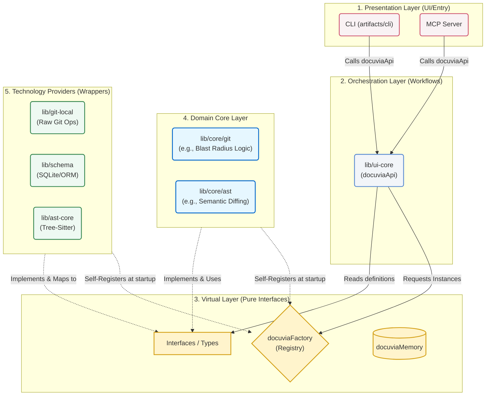

# The Virtual Contracts Architecture

> **Mandatory Architecture Protocol:**
> Docuvia2 strictly mandates the **Virtual Contracts** architecture across the entire workspace. All new features, bug fixes, and AI-agent operations must strictly adhere to these boundaries. Direct cross-imports between implementation libraries, or bypassing the orchestration layer, are strictly forbidden.

---

## 1. How It Works

Docuvia2 abandons the traditional Layered Architecture (which often suffers from dependency leakage) in favor of extreme **Dependency Inversion** and **Self-Registration**.

Implementation details (such as raw database queries, AST parsing, or raw Git operations) are hidden inside isolated libraries. Upon initialization, these libraries proactively "register" themselves into a global factory. The upper orchestration and presentation layers rely entirely on a set of pure, virtual "Contracts" and remain completely oblivious to the underlying technologies used.

---

## 2. Roles & Folder Mapping

The system is strictly divided into functional roles. Note the crucial distinction between the Domain Core (`lib/core`) and Technology Providers (e.g., `lib/git-local`):

### 🟨 The Virtual Layer (`lib/contracts`)

- **Role**: The absolute center of the application. It contains **0% operational logic**.
- **Contents**: Defines Interfaces, Types, Message structures, Error Handling, and Logging protocols.
- **Key Objects**:
  - `docuviaFactory`: The only globally permitted registration factory. Matches interfaces to concrete implementations.
  - `docuviaMemory`: A global static object used _exclusively_ to hold essential, process-lifetime state (e.g., current workspace paths or contextual locks). It is **not** a dump for runtime memory.

### 🟩 The Technology Providers (`lib/schema`, `lib/git-local`, `lib/ast-core`, `lib/llm-api`, `lib/remote-api`)

- **Role**: The raw capability wrappers. They interact directly with third-party technologies or file systems.
- **Rule**: If we decide to swap `git-local` for `isomorphic-git`, or `SQLite` for `MySQL`, these are the _only_ folders that change.
- **Mandatory Mapping**: They must strictly conform to `lib/contracts`. If `lib/schema` queries a database, it must map the raw SQL row into a pure `lib/contracts` interface before returning it. The underlying schema must never leak.
- **Plugin package**: `lib/plugins-ast` is not a standalone Tech Provider but a per-language **plugin package** — one `LanguageConfig` file per supported language, consuming `lib/ast-core`'s host types. `lib/ast-core` is the raw tree-sitter wrapper the plugins plug into; see [PLAT-009](../adr/platform/PLAT-009-ast-core-technology-provider-type-b.md).

### 🟦 The Domain Core Layer (`lib/core`)

- **Role**: Provides project-specific domain capabilities. **It is not on the same level as the Technology Providers.**
- **Distinction**: For example, `lib/git-local` simply provides raw Git operations (commit, checkout). However, `lib/core/git` provides the complex logic required specifically by Docuvia (e.g., calculating blast radius, generating knowledge branches).
- If `git-local` is replaced in the future, `lib/core/git` remains completely untouched because it solely relies on the generic Git interfaces defined in `lib/contracts`.

### 🟪 The Orchestration Layer (`lib/ui-core`)

- **Role**: The brain of the business logic workflows.
- **Responsibilities**: It requests tools from `docuviaFactory` (seeing only their interfaces) and combines them into valid, complex operations (e.g., "Analyze source code -> Generate Knowledge Branch -> Save to DB").
- **Key Object**: Exposes a unified `docuviaApi`. It does not know how the database works or how the AST is parsed; it only knows the workflows.

### 🟥 The Presentation Layer (`artifacts/cli`, `mcp`)

- **Role**: The boundary layer. Interfaces with humans or AI agents.
- **Responsibilities**: Parses user input, calls `docuviaApi`, and formats the output.
- **Constraints**: Strictly forbidden from accessing `lib/core`, `lib/schema`, or any underlying implementations directly.

---

## 3. The Goal

To build an **Extremely Decoupled**, **Pluggable**, and **AI-Safe** core engine. We aim to completely separate business logic from technical implementation, ensuring long-term maintainability and preventing "spaghetti code."

## 4. The Problem

In the first iteration of the Docuvia project, we faced severe architectural collapse:

1.  **Spaghetti Coupling**: The CLI directly read the database, and AST logic directly executed SQL writes. Changing a single SQLite schema broke hundreds of files across the entire project.
2.  **Vendor Lock-in**: Operational logic was heavily tied to specific package instances. Upgrading or swapping technologies became nearly impossible.
3.  **AI Hallucination Hazards**: With blurry boundaries, AI agents often took shortcuts, writing raw database queries directly inside the business logic layers, severely damaging system stability.

## 5. The Rationale

By enforcing the "Virtual Contracts" architecture, we separate _Definitions (Contracts)_ from _Operations (Orchestration)_:

- The Implementation layers (both Tech Providers and Domain Core) only care about their own inputs and outputs. They act as plug-and-play building blocks.
- The Orchestration layer (`ui-core`) doesn't care what material the blocks are made of; it only knows how to assemble them.
  This design completely quarantines technical details, allowing human developers and AI agents to focus entirely on single responsibilities.

## 6. The Pros

1.  **Painless Technology Swapping**: If we migrate from SQLite to MySQL, we only add a new DB Implementation Library and register it to `docuviaFactory`. `lib/ui-core`, `lib/core`, and `artifacts/cli` require **zero lines of code changes**.
2.  **Extreme Single Responsibility**: No developer needs to understand AST parsing and Database optimizations simultaneously. You only focus on mapping your specific module to the `contracts`.
3.  **Perfect Mocking & Testing**: Because everything relies on interfaces, replacing any layer with a mock implementation during unit testing is trivial.

## 7. The Cons

1.  **Mandatory Mapping Overhead**: Even if the underlying database schema looks exactly like the `contracts` type, the implementation layer **must** manually write the mapping logic. This introduces unavoidable boilerplate code.
2.  **Initial Learning Curve**: For new developers (or AI agents), you cannot simply "Go to Definition" in your IDE to find the execution code, as it will only jump to the interface. You must understand the Factory registration mechanism to locate the actual implementation files.

---

## 8. Import Restrictions & Type Safety (Coupling Prevention)

To prevent boundary erosion and long-term coupling, strict import rules apply between layers. The rules below are **enforced mechanically, not by convention**: ESLint's `no-restricted-imports` in `eslint.config.mjs` (scoped per directory, `artifacts/cli` and `lib/*`), with a regression suite (`test/layer-boundary.test.ts`) that proves each edge against the real config and scans the actual repo source — any future forbidden import turns CI red (issue #30).

1. **Tech Providers (`lib/schema`, `lib/git-local`, `lib/ast-core`, `lib/llm-api`, `lib/remote-api`, and the per-language plugin package `lib/plugins-ast`)**: **Strictly Forbidden** for any upper layer (`ui-core`, `artifacts/*`) to import anything from these packages, **including `import type`** (Type A). Tech providers wrap volatile third-party dependencies; allowing type imports would leak those dependencies' shapes (e.g., ORM query objects or Tree-sitter AST nodes) into the orchestration logic, breaking the Virtual Contracts isolation.
2. **Domain Core (`lib/core`)**: **Strictly Forbidden** for upper layers to import anything, **including `import type`** (Type A). While `core` contains pure business logic, allowing `import type` inevitably leads to high coupling and boundary erosion. The Orchestrator (`ui-core`) acts as the "purchaser" and `contracts` as the "bidding spec"; `core` simply fulfills the spec. A small allowlist of pure, side-effect-free helpers (`lib/core/src/index.ts`, e.g. `isSupportedSourceFile`) is exempted — they are not DI-registered behind a token and cannot move to contracts.
3. **The Solution: Type-Safe Registry**: Instead of relaxing import rules to alleviate the "writing interfaces is tedious" complaint, the `docuviaFactory` and `tokens.ts` are designed as a **Type-Safe Registry (TokenMap)**. Developers declare the required interface in `contracts`, register it in the `TokenMap`, and `docuviaFactory.resolve('TokenName')` provides 100% compile-time type safety without manual generic annotations or cross-layer type imports. All shared definitions must live in `contracts`.
4. **Implementation-layer directionality (Type B, [PLAT-009](../adr/platform/PLAT-009-ast-core-technology-provider-type-b.md))**: `ast-core` is the raw tree-sitter wrapper (a Technology Provider); `plugins-ast` is its per-language plugin package consuming ast-core's host types. Legal directions, left unlocked: `core → ast-core/plugins-ast` (Domain Core consumes Tech Providers) and `plugins-ast → ast-core` (plugin → host). Locked directions: any Technology Provider importing `lib/core` (upward inversion), any Technology Provider importing a sibling implementation package (cross-import, AGENTS.md mandate 1), and `ast-core → plugins-ast` (host importing its own plugin = cycle). Tech Providers may only import `@workspace/contracts` (plus third-party dependencies) — they never import `lib/core` or each other.
