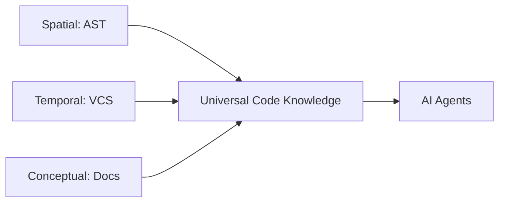

# Vision and Competitive Landscape

## The North Star

Docuvia aims to be a **VCS-based Knowledge Evolver** that acts as the ultimate **Cognitive Baseline for AI Agents**. Rather than being just another tool that reads code, Docuvia bridges the cognitive gap between human developers and AI assistants by ensuring both operate from a singular, explicitly documented, and temporally aware truth source.

- **Spatial (AST & Blast Radius)**: What is the exact call graph and structure of the code?
- **Temporal (History & Time)**: How did this code look in the past? What bugs were fixed, and what rules were learned from rebases?
- **Conceptual (Semantics & Docs)**: Which architectural document or PR discussion explains the rationale behind this module?

## Competitive Landscape Analysis

By comparing Docuvia with top-tier, highly mature open-source projects, we identify best-in-class architectural paradigms that shape our evolution. _(Refer to the [Master Dashboard](../roadmap/README.md) for detailed implementation status)._

### 1. Code Knowledge Graph (Spatial Accuracy)

| Project                 | Approach & Implementation                                                                                                                                                      | Status                                                                |
| :---------------------- | :----------------------------------------------------------------------------------------------------------------------------------------------------------------------------- | :-------------------------------------------------------------------- |
| **`code-review-graph`** | Relies strictly on Tree-sitter (30+ languages) to generate an Abstract Syntax Tree (AST), storing exact call flows into an SQLite database without depending on raw text.      | -                                                                     |
| **`graphify`**          | Maps multi-modal inputs (PDFs, images, videos) into a knowledge graph alongside code and emphasizes seamless integration with AI development environments.                     | -                                                                     |
| **Docuvia**             | Adopts the precision of AST via Tree-sitter while expanding nodes beyond pure code to include L1/L2 conceptual nodes derived from commit histories and architecture documents. | [✅ Implemented](../roadmap/features/ast-microkernel-architecture.md) |

### 2. Token Efficiency Optimization

| Project                 | Approach & Implementation                                                                                                                                                                                                     | Status                                                                     |
| :---------------------- | :---------------------------------------------------------------------------------------------------------------------------------------------------------------------------------------------------------------------------- | :------------------------------------------------------------------------- |
| **`code-review-graph`** | Utilizes a "Blast Radius" algorithm to isolate only the affected code fragments via local BFS graph traversal. This drastically reduces token consumption by avoiding full-repo contexts.                                     | -                                                                          |
| **`headroom`**          | Creates a proxy layer to implement Prefix Caching and Semantic Deduplication.                                                                                                                                                 | -                                                                          |
| **Docuvia**             | Implements local Blast Radius calculations (e.g., `/api/graph/impact`) and semantic deduplication in the Agentic RAG router (`intent-router.ts`) to intercept and compress queries before they reach expensive LLM endpoints. | [🔲 Planned](../roadmap/features/semantic-deduplication-in-agentic-rag.md) |

### 3. Multi-Agent Collaboration

| Project        | Approach & Implementation                                                                                                                                                                               | Status                                                              |
| :------------- | :------------------------------------------------------------------------------------------------------------------------------------------------------------------------------------------------------ | :------------------------------------------------------------------ |
| **`GitNexus`** | Features a mature **PR Swarm Review** mechanism using 7 independent personas (risk, security, tests, etc.) that review code in parallel and synthesize a final output.                                  | -                                                                   |
| **Docuvia**    | Orchestrates specialized agents (Frontend, Backend, Schema Expert) via a state machine (`task-verifier.agent.md`) and borrows parallel swarm review concepts to lighten the load on singular verifiers. | [🔲 Planned](../roadmap/features/parallel-swarm-review-concepts.md) |

### 4. Frontend & Safety Guardrails

| Project        | Approach & Implementation                                                                                                                                                                                                                              | Status                                                           |
| :------------- | :----------------------------------------------------------------------------------------------------------------------------------------------------------------------------------------------------------------------------------------------------- | :--------------------------------------------------------------- |
| **`tolaria`**  | Utilizes a Tauri-based local-first desktop app and strictly enforces a CodeScene Ratchet Gate, blocking AI-generated code that degrades codebase health.                                                                                               | -                                                                |
| **`graphify`** | Focuses on interactive visualizations (`graph.html` and Mermaid call-flows) to give human developers an immediate understanding of the graph.                                                                                                          | -                                                                |
| **Docuvia**    | Enhances the Vite + React Dashboard (`kg-engine`) and VS Code Client to render interactive topology maps for implementation plans, ensuring Human-in-the-loop oversight and implementing rigorous health-check gates before committing AI suggestions. | [🔲 Planned](../roadmap/features/rigorous-health-check-gates.md) |

## Strategic Implementation Priorities

To achieve this vision, we integrate these industry-leading strategies into a cohesive LNode Enhancement framework:

1. **AST Parser Phase**: Enforce strict extraction of code references (Tree-sitter) alongside semantic knowledge.
2. **Blast Radius Queries**: Handle dependency expansion strictly locally (via SQL BFS) to bypass massive LLM token overhead.
3. **Graphify-like Visualization**: Empower developers with visual implementation plans rendered in the frontend to validate AI decisions safely.

## Deep-Dive Comparisons

Per-domain benchmarks against sibling workspace projects (`code-review-graph`, `graphify`, `GitNexus`, `headroom`, `tolaria`):

1. [AST & Semantic Graph](ast-semantic-graph.md)
2. [Agentic RAG](agentic-rag.md)
3. [MCP AI Interfaces](mcp-ai-interfaces.md)
4. [IDE & VS Code Client](ide-vscode-client.md)
5. [Data Pipeline & Sync](data-pipeline-sync.md)
6. [CLI & Core API Parity](cli-core-api.md)

See also the [Capabilities Matrix](../development/capabilities-matrix.md) for a scored side-by-side across all projects.
