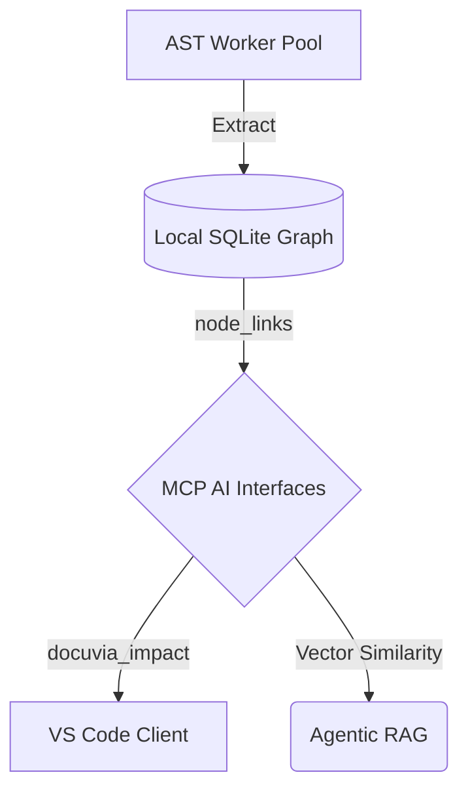

# Detailed Development Materials

This section collects the implementation-level deep-dives that sit underneath the formal [System Architecture](../architecture/README.md) chapters: capability benchmarking, refactoring notes, low-level AST/WASM mechanics, and the full VS Code extension design.

- **[Capabilities Matrix](capabilities-matrix.md)** — Scored comparison of Docuvia against sibling workspace projects across knowledge-graph, AI/LLM, architecture, and QA dimensions.
- **[Refactoring Plan](refactoring-plan.md)** — Structural refactor moving AST parsing core from `artifacts/` into `lib/`, and extracting shared services into `lib/core`.
- **[AST Semantic Diff & Blast Radius (WASM)](wasm-ast-blast-radius.md)** — How `web-tree-sitter` powers semantic diffing and smart-pruned blast radius without a heavy database.
- **[VS Code Client — Design Overview](vscode-client/00-router-overview.md)** — Full extension architecture: command palette, chat participant, knowledge graph tree view, and UI/UX guidelines (17 pages).

## Local-First Architecture Concepts & Status

_Project Focus: Prioritize Local-First features. Other features are deprioritized unless addressing critical bugs._

This is the high-level index for tracking Docuvia's architectural pillars and benchmarking our progress against industry leaders (e.g., GitNexus, Cursor, Sourcegraph Cody, Copilot Workspace).

Each pillar below links to a dedicated deep-dive in [Competitive Comparisons](../comparisons/README.md) that outlines our unique edge, fatal flaws, and the immediate roadmap required to achieve and surpass parity.

## Architecture Data Flow

## Architectural Pillars & Competitor Analysis

- **[1. AST & Semantic Graph](../comparisons/ast-semantic-graph.md)**
  - _Core Challenge:_ Achieving real-time incremental parsing and deep cross-language call graph resolution without sacrificing our L1-L3 intent tracking.

- **[2. Agentic RAG](../comparisons/agentic-rag.md)**
  - _Core Challenge:_ Implementing robust hybrid search and intent routing temporal decay to ensure context retrievals never miss critical cross-module dependencies.

- **[3. MCP AI Interfaces](../comparisons/mcp-ai-interfaces.md)**
  - _Core Challenge:_ Expanding our MCP toolset to provide granular blast radius and semantic search capabilities directly to LLMs.

- **[4. IDE & VS Code Client](../comparisons/ide-vscode-client.md)**
  - _Core Challenge:_ Reducing agent response latency and improving inline diff applications to match native editor integrations.

- **[5. Data Pipeline & Sync](../comparisons/data-pipeline-sync.md)**
  - _Core Challenge:_ Moving heavy ingestion workloads to background processes and optimizing SQLite lock contentions to prevent main thread blocking during large monorepo syncs.

- **[6. CLI & Core API Parity](../comparisons/cli-core-api.md)**
  - _Core Challenge:_ Ensuring complete parity and consistent vocabulary (e.g., `sync` vs `refresh`) across our CLI, MCP, and VS Code presentation layers.

- **[7. AST Semantic Diff & Blast Radius (WASM)](wasm-ast-blast-radius.md)**
  - _Core Challenge:_ Using web-tree-sitter to perform semantic diffs and smart pruning to achieve zero-cost delta updates without heavy databases.
