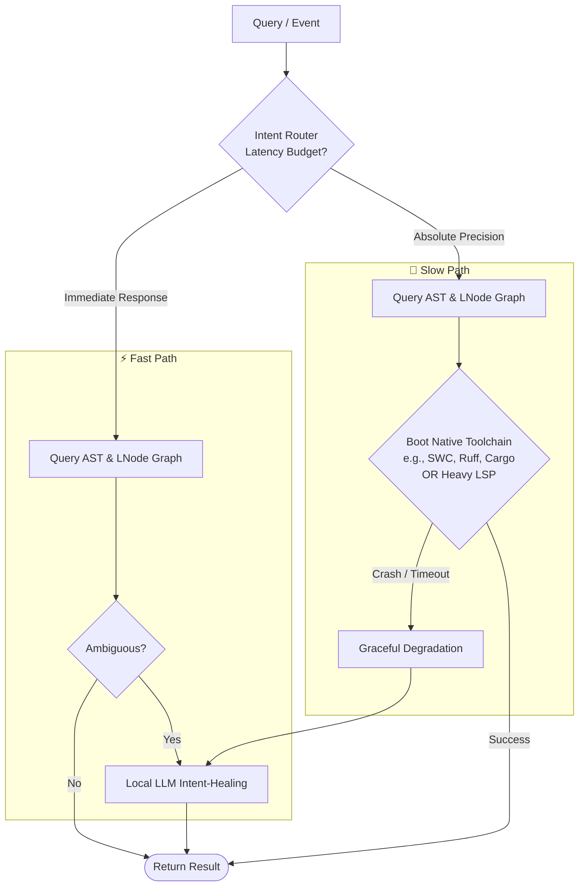
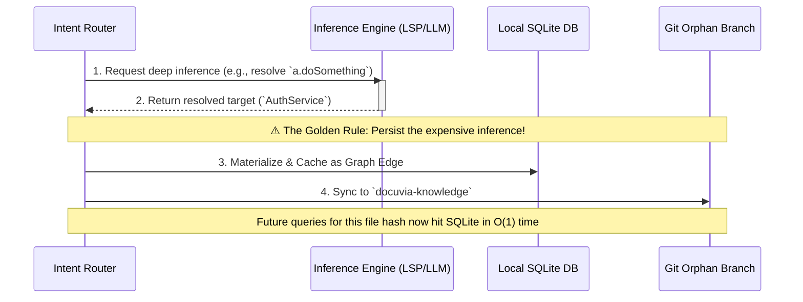

# Progressive Enrichment (Dynamic Degradation Routing)

This document consolidates everything you need to know about how Docuvia handles deep code analysis, blast radius calculation, and execution flow tracing without suffering from out-of-memory (OOM) crashes.

---

## 1. The Core Problem: Precision vs. Resilience

When analyzing a large codebase (e.g., to find all callers of a function), there are two extreme approaches:

- **Pure Static Analysis (Tree-sitter AST)**: Lightning fast, never crashes, requires 0 dependencies. But it lacks type inference and often fails on dynamic imports or complex generics (e.g., achieving only 60-80% precision).
- **Compiler/LSP Analysis (e.g., `tsserver`)**: 100% precise. But running it across a 10,000-file monorepo during a batch `init` phase causes massive RAM spikes (OOM) and fails completely if `node_modules` aren't installed.

**The Docuvia Approach:** We do not choose one. We use a **Dynamic Degradation Router** (often called the AST+LSP Dual Engine) to balance latency and precision.

> **Related:** This document covers the _execution_ routing — once a change is confirmed to need re-evaluation, this decides which engine handles it and how results get persisted. The _trigger_ logic that decides whether re-evaluation is needed at all lives in [AST Semantic Diff & Blast Radius](wasm-ast-blast-radius.md).

---

## 2. The Playbook: Fast vs. Slow Paths

When a query enters the system (e.g., a hover event or an Agentic RAG MCP call), it follows strict routing rules based on latency budgets:

### ⚡ Fast Path: Immediate Response Required

_(Triggered by UI events like Hover, Autocomplete, or rapid Graph Exploration)_

- **Pipeline:** `AST -> LNode -> Local LLM -> Cloud LLM`
- **Mechanism:** The system queries the baseline SQLite graph built via WASM AST. If a relationship is ambiguous, the Intent Router will immediately pass the localized AST snippet to a fast local LLM (Intent-Healing) to guess the relationship.
- **Rule:** **NEVER** boot the LSP on the Fast Path.

### 🐢 Slow Path: Absolute Precision Required

_(Triggered by background metabolism, deep PR impact analysis, or explicit Agent requests)_

- **Pipeline:** `AST -> LNode -> Fast Native Toolchain (SWC/Ruff) -> Heavy LSP -> Local LLM -> Cloud LLM`
- **Mechanism:** The system performs "Predictive Pre-warming." Before resorting to a bloated LSP (like `tsserver`), the system checks for highly optimized, language-specific native toolchains (e.g., `SWC` or `Biome` for TS, `Ruff` for Python, `Cargo` for Rust). It asynchronously shells out to these fast toolchains to extract 100% precise type information. If none exist or they crash due to a broken build, it attempts a heavy LSP boot. If all compiler-grade tools fail, the system _gracefully degrades_ back to the Local LLM for intent-healing.

---

## 3. Cumulative Knowledge Accumulation (The Golden Rule)

**Never treat the Slow Path as a disposable request.**
Every time the system incurs the high cost of booting an LSP, running a compiler, or performing an LLM Intent-Heal, the resulting knowledge **MUST be persisted**.

1. **Materialize:** Convert the inferred relationship (e.g., resolving `a.doSomething()`) into a deterministic Graph Edge.
2. **Local Cache:** Write it to the local SQLite database.
3. **Global Sync:** Push the edge to the `docuvia-knowledge` orphan branch.
   _(Result: The expensive 5-second inference cost is paid exactly once per file hash. All subsequent queries become $O(1)$ fast-path hits for the entire team)._

---

## 4. 🚫 Strict Taboos & Allowed Practices


**WHAT NOT TO DO:**

- **NEVER batch-process with an LSP:** Do not attempt to run a heavy LSP (like `tsserver`) over the entire repository during the `init` or `sync` phase. It will cause an OOM crash.
- **NEVER discard inferred edges:** If a slow-path toolchain or LLM deduces a relationship, it must be saved to the database. Discarding it violates the Cumulative Accumulation rule.
- **NEVER fail fatally on compiler errors:** If an LSP or native toolchain fails to run (e.g., missing dependencies), the system must gracefully degrade to AST + LLM Healing. A broken project build should not break the knowledge graph.
  


**WHAT YOU CAN DO (The GitNexus Parity):**

- **Batch-Process during `init` using Fast Toolchains:** It is _highly encouraged_ to run a global extraction pass during project initialization IF you are using the Fast Native Toolchains (SWC, Ruff) combined with Local LLM Intent-Healing. Because these do not suffer from the bloat of an LSP, they can safely run across 10,000 files in the background, populating the graph exactly like GitNexus and `code-review-graph` do.
  

---

## 5. 🛠️ Future Enhancements (WIP)

- **[Enhancement] Toolchain Extensibility:** Currently, Docuvia relies heavily on generic LSPs. We need to implement adapters to shell out directly to ultra-fast native toolchains (like SWC, Biome, or Ruff) to drastically reduce the 3-5s cold start time.
- **[Enhancement] Local LLM RAM Profiling:** We need strict memory profiling to ensure that running a local LLM for "Intent Healing" alongside normal VS Code operations stays under our 1GB-2GB RAM budget limit.
