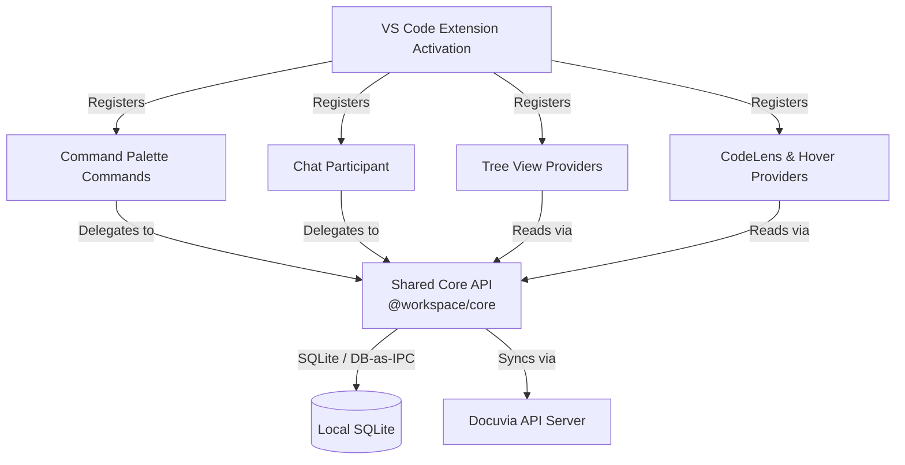

# VS Code Client Design Router

This directory contains the structural and functional design documentation for the Docuvia VS Code Client (`@workspace/vscode-client`).

AI Agents and developers should consult these files to understand the architecture, command flows, and component responsibilities before making changes to the extension. For a package-level introduction (activation flow, current architecture status), see [Packages → VS Code Client](../../packages/vscode-client.md) first.

## Extension Component Architecture

Per [ADR-021: Shared Core API and Presentation Layers](../../adr/ADR-021-shared-core-api-and-presentation-layers.md), the VS Code Client acts strictly as a presentation layer. It composes `@workspace/core`, which handles all business logic, local SQLite state, and remote synchronization. **This refactor is complete in the current codebase** — there is no `KnowledgeStore`, `TaskRunner`, or `CentralServerClient` class left in `src/`.

## Documentation Index

### 1. Knowledge Graph & Task Queue Views (`knowledge-graph/`)

- [Tree Nodes & Multi-root Structure](./knowledge-graph/nodes.md) – Explains the `KGNode` hierarchy (`project` -> `l1tag` -> `l2module` -> `l3entry`) and workspace scoping. Implemented in `artifacts/vscode-client/src/knowledge-graph-tree-provider.ts`.
- [Inline Init Action](./knowledge-graph/init-action.md) – Describes the contextual `Init` button for uninitialized workspace folders. Registered in `artifacts/vscode-client/src/extension.ts`.
- [Knowledge Graph State](./knowledge-graph/store.md) – How state is read directly from `@workspace/core` (`LocalSnapshotService`, `openLocalDatabase`) now that `KnowledgeStore` is gone.
- **Task Queue view** — a second sidebar tree (`docuvia.taskQueue`, registered alongside Knowledge Graph in `package.json`) does not yet have a dedicated design doc.

### 2. Command Palette Flows (`command-palette/`)

The extension registers **21 commands** in total (`package.json` → `contributes.commands`). Four have dedicated flow docs; the rest are simpler and documented inline in code:

- [Init Project](./command-palette/init-project.md) – `docuvia.initProject`. Implemented in `artifacts/vscode-client/src/commands/init-project.ts`.
- [Add Decision](./command-palette/add-decision.md) – `docuvia.addDecision` / `addDecisionFromSelection`. Implemented in `artifacts/vscode-client/src/commands/decision.ts`.
- [Run Extraction](./command-palette/run-extraction.md) – `docuvia.runExtraction`, powered by the [AST Microkernel](../../adr/ADR-020-unified-isomorphic-ast-microkernel.md) via `ExtractService` (`@workspace/core`). Implemented in `artifacts/vscode-client/src/commands/extraction.ts`.
- [Cross-Project Search](./command-palette/search.md) – `docuvia.openSearch` / `searchFromSelection`. Implemented in `artifacts/vscode-client/src/commands/search.ts`.
- Other registered commands without a dedicated doc yet: `startExplore`, `graph.traverse`, `clean`, `status`, `detectChanges`, `sync`, `showDecisionsForLens`, `openDecision`, plus the credential commands (`setServerToken`, `clearServerToken` — see [Settings](./configuration/settings.md#credential-management)) and internal refresh/UI commands (e.g. `docuvia.knowledgeGraph.refresh`).

### 3. Settings & Configuration (`configuration/`)

- [Settings Overview](./configuration/settings.md) – List of user-configurable options defined in `artifacts/vscode-client/package.json`, plus the global `~/.docuvia/config.yaml` config file.

### 4. Copilot Chat Integration (`chat-participant/`)

- [Slash Commands](./chat-participant/slash-commands.md) – Registration and routing logic for the `@docuvia` chat participant. Currently implemented: `/explore`, `/query`, `/extract`, `/help`. `/init` is designed but not yet wired up as a chat command — see the Planned section in that doc. Implemented in `artifacts/vscode-client/src/chat-participant.ts` and `chat/handlers/`.

### 5. UI/UX Guidelines (`ui-ux/`)

- [User Journeys & Scenarios](./ui-ux/user-journeys.md) – The core user journeys and how features connect together, plus known bugs.
- [Notifications & Prompts](./ui-ux/notifications-and-prompts.md) – Standards for toasts, quick picks, and destructive actions.
- [Webview Panels](./ui-ux/webview-panels.md) – Design goals and theming for custom views (Search Results, Dashboard). Implemented in `artifacts/vscode-client/src/search-results-panel.ts` and `artifacts/vscode-client/src/dashboard-panel.ts`.
- [Editor Integration](./ui-ux/editor-integration.md) – Guidelines for CodeLens and Hover providers to ensure unobtrusive assistance. Implemented in `artifacts/vscode-client/src/docuvia-code-lens-provider.ts` and `artifacts/vscode-client/src/docuvia-hover-provider.ts`.

---

**Note to AI Agents:** When asked to implement or modify a feature in `vscode-client`, always read the corresponding design document here first to ensure you adhere to the established architecture and UX patterns. Where a doc contains a **🚧 Planned (Not Yet Implemented)** section, treat that as a design intent, not current behavior.
