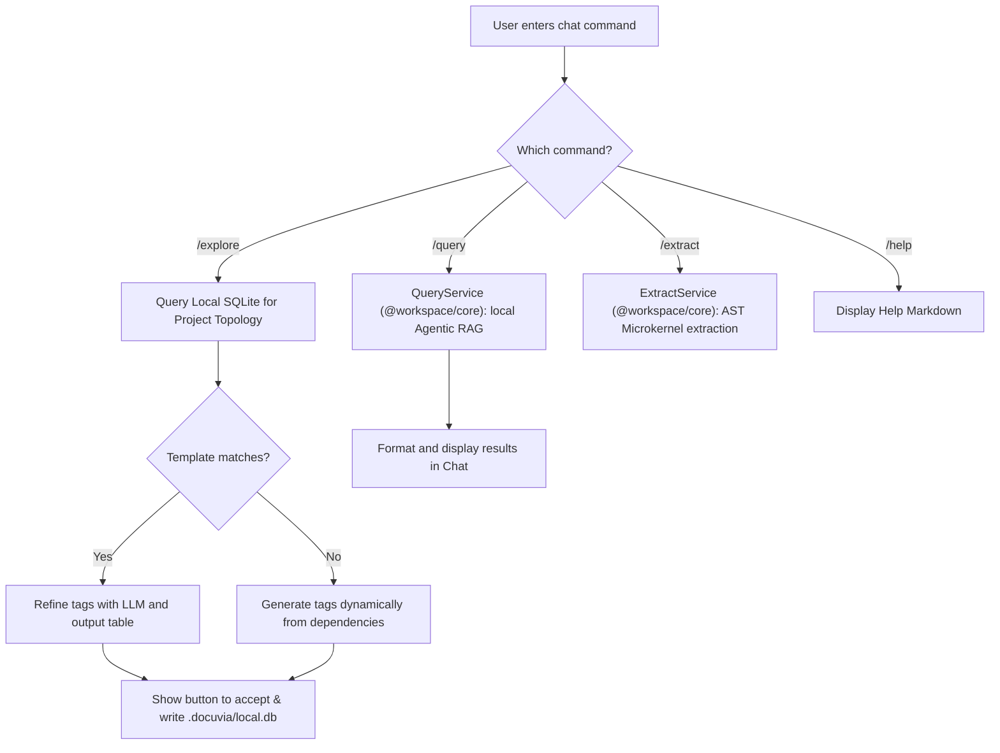

# Chat Participant: @docuvia

## Registration Details

- **ID**: `docuvia.assistant`
- **Name**: `docuvia`
- **Full Name**: `Docuvia Knowledge Graph`
- **Source Code**: `artifacts/vscode-client/src/chat-participant.ts` + handlers in `chat/handlers/` (`explore.ts`, `query.ts`, `extract.ts`)

Currently implemented slash commands: `/explore`, `/query`, `/extract`, `/help`. `/init` is not a registered chat command today — see [Planned: `/init`](#planned-init-not-yet-implemented) below; project initialization currently happens through the regular `docuvia.initProject` command (see [Init Project](../command-palette/init-project.md)), not through chat.

### `/explore`

- **Description**: Detect project type and suggest L1 tags for [Database-as-IPC](../../../adr/ADR-014-sql-indexed-graph-and-database-as-ipc.md) via [Three-tier knowledge graph](../../../adr/ADR-005-knowledge-abstraction-strategy.md)
- **Flow**:

  #### 1. Keyword type override (fast path)

  If the user's prompt contains a recognised project-type token (`backend`, `frontend`, `library`, `data-science`, `cli`, `fullstack`, `monorepo`), Docuvia skips workspace detection and immediately matches the token against the built-in `L1_TEMPLATES` array. The matching template's tags are formatted as markdown and streamed to chat.

  > ⚠️ NOTE: `data-science` is present in `TYPE_TOKENS` (`chat-participant.ts:157`) but has no corresponding entry in `L1_TEMPLATES`. The `if (template)` guard never fires, so workspace detection is **not** skipped – this is a dead token and a known code gap, still present.

  #### 2. Workspace detection (default path)

  When no type keyword is found:
  1. Reads `README.md` and `package.json` from `workspaceFolders[0]` (first workspace only).
  2. Calls `detectProjectTypes()` – scores each of the 6 built-in templates by counting how many of the template's `keywords` appear in the README text (lowercased) or the `package.json` dependency names. Returns all templates with a non-zero score.
  3. If one or more templates match, calls `refineTagsWithLM()` – sends the detected template tags and the README excerpt to `request.model` (the user's currently selected Copilot model) for refinement. The AI is instructed to generate a comprehensive list (typically 10-25 tags) of structured L1 tags.
  4. **Dynamic AI Analysis**: If no built-in template matches, it calls `generateTagsDynamically()` – sending all discovered `dependencies`/`devDependencies` and the README excerpt to `request.model` for zero-shot architectural analysis. The AI dynamically generates 10-25 custom L1 tags based on the domain (e.g. Data Science, IoT, Game Engine).
  5. If dynamic AI analysis also fails (e.g. API error), it falls back to an interactive clarification message asking the user to reply with `/explore <type>`.

  #### 3. Built-in L1 Templates (`L1_TEMPLATES`)

  | `projectType` | Label                    | Sample keywords                         |
  | ------------- | ------------------------ | --------------------------------------- |
  | `frontend`    | Frontend Application     | react, vue, angular, vite, next         |
  | `backend`     | Backend / API Server     | express, fastify, nestjs, django        |
  | `fullstack`   | Fullstack Application    | fullstack, trpc, remix, sveltekit       |
  | `monorepo`    | Monorepo / Multi-package | monorepo, turborepo, nx, pnpm-workspace |
  | `library`     | Library / SDK / Package  | library, sdk, npm, publish              |
  | `cli`         | CLI Tool                 | cli, commander, yargs, oclif            |

  #### 4. Output Rendering and Accept Action

  The resulting structured data from either the static templates or dynamic AI analysis is parsed by `formatYamlAsTable()` and presented to the user as a clean Markdown table in the chat (showing Name and Description).

  After streaming the table, Docuvia renders a `stream.button` with the label **"Accept & Write to local.db"**. Clicking it invokes `docuvia.acceptL1Tags(yamlContent, workspaceRoot)` (handler in `commands/tags.ts`).

  `handleExplore()` resolves `workspaceRoot` up-front (from the active editor's folder, or via `showWorkspaceFolderPick` in multi-root workspaces with no active editor) and passes it explicitly as an argument to every `acceptL1Tags` button — this correctly targets the workspace `/explore` was run against, not always the first folder. `acceptL1TagsCommand()` then creates `.docuvia/` and `.docuvia/l3_decisions/` (via `createDirectory`) if missing, and creates the full SQLite schema (`l1_tags`, `l2_nodes`, `l3_nodes`, `node_links`) if it doesn't already exist, before inserting the tags — so it also works correctly against a workspace that only has `.docuvia/config.json` but no DB yet.

### `/query`

- **Description**: Search the local knowledge graph via [Agentic RAG Routing](../../../adr/ADR-007-agentic-rag-routing.md), backed by `QueryService` (`@workspace/core`) — not the deleted `CentralServerClient`, per [Local-First Architecture](../../../adr/ADR-002-local-first-architecture.md).
- **Flow**: Acts as the primary target for local search, or as the display target for cross-project search when `docuvia.search.defaultView` is set to `chat` (see [Search](../command-palette/search.md)).

### `/extract`

- **Description**: Run L3 decision extraction on target files via the [AST Microkernel](../../../adr/ADR-020-unified-isomorphic-ast-microkernel.md), respecting [Token Management](../../../adr/ADR-009-token-management.md) boundaries.
- **Flow**:
  1. **Target Resolution**: Uses the provided path, or the active editor's file. If neither is provided, defaults to the root of the first open workspace folder.
  2. **Directory Scanning**: If the target is a directory, recursively scans for files. It automatically ignores `.git`, `node_modules`, and `.docuvia`.
  3. **Pattern Filtering**: Applies `minimatch` against `docuvia.extraction.includePatterns` (configured in settings) to ensure only valid source code files are processed.
  4. **Extraction**: Delegates to `ExtractService.extractDecisions()` (`@workspace/core`) — chunking and LLM calls happen inside that service, not in the extension. See [Run Extraction](../command-palette/run-extraction.md) for the equivalent command-palette flow and its current limitations (e.g. extracted decisions aren't linked to an L2 module).

### `/help`

- **Description**: Show available commands and usage
- **Flow**: Displays standard markdown instructions for using the Docuvia extension.

### Planned: `/init` (Not Yet Implemented)

> 🚧 **Planned (Not Yet Implemented)** — none of the commands below exist in `package.json` or `chat-participant.ts` today. This section preserves the original design intent for a conversational onboarding flow.

- **Description**: Zero to One onboarding flow via Chat.
- **Interactive Flow (planned)**:
  - **Chat Cards & Options**: Present the user with three choices as trusted command links: `[✨ Initialize Knowledge Graph here (New)](command:docuvia.initNew)`, `[🔗 Connect to Remote Graph (Existing)](command:docuvia.initConnect)`, and `[📚 Clone & Explore Demo Sandbox (Demo)](command:docuvia.initDemo)`.
  - **Natural Language Parsing**: Parse free-text replies (e.g. "I want a new project", "connect to existing", "yes") and map them to the corresponding onboarding action.
- **Error Handling (planned)**:
  - **Dirty Git Tree**: Block scaffolding with a `[Stash & Retry](command:docuvia.stashAndRetry)` action.
  - **Missing/Corrupt Configurations**: Offer a `[Repair Workspace](command:docuvia.repair)` button.
  - **Network Failures**: Offline warning with a fallback to initialize locally.
- **Scaffolding Consent (planned)**:
  - Preview proposed `.docuvia` contents as a markdown code block before creation, requiring an explicit `[Approve & Generate](command:docuvia.approveScaffold)` click.

**Current reality**: `docuvia.initProject` (see [Init Project](../command-palette/init-project.md)) implements a much simpler subset of this — a git-dirty check and a direct call to `InitService.init()`, invoked from the Command Palette or tree view, not from chat.
