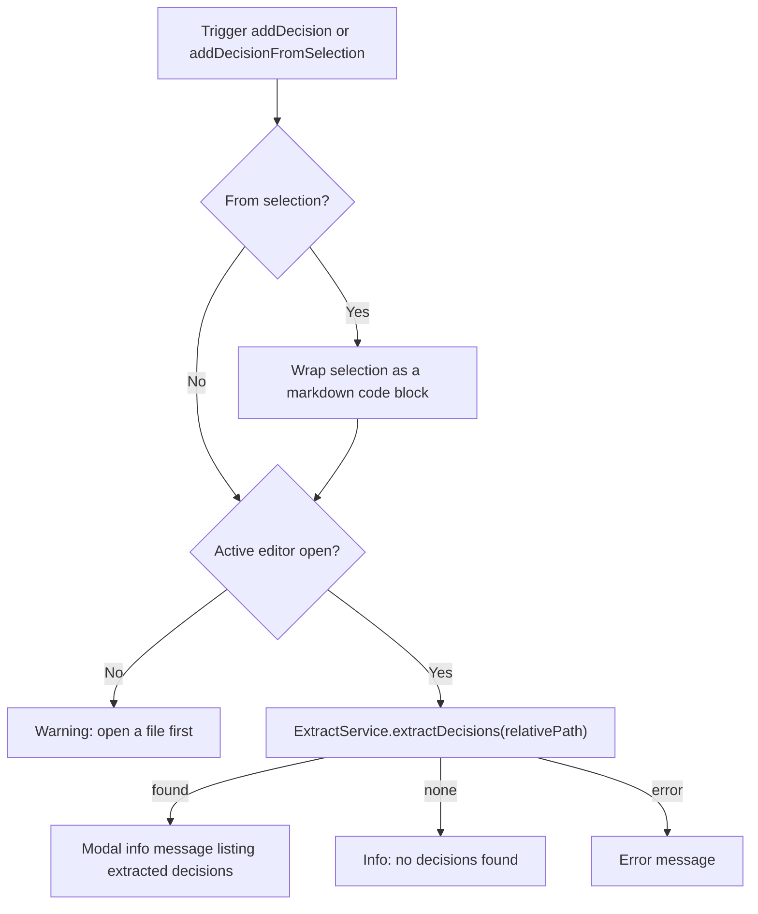

# Command: Docuvia Add Decision

## Command Details

- **Command IDs**:
  - `docuvia.addDecision` (Command Palette) — extracts decisions from the active file
  - `docuvia.addDecisionFromSelection` (Editor Right-Click Context Menu) — wraps the selection and delegates to the same handler
  - `docuvia.openDecision` — opens a decision's source file in the editor
  - `docuvia.showDecisionsForLens` — QuickPick over a module's decisions (invoked from a CodeLens, see [Editor Integration](../ui-ux/editor-integration.md))
- **Title**: `Docuvia: Add Decision` / `Docuvia: Add Decision from Selection`
- **Registration**: `artifacts/vscode-client/src/commands/index.ts`, handlers in `artifacts/vscode-client/src/commands/decision.ts`.

## Current Functional Flow

This command is an **extraction helper**, not a manual decision-record editor — it does not prompt for a title, generate a UUID/slug, or let the user pick an L2 module. It runs [`ExtractService`](../../../packages/cli.md) (`@workspace/core`, the same service backing [Run Extraction](run-extraction.md) and the [`/extract` chat command](../chat-participant/slash-commands.md)) against whatever file is currently open.

1. **Selection handling**: `addDecisionFromSelectionCommand` requires a non-empty selection, wraps it as a fenced code block (using the document's language ID), and calls the same handler as `addDecisionCommand`.
2. **Resolve the target file**: uses `folders[0]` (first workspace folder) and the currently active editor's file. If no editor is open, shows a warning and stops — there is no fallback to a QuickPick of open/initialized workspaces.
3. **Extract**: constructs `new ExtractService(workspaceRoot)` and calls `.extractDecisions(relativePath)`.
4. **Result display**: if decisions were found, shows a **modal** info message listing them (`result.decisions.join("\n- ")`); otherwise shows a plain info message that none were found. Errors surface as an error message.

> ⚠️ **Note**: `addDecisionCommand` accepts a `prefillBody` parameter (the wrapped selection text from step 1), but the current implementation never reads it — the extraction runs against the whole active file regardless of what was selected. Selecting code and running "Add Decision from Selection" currently behaves identically to running "Add Decision" with no selection.

### Related: opening and browsing decisions

- `docuvia.openDecision(filePath)` — opens the given file path as a text document (used by CodeLens/tree actions to jump to a decision's source).
- `docuvia.showDecisionsForLens({ module, decisions })` — shows a QuickPick over a module's decisions (title + type + status); selecting one calls `docuvia.openDecision` with its file path. See [Editor Integration](../ui-ux/editor-integration.md) for the CodeLens that invokes this.

---

## 🚧 Planned (Not Yet Implemented)

The original design described a considerably richer manual decision-authoring flow. None of this exists in the current code — preserved here as design intent:

- **Metadata gathering**: prompting for a decision title, generating a UUID and a slugified filename, and capturing the current date.
- **L2 module assignment**: a `QuickPick` over existing L2 modules (queried from SQLite), with an `$(add) Create new module later... (unassigned)` fallback option.
- **Structured record write**: generating an L3 record payload (`id`, `l2_module_id`, `title`, `date`, `status`) with templated Markdown sections (`## Context`, `## Decision`, `## Consequences`), writing it directly to `l3_nodes`, and queueing a sync event.
- **Virtual document editing**: opening the newly created record as a virtual document so the user can finish filling it out, with edits syncing back to SQLite.

If a manual "create decision record" flow is built, it would sit alongside — not replace — today's extraction-based `addDecision`.
