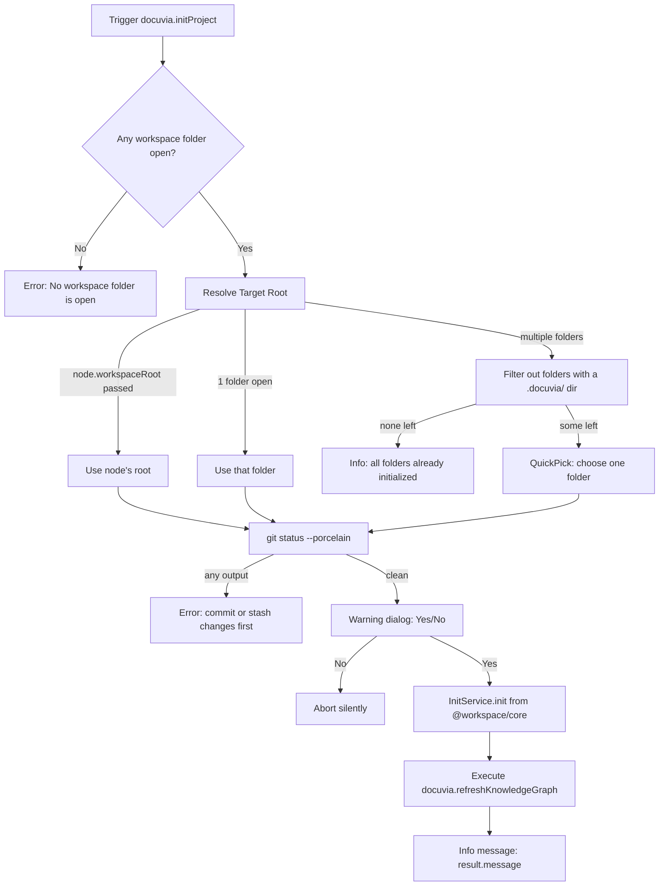

# Command: Docuvia Init Project

## Command Details

- **Command ID**: `docuvia.initProject`
- **Title**: `Docuvia: Init Project`
- **Activation Context**: Available globally via Command Palette, or triggered via inline tree view actions/welcome views (registered in `artifacts/vscode-client/src/commands/index.ts`, handler in `artifacts/vscode-client/src/commands/init-project.ts`).

## Current Functional Flow

1. **Workspace check**: if no workspace folder is open, show an error and stop.
2. **Resolve target root**:
   - If invoked from a tree item with `node.workspaceRoot`, use that.
   - If exactly one workspace folder is open, use it.
   - If multiple folders are open, filter to those **without** a `.docuvia/` directory (`fs.existsSync`), and show a single-select `QuickPick` over the remainder. If none remain, show "all workspace folders are already initialized" and stop.
3. **Git pre-flight check**: run `git status --porcelain` in the target root. If the output is non-empty **at all** (tracked or untracked changes — the check does not distinguish between them), block with: _"Please commit or stash your changes before initializing Docuvia. Creating an orphan branch requires a clean working tree."_
4. **Consent**: show a warning dialog — _"This will create a `.docuvia/` folder for settings and a hidden `docuvia-knowledge` orphan branch for your graph. No source code will be modified. Proceed?"_ (Yes/No). Anything other than "Yes" aborts silently.
5. **Initialize**: construct `new InitService(targetRoot)` (`@workspace/core`) and call `.init()`. See [CLI: `docuvia init`](../../../packages/cli.md#call-chains) for the same call chain (orphan branch creation, `.docuvia/config.json`, `.docuvia/local.db`).
6. **Refresh & notify**: execute `docuvia.refreshKnowledgeGraph`, then show an info message with `result.message`. Errors from any step show an error message instead.

## Known Limitations

- **No force-overwrite**: an already-initialized folder is filtered out of the picker entirely, so there is no code path that could destructively re-initialize a project. Data is never accidentally destroyed, but a user who wants to intentionally re-initialize also cannot do so today.
- **No multi-select**: only one folder can be initialized per invocation, even in a multi-root workspace with several uninitialized folders.

---

## 🚧 Planned (Not Yet Implemented)

The original design for this command was considerably richer than what's implemented today. None of the following exists in the current code — preserved here as design intent:

- **Server connectivity check**: pinging a `/health` endpoint (2000ms timeout via `AbortController`) to decide whether a "Connect to Remote Graph" option should be offered, greying it out with an `(Offline)` suffix when unreachable.
- **Three-way choice**: `✨ Initialize Knowledge Graph here (New)` / `🔗 Connect to Remote Graph (Existing)` / `📚 Clone & Explore Demo Sandbox (Demo)`, instead of today's single implicit "New" path.
- **State corruption handling**: detecting an existing `docuvia-knowledge` branch or a SQLite DB missing required tables, and prompting to "Connect to Existing", "Reset/Overwrite", or "Repair Workspace".
- **Force-overwrite dialog**: an explicit "`.docuvia` already exists. Overwrite? This action cannot be undone." prompt for intentional re-initialization.

If any of this is picked up for implementation, cross-check against [Roadmap → VS Code Extension Roadmap](../../../roadmap/vscode-roadmap.md) and update this doc alongside the code.
