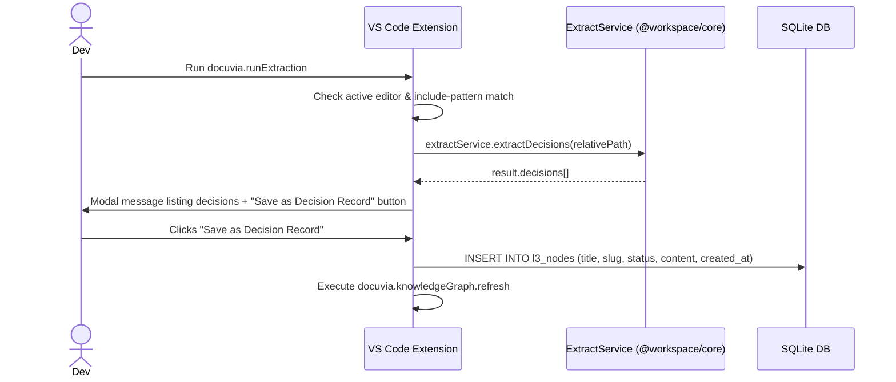

# Command: Docuvia Run Extraction

## Command Details

- **Command ID**: `docuvia.runExtraction`
- **Title**: `Docuvia: Run L3 Extraction on Active File` (see [ADR-005: Three-tier knowledge graph](../../../adr/ADR-005-knowledge-abstraction-strategy.md))
- **Activation Context**: Command Palette, Editor Context Menu. Handler: `artifacts/vscode-client/src/commands/extraction.ts` → `runExtractionCommand()`.

## Current Functional Flow



1. **Context validation**: requires an active editor; resolves the file's relative path via `vscode.workspace.getWorkspaceFolder()` (correctly supports multi-root workspaces, not hardcoded to `workspaceFolders[0]`).
2. **File type filtering**: reads `docuvia.extraction.includePatterns`, checks the file with `minimatch`. If it doesn't match any pattern, prompts "Analyze it anyway?" (Yes/No) — can be aborted.
3. **No size protection today**: unlike the settings doc, the current handler does **not** check `docuvia.extraction.maxLinesWarning` or `docuvia.extraction.maxFileSizeKBWarning` at all — neither the line-count nor the KB-size warning is implemented in `runExtractionCommand()`. Both settings exist in `package.json` (see [Settings](../configuration/settings.md)) but aren't read here.
4. **Extraction**: shows a progress notification, then calls `new ExtractService(workspaceRoot).extractDecisions(relativePath)`. All chunking and LLM interaction happens inside `@workspace/core` — not in the extension.
5. **Review & save**: if decisions were found, shows a **modal** message listing them with a **"Save as Decision Record"** button. Extraction alone does not write anything — only clicking this button does.
6. **Save**: on click, opens the local SQLite DB directly (`openLocalDatabase()`) and runs:

   ```sql
   INSERT INTO l3_nodes (title, slug, status, content, created_at) VALUES (?, ?, ?, ?, ?)
   ```

   for each extracted decision (`title` is always `"Extracted from <filename>"`, `status` is always `"proposed"`, `slug` is a timestamp+random string).

   > ⚠️ **Known gap**: this `INSERT` does not set `l2_module_id` at all. Every decision created via Run Extraction is currently unlinked from any L2 module — equivalent to the "orphaned decisions" issue tracked in [User Journeys](../ui-ux/user-journeys.md).

7. **Refresh**: shows a success message and executes `docuvia.knowledgeGraph.refresh`.

   > ⚠️ **Known bug**: `docuvia.knowledgeGraph.refresh` is never actually registered as a command (only `docuvia.refreshKnowledgeGraph` is) — this call silently no-ops. The tree view still ends up refreshed in practice because it separately watches `.docuvia/local.db` for changes (see [Tree Nodes](../knowledge-graph/nodes.md#data-management--sync)), not because of this call.

## See also

- [Add Decision](add-decision.md) — the same `ExtractService`, triggered from the active file without the size/pattern gating.
- [`/extract` chat command](../chat-participant/slash-commands.md) — same underlying service via the chat participant.
