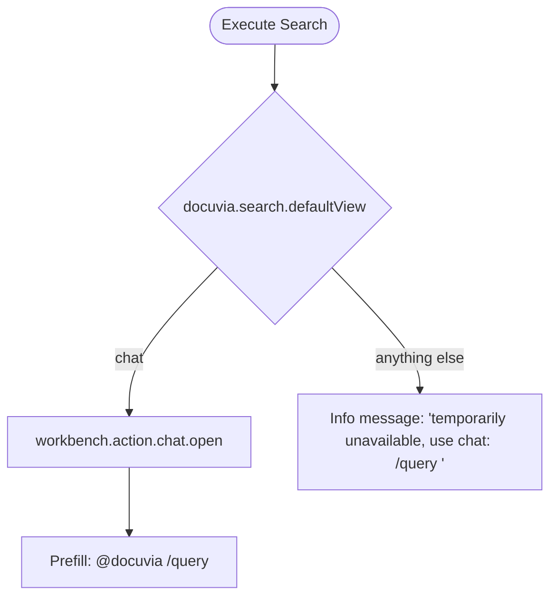

# Knowledge Graph Cross-Project Search

## Settings & Configuration

- **Setting**: `docuvia.search.defaultView`
- **Values**: `chat` (default) or `webview`
- **Description**: Determines where search results are displayed when the user triggers a search. Only `chat` is functional today (see below).

## Commands

- **`docuvia.openSearch`** — Command Palette or view title icon. Prompts with an input box ("Search cross-project knowledge") and passes the trimmed query into `executeSearch`.
- **`docuvia.searchFromSelection`** — Editor right-click context menu (`editorHasSelection`). Takes the selection text directly into `executeSearch`, truncating to **2000 characters** (`MAX_QUERY_LENGTH`) with a warning if the selection was longer.

Handler: `artifacts/vscode-client/src/commands/search.ts`.

## `executeSearch` Flow — Current Reality

1. Reads `docuvia.search.defaultView` (default `"chat"`).
2. **If `"chat"`**: executes `workbench.action.chat.open` with `query: "@docuvia /query <user_query>"` prefilled, then hands off entirely to the Copilot Chat UI (see [`/query`](../chat-participant/slash-commands.md#query)).
3. **If anything else (including `"webview"`)**: shows a plain info message — _"Cross-project search via UI is temporarily unavailable. Use chat: /query \<term\> instead."_ **No webview, RAG routing, or context compression path runs today** — the `else` branch is a hardcoded placeholder message, not a fallback implementation.

## 🚧 Planned (Not Yet Implemented)

The original design specified a full webview-based search experience for `docuvia.search.defaultView = "webview"`. None of this is implemented — preserved here as design intent:

- Route the query through [Agentic RAG Routing](../../../adr/ADR-007-agentic-rag-routing.md) instead of always going to chat.
- Apply [Context Compression](../../../adr/ADR-010-context-compression-and-proxy.md) before any remote LLM call to respect [Token Management](../../../adr/ADR-009-token-management.md).
- Render results in the `SearchResultsPanel` webview (the webview itself exists and is implemented — see [Webview Panels](../ui-ux/webview-panels.md) — but nothing in `search.ts` constructs or shows it today).
- Fall back to the [WASM AST Microkernel](../../../adr/ADR-020-unified-isomorphic-ast-microkernel.md) for offline syntax search when local data is stale, and trigger [Orphan Branch Maintenance](../../../adr/ADR-017-tiered-storage-and-orphan-branch-graph-maintenance.md) to resync.

If this is picked up, `SearchResultsPanel` (already built) is the natural rendering target — the missing piece is wiring `executeSearch`'s non-chat branch to actually call the RAG pipeline and open it.
