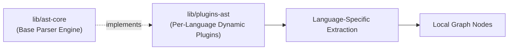

# AST Plugin Architecture

- **Status**: ⚠️ WARN
- **Phase**: Phase 2: AST Microkernel & Semantic Diffing
- **Evidence / Verification Target**: `lib/plugins-ast/`
- **ADR**: [ADR-020](../../adr/ADR-020-unified-isomorphic-ast-microkernel.md)

## Implementation Details

This feature is anchored by the following core components:

[`lib/plugins-ast/`](../../../../lib/plugins-ast/)

### Architecture Flow

### Component Description

- **Core Logic**: Per-language detection and dynamic parsing logic split out of the base parser engine ([`lib/ast-core/`](../../../../lib/ast-core/)) into its own package, per the [System Architecture Refactoring Plan](../../development/refactoring-plan.md#phase-3-dynamic-ast-plugins).
- **State Management**: Persists or queries state directly via the defined interfaces.

## Testing & Verification

- Run `pnpm test` in the relevant workspace.
- Validate the behavior locally using `docuvia` CLI or the VS Code Extension.
- Check the [Regression & Parity Testing](../../guidelines/regression-and-parity-testing.md) guidelines.
