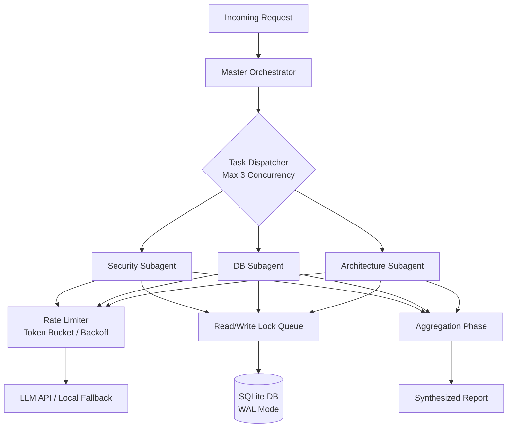

# Background Agentic RAG

- **Status**: ⚠️ WARN
- **Phase**: Phase 3: Agentic RAG & MCP Interfaces
- **Evidence / Verification Target**: No dedicated background-RAG config file found
- **ADR**: [ADR-032](../../adr/ADR-032-parallel-swarm-review-and-background-rag.md)

## Implementation Details

This feature is anchored by the following core components to implement parallel subagents while mitigating `database is locked` issues and LLM API rate limits.

### Architecture Flow

### Component Description

- **SQLite WAL & Read/Write Lock Queue**: Enables concurrent reads and queues writes and heavy vector queries, preventing `SQLITE_BUSY` (database is locked).
- **Task Dispatcher**: Limits active parallel subagents to a strict concurrency bound (e.g., max 3 active parallel agents) mapped to local hardware capacity.
- **Rate Limiter & Fallback**: Manages token buckets, exponential backoff, and routes non-critical swarm agents to local models when LLM provider rate limits are exhausted.
- **Master Orchestrator & Aggregation Phase**: Handles parallel dispatching and subsequent synthesis of parallel findings into a final cohesive output.

## Testing & Verification

- Run `pnpm test` in the relevant workspace.
- Validate the behavior locally using `docuvia` CLI or the VS Code Extension.
- Check the [Regression & Parity Testing](../../guidelines/regression-and-parity-testing.md) guidelines.
