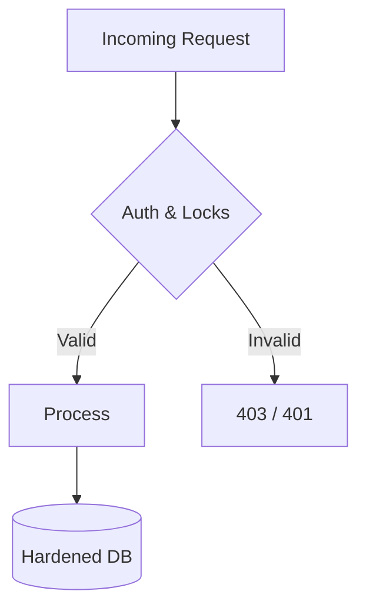

# Cross-team subscription

- **Status**: ⚠️ WARN
- **Phase**: Phase 6: Architecture Hardening & Security
- **Evidence / Verification Target**: `lib/db/src/schema/pg/subscriptions.ts`

## Implementation Details

`subscriptions.ts` exists with subscriber/publisher project foreign keys, but the file looks unfinished/broken, not just incomplete: it has two conflicting `import { z }` statements, and locally redefines fake `createInsertSchema`/`createSelectSchema` helpers that shadow the real `drizzle-zod` import. This should be verified to actually compile/typecheck before this feature is treated as further along than "schema skeleton only."

### Architecture Flow

### Component Description

- **Core Logic**: `subscriptions.ts` schema exists but contains shadowed/duplicate imports (`z`, `createInsertSchema`, `createSelectSchema`) that look like leftover stub code — needs cleanup and compile verification.
- **State Management**: Persists or queries state directly via the defined interfaces, pending the cleanup above.

## Testing & Verification

- Run `pnpm test` in the relevant workspace.
- Validate the behavior locally using `docuvia` CLI or the VS Code Extension.
- Check the [Regression & Parity Testing](../../guidelines/regression-and-parity-testing.md) guidelines.
