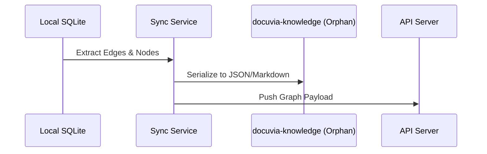

# `docuvia sync` Bidirectional CLI

- **Status**: ⚠️ WARN
- **Phase**: Phase 4: Git-Isomorphic Sync & Temporal Knowledge
- **Evidence / Verification Target**: `artifacts/cli/src/commands/sync.ts`

## Implementation Details

The CLI wiring exists (`sync.ts` prompts for `<project_id>` when missing, per the Phase 8 wizard-CLI work), but the sync logic it calls into is not implemented: `SyncService.sync()` in `lib/core/src/services/sync-service.ts` is a literal no-op stub that only logs and returns — it does not extract edges/nodes, serialize to JSON/Markdown, or push anything. The diagram below is the _intended_ design, not current behavior.

**Known bug**: `artifacts/cli/src/commands/sync.ts` references `DI_KEYS` without importing it — this is likely a runtime `ReferenceError` on the code path that uses it and should be checked before relying on this command.

### Architecture Flow (target design, not yet implemented)

### Component Description

- **Core Logic**: `SyncService.sync()` (`lib/core/src/services/sync-service.ts`) is currently a stub — see note above.
- **State Management**: Not yet wired; no state is persisted or pushed by this command today.

## Testing & Verification

- Run `pnpm test` in the relevant workspace.
- Validate the behavior locally using `docuvia` CLI or the VS Code Extension.
- Check the [Regression & Parity Testing](../../guidelines/regression-and-parity-testing.md) guidelines.
