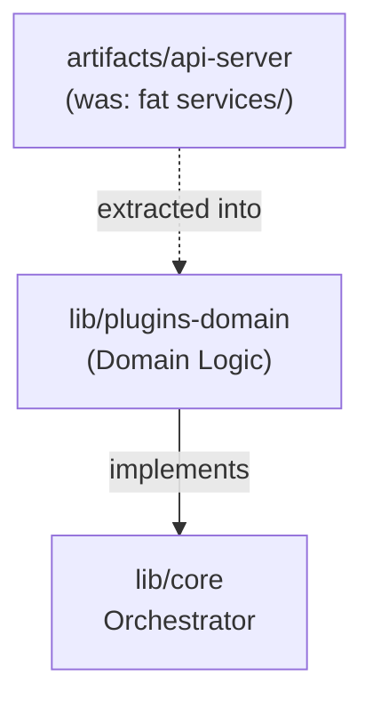

# Domain Plugin Architecture

- **Status**: ✅ Done
- **Phase**: Phase 6: Architecture Hardening & Security
- **Evidence / Verification Target**: `lib/plugins-domain/`

## Implementation Details

This feature is anchored by the following core components:

[`lib/plugins-domain/`](../../../../lib/plugins-domain/)

### Architecture Flow

### Component Description

- **Core Logic**: Domain services (e.g. document, git-ingestion, dashboard, sync) that previously lived tightly coupled inside `artifacts/api-server/src/services/` were extracted into `lib/plugins-domain`, per the [System Architecture Refactoring Plan](../../development/refactoring-plan.md#phase-4-domain-services-extraction).
- **State Management**: Persists or queries state directly via the defined interfaces.

## Testing & Verification

- Run `pnpm test` in the relevant workspace.
- Validate the behavior locally using `docuvia` CLI or the VS Code Extension.
- Check the [Regression & Parity Testing](../../guidelines/regression-and-parity-testing.md) guidelines.
