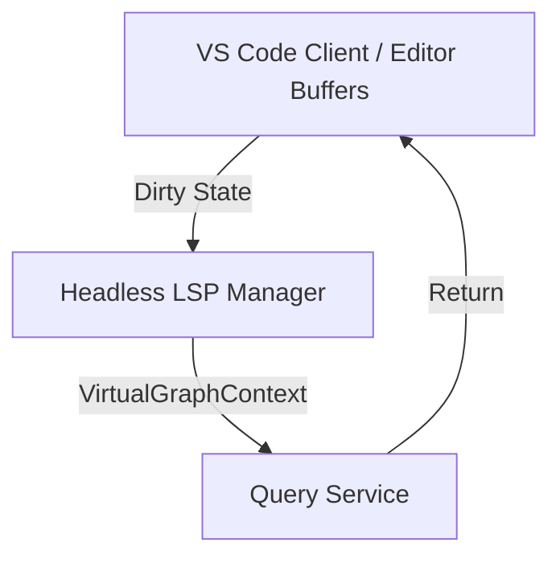

# Headless LSP Manager

- **Status**: ⚠️ WARN
- **Phase**: Phase 2: AST Microkernel & Semantic Diffing
- **Evidence / Verification Target**: `lib/headless-lsp/`
- **ADR**: [ADR-025](../../adr/ADR-025-hybrid-temp-file-blast-radius.md)

## Implementation Details

This feature is anchored by the following core components:

`lib/headless-lsp/` (Not implemented yet)

### Architecture Flow

### Component Description

- **Core Logic**: Manages standalone LSP child processes (e.g. `tsserver`) to analyze dirty unsaved editor buffers.
- **State Management**: Writes dirty state to temporary files matching the orphan branch schema, bypassing the SSOT DB to prevent corruption.

## Testing & Verification

- Run `pnpm test` in the relevant workspace.
- Validate the behavior locally using `docuvia` CLI or the VS Code Extension.
- Check the [Regression & Parity Testing](../../guidelines/regression-and-parity-testing.md) guidelines.
