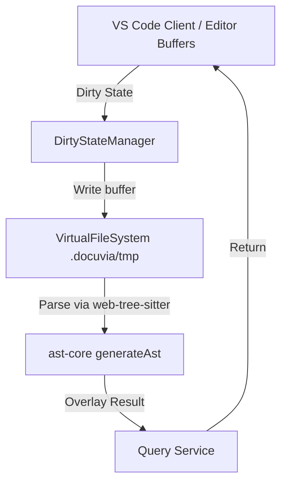

# Headless LSP Manager

- **Status**: ⚠️ WARN
- **Phase**: Phase 2: AST Microkernel & Semantic Diffing
- **Evidence / Verification Target**: `lib/headless-lsp/`
- **ADR**: [ADR-025](../../adr/ADR-025-hybrid-temp-file-blast-radius.md)

## Implementation Details

`lib/headless-lsp/src/` is implemented, but not as a headless LSP process manager. It does **not** spawn or manage any LSP child process (e.g. `tsserver`) — there is no LSP client/server wiring anywhere in the package. Instead it implements a lighter temp-file overlay:

- `DirtyStateManager` (`dirty-state-manager.ts`) tracks unsaved editor buffer contents.
- `VirtualFileSystem` (`vfs.ts`) writes those dirty contents to `.docuvia/tmp/` and parses them directly via `web-tree-sitter`/`generateAst` from `@workspace/ast-core` — i.e. dirty buffers are re-parsed with the AST microkernel itself rather than proxied through a real LSP.

This matches ADR-025's "Hybrid Temp-File Blast Radius Overlay" name more literally than its "Headless LSP" framing suggests — there is a temp-file overlay, but no LSP.

### Architecture Flow

### Component Description

- **Core Logic**: `DirtyStateManager` tracks dirty buffers; `VirtualFileSystem` persists them to `.docuvia/tmp/` and re-parses via the AST microkernel — no LSP process is spawned.
- **State Management**: Writes dirty state to temporary files, bypassing the SSOT DB to prevent corruption.

## Testing & Verification

- Run `pnpm test` in the relevant workspace.
- Validate the behavior locally using `docuvia` CLI or the VS Code Extension.
- Check the [Regression & Parity Testing](../../guidelines/regression-and-parity-testing.md) guidelines.
