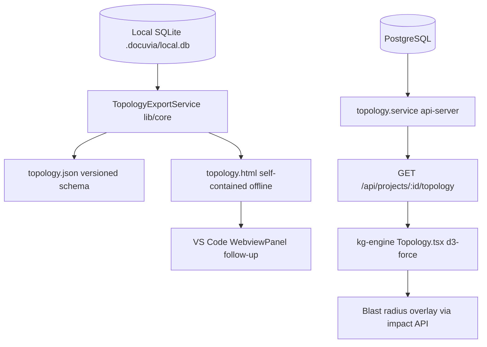

# Interactive Topology Maps

- **Status**: ✅ Done (2026-07-06 — shared `buildTopologyGraph` + SQLite/PG services, CLI `docuvia export --topology` producing offline topology.json/topology.html, `GET /projects/{id}/topology` API with Orval codegen + contract tests, and the kg-engine `/topology` page with d3-force layout + blast-radius highlighting. Follow-ups: VS Code webview reuse, in-browser visual tuning of layout parameters)
- **Phase**: Phase 5: Local-First VS Code Client & Web UI
- **Evidence / Verification Target**: `lib/core/src/services/topology-export.service.ts`, `lib/core/src/types/topology.types.ts` — see [AI Implementation Plan](../../ai_plans/implement_interactive-topology-maps.md) for execution details.
- **AI Plan**: [implement_interactive-topology-maps.md](../../ai_plans/implement_interactive-topology-maps.md)

## Implementation Details

Modeled after **graphify**'s "one graph dataset, many renderings" export architecture (`graphify/export.py`), adapted for Docuvia's local-first constraints and decision-graph (L3) semantics:

1. **Machine-readable `topology.json`** — versioned schema generated read-only from `.docuvia/local.db` (`l2_nodes`, symbol-level `node_links`, `l3_nodes` decisions, `l1_tags` as groups) by a new `TopologyExportService` in `lib/core`. No DB migration required. Server-side collapse to file-level view beyond a node cap (instead of graphify's hard 5000-node rejection).
2. **Self-contained `topology.html`** — CLI command `docuvia export --topology`; interactive force-layout page with search, click-to-inspect (blast-radius upstream highlight), group legend filtering, and groups rendered as layer containers (graphify hyperedge convex-hull technique). Renderer is inlined at build time — **no CDN**, fully offline.
3. **kg-engine Dashboard page** — API-first: `GET /api/projects/{projectId}/topology` added to `openapi.yaml` → Orval codegen → `Topology.tsx` using the already-present `d3-force` dependency. Node click overlays impact-analysis blast radius (leverages the 2026-07-06 symbol-level `node_links` fix).
4. **VS Code webview** (follow-up) — reuse the self-contained HTML in a `WebviewPanel`.

L3 decision records render as a distinct node kind attached to their L2 node — the "human & machine readable decision graph": humans read the HTML/Dashboard, agents consume `topology.json`.

### Architecture Flow

### Component Description

- **Core Logic**: `lib/core/src/services/topology-export.service.ts` (SQLite) + `artifacts/api-server/src/services/topology.service.ts` (PostgreSQL), sharing types from `lib/core/src/types/topology.types.ts`.
- **State Management**: Read-only projection over existing graph tables; no new persisted state.

## Testing & Verification

- Unit tests: in-memory SQLite fixture validating nodes/links/groups/decision nodes/collapse logic.
- Contract test: API response passes generated Zod schema; CLI vs API output parity test.
- Run `pnpm test` in the relevant workspace.
- Validate the behavior locally using `docuvia` CLI or the VS Code Extension.
- Check the [Regression & Parity Testing](../../guidelines/regression-and-parity-testing.md) guidelines.
