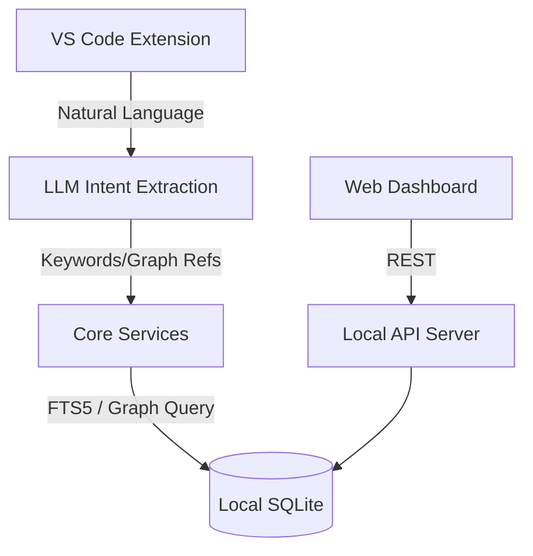

# Natural language UI

- **Status**: ⚠️ WARN
- **Phase**: Phase 5: Local-First VS Code Client & Web UI
- **Evidence / Verification Target**: `artifacts/kg-engine/src/pages/Query.tsx`
- **ADR**: [ADR-029](../../adr/ADR-029-local-vector-index-and-natural-language-ui.md)

## Implementation Details

This feature is anchored by the following core components:

[`artifacts/kg-engine/src/pages/Query.tsx`](../../../../artifacts/kg-engine/src/pages/Query.tsx)

The Natural Language UI embraces the **Graceful Degradation** pattern for offline and local-first environments. Instead of relying on a heavy local vector database for semantic search, the UI uses an LLM-driven Intent Router.

When operating locally, natural language queries are parsed into hard keywords, structural filters, and node references (Intent Extraction). These extracted intents are then resolved using SQLite FTS5 and AST Graph traversal, providing a rich, responsive natural language experience without local vector search bloat.

### Architecture Flow

### Component Description

- **Core Logic**: Handled primarily within the target files linked above, using LLM parsing to convert natural language into structured local queries.
- **State Management**: Persists or queries state directly via the defined interfaces.

## Testing & Verification

- Run `pnpm test` in the relevant workspace.
- Validate the behavior locally using `docuvia` CLI or the VS Code Extension.
- Check the [Regression & Parity Testing](../../guidelines/regression-and-parity-testing.md) guidelines.
